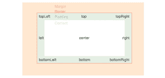
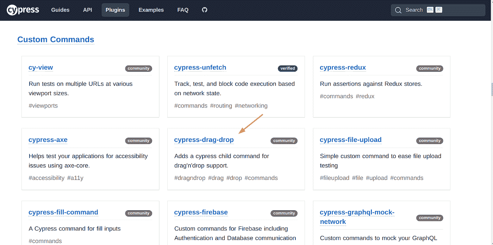
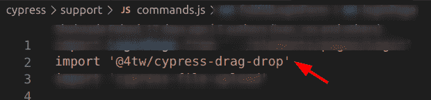

# 在 Cypress 中使用鼠标动作

> 原文：<https://javascript.plainenglish.io/working-with-mouse-actions-in-cypress-e7ef22aa4b89?source=collection_archive---------8----------------------->

我们都知道，随着自动化的发展，软件测试已经走了很长的路，因为它有很多好处，比如节省时间，早期的错误捕获等等。随着时间的推移，各种测试框架已经被引入不同的平台。其中一个就是 Cypress，它用于 web 应用程序测试用例的自动化。

Cypress 帮助 QA 工程师以更快、更可靠的方式编写测试用例，并且它的设置也非常简单快捷。Cypress 在许多方面让自动化变得更加容易。几乎所有传统框架要求用户自己编写的任务都有一个插件。

其中一个被 Cypress 简化的领域是鼠标功能，比如拖放。Cypress 自带一个名为 trigger 的内置函数。Trigger 帮助用户轻松地执行鼠标操作。为此，它使用了一些属性:

*   事件名称
*   x 坐标
*   y 坐标
*   其他选项

让我们讨论其中的几个。

**鼠标悬停&鼠标抬起**

Mouseover 和 Mouseup 的组合用于模拟许多不同的动作。

例如，用户可以执行长按或点击特定的持续时间。

> cy.get(定位器)。触发器(“鼠标按下”)
> 
> cy.wait('3000 ')
> 
> cy.get(定位器)。触发器(“鼠标抬起”)

上面三种方法所做的是，首先，用户使用 mousedown 单击特定的元素。接下来，用户等待 3000 毫秒或 3 秒，保持点击，或者在这种情况下按下。然后最后用 mouseup 释放。

**元素位置**

用户还可以通过指定元素的位置来指定需要执行操作的确切位置。举个例子，

> cy.get(定位器)。触发器(“鼠标按下”、“顶部”)

位置可以作为第二个参数。本例中有效的九个位置是:

*   顶端
*   右上
*   左上
*   中心
*   左边的
*   正确
*   底部
*   左下角
*   右下角

**位置坐标**

与指定位置类似，用户也可以指定精确的坐标来执行操作。这通过提供 x 和 y 坐标来完成。例如:

> cy.get(定位器)。触发器(“鼠标按下”，100，200)

第二个参数是 x 坐标，第三个参数是 y 坐标。

**拖拽**

使用这些功能有许多不同的方法，如何根据用户的需要利用它们取决于用户的创造力。使用这两个基本功能，用户也可以使用鼠标执行拖放操作。

与 mouseover 和 mousedown 类似，mousemove 也存在，顾名思义，它移动鼠标。

例如，取两个具有定位器 loc1 和 loc2 的元素。用户需要将位置为 loc1 的元素拖动到位置为 loc2 的区域。这可以通过以下方式来实现。

> cy.get(loc1)。触发器(“鼠标按下”)
> 
> cy.get(loc2)。触发器(' mousemove ')。触发器(“鼠标抬起”)

这里我们用参数鼠标移动和鼠标抬起链接了两个触发函数。它点击 loc1，移动到 loc2，然后提升。以一种我们称之为拖放的方式。

**使用插件拖放**

为此，用户可以使用 Cypress 的插件进行拖放操作。它可以在官方文档网站的插件下找到。

使用起来很简单。首先，通过输入以下命令使用终端安装插件。

> npm 安装—save-dev @ 4tw/cypress-drop

将其导入到 command.js 文件中。

就这样，你可以开始使用这个插件了。例如:

> cy.get(loc1)。拖('。'，{ clientX: 250，clientY: 100，force: true })

在这里，我们基本上是获取具有 local 1 的元素，并将其拖到具有 class className 的位置。clientX 指定 x 坐标，clientY 指定 y 坐标。Force true 是一个检查，我们需要使用这个插件在元素上强制触发事件。

这和用 trigger()拖拽基本一样；唯一的区别是它用一个命令而不是两个命令来执行操作。

剩下的取决于用户，他或她希望如何利用这些动作来执行他们的任务。

## 更多内容请访问 [PlainEnglish.io](https://plainenglish.io/) 。

*报名参加我们的* [***免费每周简讯***](http://newsletter.plainenglish.io/) *。关注我们关于*[***Twitter***](https://twitter.com/inPlainEngHQ)，[***LinkedIn***](https://www.linkedin.com/company/inplainenglish/)***，***[***YouTube***](https://www.youtube.com/channel/UCtipWUghju290NWcn8jhyAw)***，以及****[***不和***](https://discord.gg/GtDtUAvyhW) *

## *希望扩大你的科技创业公司的知名度和采用率吗？检查[电路](https://circuit.ooo/?utm=publication-post-cta)。*