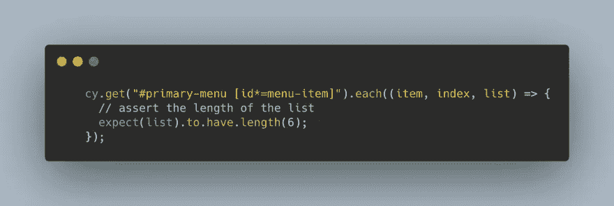
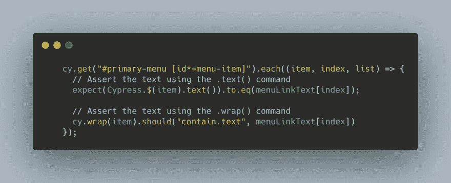

# 在 Cypress 中使用多个元素

> 原文：<https://javascript.plainenglish.io/working-with-multiple-elements-in-cypress-ec99e4ba5db7?source=collection_archive---------3----------------------->

[https://youtu.be/eMLVTX7AyNk](https://youtu.be/eMLVTX7AyNk)

在这个 Cypress 教程中，我们将介绍如何使用多个元素。我们将验证列表的长度，并断言所有列表项的文本。

# 测试场景

在这个测试场景中，我们将尝试获取下面菜单链接项的长度以及每个列表项的文本。

# 。每个()

因为我们将使用列表项，所以我们需要遍历列表。Cypress 提供了一个方便的`.each()`函数来遍历类似数组的结构。让我们看看如何使用它——

# 断言列表文本

一旦我们能够使用。每个()命令，我们可以访问每个单独的列表项。然后我们可以使用。text()命令来访问列表项的文本。

在上面的代码中，我们使用两种方式断言文本

*   通过`.text()`命令——如果你想在断言前以某种方式修改文本，这种方式很有用
*   通过`.wrap()`和`.should()`命令——这是在 Cypress 中断言文本的自然方式，取决于您自己的用例，您可以选择任何一种方式来断言文本。

## 观看下面的视频，了解如何在 Cypress 中使用多个元素——

感谢阅读！

*更多内容尽在*[*plain English . io*](http://plainenglish.io/)