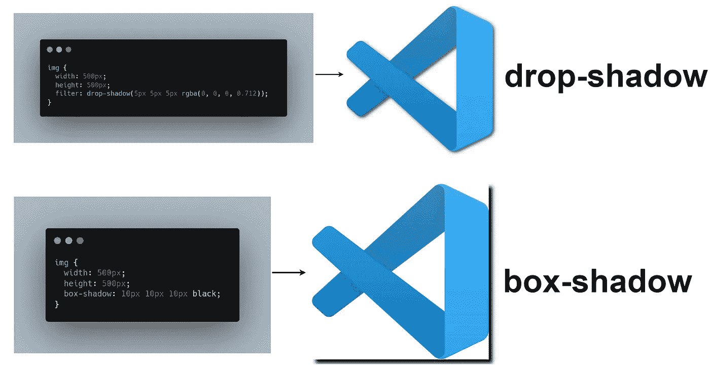

# 如何在 CSS 中创建阴影

> 原文：<https://javascript.plainenglish.io/working-with-shadows-in-css-15ff0717cf71?source=collection_archive---------19----------------------->

## 为您的应用程序构建出色的视觉效果

阴影是 CSS 中最容易被误解的概念之一，因为开发人员通常会使用错误的方法来获得他们想要的结果。关于 **box-shadow** 属性有很多需要了解的地方，你可以使用一些小的改动来创建更真实的视觉效果。

> 注意:在你开始使用 CSS 中的阴影之前，请确保阅读以下属性。

*   **h-offset(必需):**正值将阴影放在盒子的*右侧*，负值将阴影放在*左侧*。
*   **v-offset(必需):**与前面的属性类似，正值将阴影*放在框的*下方，负值将阴影*放在框的*上方。
*   **模糊半径(可选):**模糊半径越高，阴影越模糊。
*   **扩散(可选):**正值*增加*阴影的大小，负值*减少*阴影的大小。

## 单面阴影

大多数时候，人们使用三种长度和颜色的盒影。但是这会导致复杂的阴影，很难进一步定制。

***例如，***

*   比方说，我们有**盒影:2px 3px 4px 黑；**这会导致两面都有阴影，为了达到只在一面有阴影的预期效果，你必须了解第四个参数，称为**扩散半径**。

**Without Spread Radius**

*   扩散半径是许多开发人员不太了解的参数，扩散半径**增加**或**减少**(如果为负)阴影的大小，增加的量由您指定。
*   在我们的例子中，如果我们简单地应用一个 **-4px** 的扩散半径，它会将阴影的**宽度**和**高度**在每一侧减少 **4px** 。简而言之，在这个阶段，阴影的尺寸与它所应用的元素尺寸完全相同(*，除非它用偏移值*明确移动)。
*   使用扩散半径 **-4px** 将很容易解决这个问题，您将在元素的底部观察到一个阴影，但在其他任何一侧都不会。

**Using a Spread Radius of -4px**

## 两个相对面上的阴影

如果你想在元素的不同边上获得阴影，在 CSS 中使用阴影会变得更加棘手，因为扩散半径在所有边上都是相等的。

*   最简单的方法是使用两个不同的阴影，并使用同一个**“单面”**解决方案两次来获得最终的效果。

**Shadow on Two Opposite Sides**

## 使用投影

开发人员经常在**框阴影**和**投影**之间混淆，在 CSS 中我们有一个称为投影的过滤器，它做一些类似于 ***框阴影、*** 的事情，在那里我们可以传入 *x 偏移*、 *y 偏移、*和*颜色的值。*

> ***注:*** *它没有* ***价差*** *参数。*

有时候，开发人员不得不处理非矩形的形状，这些形状并不能很好地适应框阴影属性，这就是投影开始起作用的地方。

***例如；***

*   比方说，你有一个 **SVG** 资产可以在你的 web 应用程序中使用，在这个阶段，你真的可以使用 box-shadow 属性来给出一些漂亮的阴影。
*   简单地说，每当你需要处理不规则的形状时，就使用阴影。

> *请注意，如果您尝试将* ***框阴影*** *属性与 SVG 资产一起使用，您最终会得到一些非常难看的结果，如下所示。*

**drop-shadow VS box-shadow**

 [## 网站开发人员避免常见错误的 5 个便捷的网站设计技巧

### 网页设计中要避免的常见错误

javascript.plainenglish.io](/5-handy-web-desing-tips-for-web-developers-f36bcb3fdaf4)  [## 作为软件开发人员，你正在犯的 5 个 UI 错误

### 开发人员在前端应用程序中经常犯的 UI 错误

javascript.plainenglish.io](/5-ui-mistakes-you-are-making-as-a-software-developer-6e311d769a77)  [## 让你成为前端忍者的 6 个 UI 概念

### 构建具有出色 UI 的应用程序的基本概念

javascript.plainenglish.io](/6-ui-concepts-that-makes-you-a-frontend-ninja-c6c0a29fa954) 

*更多内容请看*[***plain English . io***](http://plainenglish.io)