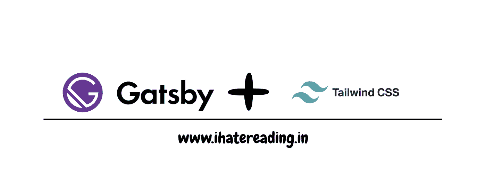
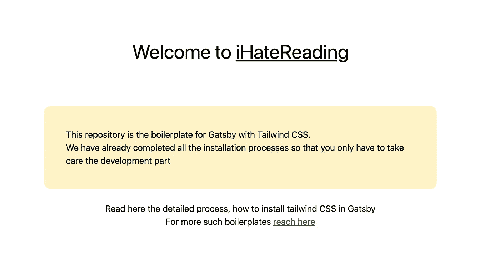

# 在《盖茨比》中使用顺风 CSS

> 原文：<https://javascript.plainenglish.io/working-with-tailwind-css-in-gatsby-8cbc079a9d55?source=collection_archive---------13----------------------->

为开发人员准备的另一个专业样板。✌️😁



[www.ihatereading.in](http://www.ihatereading.in)

## 在后台

故事从我们用 Next.js 创建每个前端 UI React 库样板文件开始，现在，我们正在向其他 React 框架前进。因此，是时候考虑我们需要遵循的架构和安装流程了。

```
🔗 [Click me to get the code](https://github.com/shreyvijayvargiya/iHateReadingLogs/tree/main/TechLogs/Gatsby-Logs/gatsby-tailwindcss) 
```

## 安装插件和顺风 CSS

在今天的故事中，我们将在 Gatsby 站点上安装 Tailwind CSS。第一步是创建我们的盖茨比项目。你可以阅读我的文章来开始了解 Gatsby，也可以直接下载现成的代码。

一旦完成，我们将安装 Tailwind 和一些 post CSS 插件，帮助服务器端渲染 web 应用程序加载 CSS。

```
yarn add gatsby-plugin-postcss tailwindcss@latest postcss@latest autoprefixer@latest
```

## 在服务器端激活 CSS 插件

安装插件后，我们只需要为我们的 Gatsby 项目配置它们。因此，首先创建 tailwind.config.js 和 postcss.config.js。

```
npx tailwindcss init -p
```

如果您正在手动创建文件，请确保将它们添加到根目录。下一步是在配置中添加顺风 CSS。在`tailwind.config.js`文件中添加以下代码。

```
module.exports = {
  purge: ['./src/**/*.{js,jsx,ts,tsx}'],
  darkMode: false, // or 'media' or 'class'
  theme: {
    extend: {},
  },
  variants: {
    extend: {},
  },
 plugins: [],
}
```

在`postcss.config.js`文件中添加以下代码。

```
module.exports = {
  plugins: {
    tailwindcss: {},
    autoprefixer: {},
  },
}
```

在`gatsby.config.js`文件中，通过添加以下代码激活 postcss gatsby 插件:

```
module.exports = {
  siteMetadata: {
    title: "GatsbyIntroduction",
   },
  plugins: ["gatsby-plugin-styled-components, gatsby-plugin-postcss"],
};
```

这 3 个步骤将在服务器端配置顺风 CSS。

## 导入 CSS 及其应用

最后一步是将 Tailwind 包含在我们项目的全球 CSS 中。在 src 的 styles 文件夹中创建一个全局样式文件，并在其中添加以下代码。

```
/* ./src/styles/global.css */@tailwind base;
@tailwind components;
@tailwind utilities;
```

确保目录与上面提到的相同，因为 tailwind 将在构建时交换这些目录，并使它们在服务器端可用。最后一步是向 gatsby 提供全局样式位置，然后 Gatsby 在构建时从目录中导入 CSS。

最后，在项目的根目录下创建一个`./gatsby-browser.js`文件(如果它不存在的话),并导入您的 CSS 文件:

```
// ./gatsby-browser.js
import './src/styles/global.css';
```

## 在本地测试 Gatsby 中的顺风 CSS

一旦完成以上步骤，我们就可以在 Gatsby 项目中使用 Tailwind CSS 了。我将使用 Tailwind CSS 创建一个示例登录页面，以成功确认安装过程。运行以下命令在本地测试项目。

```
yarn run develop
```



Gatsby website using Tailwind CSS

## 结论

这就是今天的故事，更多类似的样板参考我们的网站样板部分，在那里你可以找到世界级的专业样板。直到，下一次，有一个美好的一天，人们。

```
For more such boilerplates reach - 💻 [**iHateReading**](http://www.ihatereading.in)
```

## 更多阅读

[](/15-ways-to-improve-the-performance-of-your-react-application-459c93904eaf) [## 提高 React 应用程序性能的 15 种方法

### 开发高性能应用程序必须遵循的原则。

javascript.plainenglish.io](/15-ways-to-improve-the-performance-of-your-react-application-459c93904eaf) [](https://medium.com/geekculture/introduction-to-gatsby-4641948b450b) [## 盖茨比简介

### 下一个 JS 开发者开始使用 Gatsby，让我们看看它能提供什么🙃

medium.com](https://medium.com/geekculture/introduction-to-gatsby-4641948b450b) [](https://medium.com/nerd-for-tech/5-reasons-why-vercel-is-the-best-for-application-deployment-92009b17e601) [## Vercel 最适合应用部署的 5 个原因

### 无论是 React project 还是 Gatsby 还是 Next JS 或者 Vue JS 或者 Nuxt JS 或者 Nest JS 或者 Node JS Vercel 都是完美的选择…

medium.com](https://medium.com/nerd-for-tech/5-reasons-why-vercel-is-the-best-for-application-deployment-92009b17e601) 

*更多内容尽在*[*plain English . io*](http://plainenglish.io/)