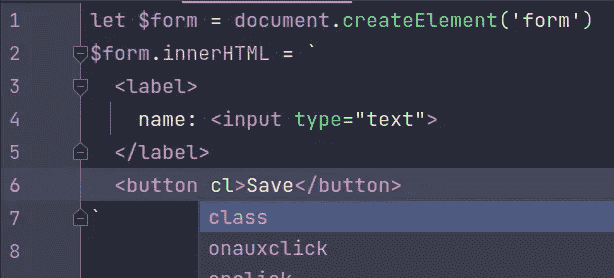
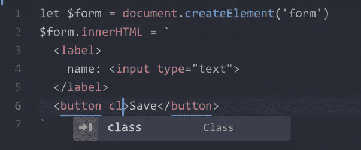

# 如何在 Vanilla JS 中创建和操作 DOM 节点

> 原文：<https://javascript.plainenglish.io/working-with-the-dom-in-vanilla-js-apps-part-1-bf8ccc0faaed?source=collection_archive---------0----------------------->

## 在普通 JS 应用程序中使用 DOM(第 1 部分):在没有框架的情况下创建和操作 DOM 节点的技巧。


在前一篇文章中，我概述了普通 JS 项目的基本设置。在那里，我提到了与 DOM 节点创建和操作相关的一些事情，并承诺在下一篇文章中更详细地讨论这些内容。

掌握 DOM 操作是普通 JS 项目成功的关键。幸运的是，DOM 操纵不是火箭科学。您只需要 DOM API 的一个较小的子集和本文中的一些提示。正如一切香草，难的部分是适应新的(旧的？)的思维方式和对现有资源的创造性利用。正如我告诉我的一个队友的那样，“一旦你停止使用框架，你会发现你比你想象的更加足智多谋。”(他们做到了。)

在我写这篇文章的时候，我意识到需要两篇文章来涵盖我认为对大多数应用程序来说必不可少的东西。因此，这是文章的第一部分。在第一部分中，我们将介绍 DOM 节点的创建，并将重点放在操作单个节点上。在第二部分，我们将讨论节点列表。

# 创建 DOM 节点

有几种方法可以创建 DOM 节点。最明显的方法是将它们添加到 HTML 页面中。我们将在本文后面对此进行更详细的讨论。现在，让我们看看典型的纯 JavaScript 方法。

先是德高望重的`document.createElement()`:

```
let $node = document.createElement('div')
$node.className = 'my-node'
let $child = document.createElement('div')
$child.className = 'my-child'
$node.append(child)
```

当我希望子节点只是一些文本时，我使用`document.createTextNode()`:

```
let $node = document.createElement('div')
$node.className = 'my-node'
let $textChild = document.createTextNode('some text')
$node.append(textChild)
```

如果我的节点只包含文本，我不会单独创建文本节点。我可以简单地使用`Element.textContent`属性:

```
let $node = document.createElement('div')
$node.className = 'my-node'
$node.textContent = 'some text'
```

如果我要创建更复杂的节点树，我更喜欢使用带有模板字符串的`Element.innerHTML`:

```
let $form = document.createElement('form')
$form.innerHTML = `
  <label>
    name: <input type="text">
  </label>
  <button>Save</button>
`
```

就性能而言，使用`document.createElement()`和`Element.innerHTML`没有明显的区别，即使我们考虑到使用后一种技术，如果我们需要引用它们，我们需要选择已创建的节点。

模板字符串的使用非常适合这一目的，因为一些现代编辑器可以将这些字符串视为独立的语言上下文。例如，在 JetBrains IDEs 和 Atom 编辑器中，HTML 突出显示和代码智能功能可以无缝工作，HTML 可以自动检测，无需我的干预。很有想法！



A JetBrains IDE treating the template string as HTML and offering attribute completion



Atom detecting the HTML inside a template string and offering attribute completion

对于`Element.innerHTML`,我们总是需要一个单独的 DOM 元素作为我们想要放入其中的任何 HTML 的根。但是有时我们想创建一个 HTML，它是一个元素列表，我们不需要根节点。为了处理这种情况，我们可以使用`[template](https://developer.mozilla.org/en-US/docs/Web/HTML/Element/template)`元素:

```
let $list = document.getElementById('my-list')
let $children = document.getElementById('template')
$children.innerHTML = `
  <li class="item">First item</li>
  <li class="item">Second item</li>
`
$list.append(children.content)
```

注意，对于`template`元素，我附加了`HTMLTemplateElement.content`属性，而不是元素本身。此元素不是普通元素。它是 web 组件规范的一部分，专门用于存储稍后会用到但不会立即呈现的元素。`HTMLTemplateElement.content`属性表示一个与模板内容匹配的`[DocumentFragment](https://developer.mozilla.org/en-US/docs/Web/API/DocumentFragment)`对象。

DOM 节点的创建远不止这些，但是我们不会深入研究所有的细微差别，因为它们中的大部分对于下一个模式都不是很有用:

# HTML 作为 DOM 节点储存库

用 JavaScript 创建 DOM 节点既不昂贵也不太复杂，但我仍然避免这样做。我不回避，因为这不是一个好的模式。我避免这样做，因为我一开始就不需要这样做。

> 不需要做的工作才是最好的工作。

当浏览器加载 HTML 文件时，它将解析该文件并将所有元素转换为 DOM 节点，并将它们放入 [DOM 树](https://developer.mozilla.org/en-US/docs/Web/API/Document_Object_Model)。这是自动发生的，并且(通常)发生在应用程序开始执行之前，所以页面的整个 DOM 树已经存在，可以使用了。

这是一个不可低估的优势。在一个典型的“现代”JavaScript 应用程序中，第一个可用的 DOM 节点是在脚本被加载、解析和评估之后创建的。当我们的脚本还在加载的时候，让浏览器为我们做所有困难的工作，我们节省了很多时间。

将内容放在 HTML 文件中的另一个好处是，我们可以在加载 JavaScript 时显示一些静态内容，并在评估代码后使其具有交互性。即使捆绑包稍微大了一点，这也能让用户马上看到一些东西。(顺便提一下，这是一种可以用于典型的基于框架的构建的技术，而不需要求助于 [SSR](https://en.wikipedia.org/wiki/Server-side_scripting) 和 NextJS 之类的框架。)

当加载 JavaScript 时，HTML 页面本身就变成了我们将在应用程序中使用的 DOM 节点的存储库。随着应用程序进入各种状态，我们将向它添加几乎所有我们以后需要的东西。

作为题外话，我还将讲述直接添加到 HTML 页面的`<template>`标签的实验结果。我最初认为我可以这样使用它们:

```
let $template = documnet.getElementById('my-template')
let $nodes = $template.content.cloneNode(true)
$parent.append($nodes)
```

然而，这种方法比本文中列出的其他创建 DOM 节点的方法要慢得多，所以我已经停止使用它了。

# 最初隐藏的元素

为了使节点库有用，我们隐藏了不想在第一次渲染时立即显示在页面上的内容。我们不需要在 JavaScript 中做任何事情来实现这一点。我们只需要几行 CSS 代码。

我通常在 CSS 中有这样的内容:

```
.hidden {
  display: none;
}
```

根据我想要显示元素的方式，我可能会使用不同的方法来隐藏它们。例如，这种隐藏元素的方式适用于淡入效果(例如，对于模态对话框):

```
.invisible {
  opacity: 0;
  pointer-events: none;
}
```

现在我可以为 HTML 中的任何标签添加这些类。

如果 CSS 文件很大，那么在应用`hidden`类之前可能会有一个视觉上的小问题。如果发生这种情况，我会在您的页面上包含一个`<style>`标签，并在其中包含`.hidden`规则:

```
<head>
  ....
  <style>
    .hidden {
      display: none;
    }
  </style>
</head>
```

这保证了规则将在第一次渲染时应用。

以下是您以后需要的一些物品示例:

*   同一个 UI 元素的不同互斥状态——我通常会在 HTML 中有同一个 UI 的多个版本，并使用`hidden`类在它们之间切换。
*   **消息**—这包括错误消息和各种通知、祝酒词等。如果需要的话，我会将`hidden`类从它们中移除。
*   **弹出对话框和模态**——当它们显示时，我会从它们中移除`hidden`类，当它们关闭时，添加`hidden`类。

不需要为其创建变体的一些示例是在其上执行以下操作的节点:

*   **仅更改文本内容**——我将简单地使用`Element.textContent`分配新内容。
*   **仅更改类** —我会更新类，而不是预先应用带有不同类的节点的两个版本。
*   **仅更改属性/特性**—我会更新属性，而不是拥有具有不同属性的各种节点。

# HTML 和初始应用程序状态

需要记住的一点是应用程序状态和 HTML 之间的同步。虽然您也可以用 JavaScript 来实现，但我发现用 HTML 来实现更有效。它为您节省了一些管理初始状态的工作。正如我喜欢说的，这是你(和你的应用程序)不必做的工作。

这里举个小例子。如果我们有一个选择列表，并且初始应用程序状态是默认选择第二个选项，我们也可以这样编写 HTML:

```
<select id="my-select">
  <option value="A">Option A</option>
  <option value="B" selected>Option B</option>
  <option value="C">Option C</option>
</select>
```

一些状态是动态的(例如，依赖于对一些 HTTP 请求的响应，或`localStorage`)。我们不能单独使用 HTML 来处理动态初始状态，所以需要推迟到加载 JavaScript 之后。在这种情况下，我们将简单地编写 HTML 代码，使我们尽可能接近。

有一个*风险*会使状态和初始视图不同步，因为我们现在有*两个*真相来源。在这种情况下，我对此没有意见，因为我得到的是交换。我不相信风险驱动的开发。另一方面，我确实相信修正程序员的错误，从错误中学习，而不会对犯错误感到内疚。(如果你找到了一种每次都能写出没有错误的软件的方法，一定要让我知道，尽管我可能会改变主意。)和往常一样，这是我喜欢的做事方式，显然，你可以无视这个建议。YMMV。

# 动态代码加载

DOM 操作还可以用于动态代码加载，而不仅仅是页面元素的操作。

为了动态加载一些 JavaScript，我们只需在页面上创建一个`<script>`标签:

```
let $script = document.createElement('script')
$script.defer = true
$script.src = 'some.js'
document.head.append($script)
```

(如果上面看起来有点熟悉，你可能在 Google Analytics 集成的片段中看到过。)

如果您想等待模块加载，您需要在添加标签之前将`Element.onload`事件监听器分配给`<script>`标签。

(如果您喜欢不使用任何 DOM 操作的咖啡/茶/水，您可以使用[原生 ES6 模块](https://caniuse.com/es6-module)。我赞成这种方法，因为它几乎是免费的。只是我对我现在所拥有的很满意，所以我还没有在模块上投入任何时间。)

您也可以动态加载 CSS:

```
let $link = document.createElement('link')
$link.rel = 'stylesheet'
$link.href = (document.body.dataset.theme || 'default') + '.css'
document.head.append($link)
```

您还可以动态添加`<style>`标签，并使用 JavaScript 填充内容:

```
let $style = document.createElement('style')
$style.textContent = `
  .sidebar {
    max-wdith: ${getSidebarMaxWidth()}px;
  }
`
document.head.append($style)
```

当与 CSS 自定义属性结合使用时，上述功能尤其强大。

# 访问 DOM 节点

现在我们的 JavaScript 已经加载，页面也已经完全解析，我们可以开始访问和操作节点了。通常的方法是获取对节点的引用，然后对其执行操作。

DOM API 提供了多种访问 DOM 节点的方法，包括流行的`Element.querySelector()`和`Element.querySelectorAll()`方法，老派的`Element.getElementById()`和`Element.getElementByClassName()`，像`Element.childNodes`、`Element.children`、`Element.firstElementChild`这样的属性，全局变量等等。

我不会讨论使用各种方法的优缺点，相反，我会根据我的研究和基准为您提供一些基本规则:

1.  理想情况下，您希望使用`id`属性精确定位节点，并使用`document.getElementById()`选择它，因为这是获得对单个节点的引用的最快方法。
2.  如果您想通过类选择一个特定的子节点，使用带有类选择器的`Element.querySelector()`。确保调用父元素上的方法，而不是`document`对象。
3.  如果您想要访问一个子节点列表以便以后迭代，使用`Element.children`属性，并使用`for`循环迭代它。您也可以使用`Array.from()`将它转换成一个数组，最好是在您创建引用时。
4.  如果您想选择第一个子元素，使用`Element.firstElementChild`。`Element.fistChild`还包括文本节点，速度较慢。您通常不需要文本节点，因为可以使用`Element.textContent`获得文本。
5.  如果您想保留共享相同选择器的节点列表的引用，请使用`Element.querySelectorAll()`。请记住，这个列表不是动态的，所以如果您的目标是随时间变化的元素集合，您将需要根据需要进行查询。

这几乎涵盖了我到目前为止遇到的所有案例。

在应用程序开始工作之前，最好立即创建对将要使用的所有 DOM 节点的所有引用，并把它们放在可以访问的地方。将它们保持在模块范围内通常是最直接的方法，所以我建议这样做，除非你有具体的(最好是非宗教的)理由用其他方式。

# 操作单个 DOM 节点

尽管有许多方法可以操作 DOM 节点，但是在实际应用程序中，通常没有那么多方法可以操作它们。以下是您需要在单个节点上进行的最典型操作的列表，大致按频率排序:

*   更改类别(切换/添加/删除)
*   设置文本内容
*   设置属性/特性
*   设置 CSS 自定义属性
*   添加/删除事件侦听器
*   更新 HTML 内容

有时您将需要执行其他操作，但是列出的是更经常遇到的操作。让我们快速浏览一遍。

## 改变类别

要设置类别，您可以使用以下方法之一:

```
$node.className = 'some-class'
$node.classList.add('some-class')
$node.classList.remove('some-class')
$node.classList.toggle('some-class')
```

当您想要完全替换`class`属性的内容时，应该使用`Element.className`属性(例如，当我们刚刚创建了一个新元素时)。如果我们想确保单个类的存在或不存在，您需要分别使用`Element.classList.add()`和`Element.classList.remove()`。对于所有其他情况，你应该选择`Element.clasList.toggle().`

`Element.classList.toggle()`方法特别强大，因为它支持强制某种状态的附加参数。我稍后会谈到这一点。

我看到不熟悉普通 JS 的开发人员会这样做:

```
if ($node.classList.includes('foo')) $node.classList.remove('foo')
else $node.classList.add('foo')
```

这不是最佳方法，原因有二:

1.  它使用 DOM 而不是存储在 JavaScript 数据结构中的内部应用程序状态来测试状态。
2.  我们已经有了一个达到同样效果的方法，就是`Element.classList.toggle()`。

## 更改文本内容

使用`Element.textContent`属性设置节点的文本内容。除非我知道我需要`Element.innerText`，否则我总是用`Element.textContent`。后者不考虑 DOM 树中文本节点和非文本节点的区别，因此更具性能，这通常也是我想要的。当设置文本内容时，我有时可能有部分文本不是动态的。例如:

```
<span id="name">Your name is: Bob</span>
```

在上面的例子中，我希望`Bob`改变，而不是`Your name is:`。我可以很容易地构造一个字符串作为`'Your name is: ' + name`，并赋予它:

```
let $name = document.getElementById('name')
$name.textContent = 'Your name is: ' + name
```

我也可以通过将动态部分包装在一个元素中并给它一个`id`或`class`属性来避免这样做:

```
<span>Your name is: <span id="name">Bob</span></span>
```

然后我可以只设置名称:

```
let $name = document.getElementById('name')
$name.textContent = name
```

我更喜欢后一种形式，因为这意味着我的 JavaScript 工作要少一些。

## 设置属性和特性

有时候我们需要设置像`checked`或者`disabled`这样的属性。我们可以使用`Element.setAttribute()`或者直接分配给`Element.property`来完成。

几乎所有的 HTML 属性都被映射到 DOM 节点属性，更新属性也会更新属性，反之亦然。虽然这两种方法之间没有明显的区别，但为了简单起见，我更喜欢给属性赋值，通过扩展，可以得到更小的非统一有效负载大小。

有些属性*不能用属性*设置(我想我记得有些 ARIA 相关的不能)。

## 设置 CSS 自定义属性

通常，控制某个元素的外观需要修改它上面的类。还有一些情况下，外观会更直接地受到 JavaScript 值的影响，例如元素在屏幕上被拖动，或者一些外观属性会受到 CSS 中无法计算的值的影响(例如，在视口中的位置)。在这种情况下，我们可以使用`Element.style`属性(或属性)并将 CSS 规则直接添加到元素中。

例如，我可能有一个滑块，它的位置是这样更新的:

```
$slider.style.left = `${sliderLeftPos}%`
```

但是有更好的方法。我们可以不直接分配 CSS 规则，而是分配 [CSS 自定义属性](https://developer.mozilla.org/en-US/docs/Web/CSS/Using_CSS_custom_properties)(也称为 CSS 变量)。

我最近遇到了一种情况，我想控制自定义选择列表元素的 CSS transform-origin，根据它在视窗中的相对位置和列表的宽度来设置打开的方向。最初，我尝试这样做:

```
$node.classList.toggle('open-left', !canOpenRight)
$node.classList.toggle('open-top', !canOpenBottom)
```

我很快意识到，因为`transform-origin`规则不能叠加，我将不得不创建四个不同的类，或者我将需要使用复合选择器，这两者都不吸引我。相反，我决定使用 CSS 自定义属性来设置`transform-origin`规则的水平和垂直值。在 CSS 中，我有这样一个声明:

```
.select-list {
  /* Default values */
  --origin-h: left;
  --origin-v: top;
  transform-origin: var(--origin-h) var(--origin-v);
}
```

然后在 JavaScript 中，我简单地覆盖了这些属性:

```
let { style } = $node
style.setProperty('--origin-h', canOpenRight ? 'left' : 'right')
style.setProperty('--origin-v', canOpenBottom ? 'top' : 'bottom')
```

对于设置自定义属性，您需要使用`[Element.style.setProperty()](https://developer.mozilla.org/en-US/docs/Web/API/CSSStyleDeclaration/setProperty)`方法。这个方法适用于任何 CSS 属性，但是对于自定义属性，这是我发现的唯一有效的方法。

因为我们只处理属性，不干涉 CSS 如何使用它们，所以我们在 CSS 和 JavaScript 之间保持了一个清晰的界限。因为这些不是完整的类，我们仍然可以对使用属性的规则应用不同的覆盖。例如:

```
.select-list-always-top-left {
  transform-origin: left top;
}
```

如果我们应用上面的类，我们赋予`--origin-h`或`--origin-v`什么值不再重要。

## 添加/删除事件侦听器

在绝大多数情况下，不需要不断地添加和删除事件侦听器。通常只需添加一次，并在应用程序的整个生命周期中保持活动状态就足够了。

因此，分配事件侦听器的典型方式如下:

```
node.oninput = ev => onEdit(ev.target.value)
```

当全局添加事件监听器时，通常使用`Element.addEventListener()`(例如，在`window`或`document.body`上)。另一种可能使用`Element.addEventListner()`的情况是当我们需要向单个元素添加多个事件侦听器时，但是这种情况很少发生，而且必须有一个很好的理由(你总是可以从一个侦听器中调用两个不同的函数，所以为什么要分配两个单独的侦听器，等等。等。).有时出现的第三种用例是事件侦听器只需要被触发一次。在这种情况下，我们可以使用[选项参数](https://developer.mozilla.org/en-US/docs/Web/API/EventTarget/addEventListener#syntax)来指定这样的行为。

如果我们想在一堆节点上处理一个事件，我们可以遍历所有节点并给它们分配相同的侦听器，或者我们可以求助于事件委托。事件委托是一种技术，其中事件在父节点之一上处理，然后由实际的目标进行过滤。

当我们使用`Element.innerHTML`更新节点的内容时，事件委托特别方便，因为我们不必遍历子元素来单独添加侦听器。

我假设我有一些类似这样的 HTML:

```
<ul id="list">
  <li>
    Item 1: <button class="open" data-id="0">open</button>
  </li>
  <li>
    Item 2: <button class="open" data-id="1">open</button>
  </li>
</ul>
```

列表中可以有任意数量的项目，我想处理按钮点击。为了在这种情况下使用事件委托，我会这样做:

```
let $list = document.getElementById('list')
$list.onclick = ev => {
  let { target } = ev
  if (!target.matches('.open')) return
  onOpen(Number(target.dataset.id))
}
```

事件委托的缺点是，找到我们感兴趣的实际子元素可能会变得复杂和/或昂贵，并抵消其便利性的好处。比方说，我的按钮包含其他元素，也可以接收点击。

```
<ul id="list">
  <li>
    Item 1: 
    <button class="open" data-id="0">
      <span class="icon icon-open">open</span>
    </button>
  </li>
  <li>
    Item 2: 
    <button class="open" data-id="1">
      <span class="icon icon-open">open</span>
    </button>
  </li>
</ul>
```

在这种情况下，我之前使用的委托代码将不起作用，因为事件目标(通常)将是`span.icon`。为了解决这个问题，我需要找出事件目标的祖先是按钮:

```
let $list = document.getElementById('list')
$list.onclick = ev => {
  let { target } = ev
  let realTarget = target.closest('button.open')
  if (!realTarget) return
  onOpen(Number(realTarget.dataset.id))
}
```

根据意外匹配处理事件的节点之外的元素的可能性(例如，在这种情况下，`#list`可能恰好嵌套在`button.open`中)，委托还有多种变化，但是在这一点上，我将开始考虑在节点上循环，因为我不想有一个太复杂(或太聪明)的事件侦听器。

## 更新 HTML 内容

节点的 HTML 内容可以被部分修改或完全替换。

如果你有长期滥用框架的历史，你可能会认为修改一个节点的 HTML 内容和替换它是一回事。您可以更新状态，并使用最初用于生成初始版本的相同函数重新生成内容。这是一种声明性的、虚拟的 DOM 思维方式，它与我们现有的实际 API 不太匹配。

从所涉及的操作的总成本的角度来看，使用目标操作修改内容更便宜，并且由于用于执行这些操作的方法是*必要的*，我们需要考虑最大效率。

修改内容通常意味着执行以下操作之一:

*   删除不再需要的节点
*   在末尾添加一个节点
*   在某处插入一个节点
*   更改节点的顺序

在删除一个节点之前，考虑隐藏它是否能达到同样的效果。如果我们以后想要出于同样的目的重用节点，那么隐藏节点是首选，因为它可以节省我们以后重新创建它的成本。

与删除一样，在考虑实际创建和添加新节点之前，请考虑取消隐藏现有节点。当我们知道可能需要多少节点时，保留一个额外节点池是一个好策略。

为了插入一个节点，您可以在显示它之前将一个隐藏的额外节点移动到正确的位置。

当更改节点的顺序时，请记住，如果您将节点添加到树的另一部分，它会自动从其先前的位置删除。当我们谈到列表时，我们会看到所有这些是如何工作的。

使用`Element.innerHTML`属性可以替换节点的内容。这很有效，因为它可以一次性清除现有节点并创建新节点。我不知道还有什么其他方法可以做到这一点。由于`Element.innerHTML`通常是我创建新节点的首选方式，使用相同的技术替换它们也为代码库增加了一点一致性。

最后，有一些复杂的算法可以将 DOM 子树同步到期望的状态。您可以从任何流行的虚拟 DOM 实现中获取这些内容。它们需要一些修改，因为 DOM 节点不是数组成员，当它们从树中取出时不会被复制，这在一定程度上提高了算法的效率，但这是可行的。自从我开始做香草开发，我还不需要这种火力。这样的代码既不容易阅读，也不小(短的代码至少有一百行)。不过，我认为意识到它的存在是个好主意。

这些操作在管理节点列表时更常用，所以我们将在第 2 部分用具体的例子来讨论它们。

# 声明性与命令性操作

我将所有 DOM 操作分为两类:

*   声明性操作
*   命令式操纵

(请不要将这些术语与编程风格混淆。我在这里不严格地使用它们来描述心智模型。)

例如，当使用`Element.classList.toggle()`方法设置一个类时，第二个参数提供了一个机会来实施与应用程序状态一致的状态:

```
$error.classList.toggle('hidden', !state.formError)
```

这就是我所说的声明性操作，因为它是应用程序状态和元素期望状态之间的直接映射。声明性操作的其他示例包括:

```
$node.innerHTML = someHTML
$node.disabled = !state.isActive
$node.toggleAttribute('data-active', sate.isActive)
$node.setAttribute('data-id', item.id)
```

声明性操作的一个重要特性是，不管你执行多少次，它们的效果总是一样的(换句话说，它们是[等幂](https://en.wikipedia.org/wiki/Idempotence))。这允许我们以各种方式简单地更新状态，同时每次执行相同的声明性操作来同步状态和 DOM。

命令式操作是指我们指示元素执行某件事情的操作。这里有几个例子:

```
$node.append($child)
$node.play()
$node.dispatchEvent(new Event('click'))
```

与声明性操作不同，命令性操作不是等幂的。

虽然如果我能告诉你“总是执行声明性操作”并完成它会很好，但情况远没有那么清楚。你两者都需要。话虽如此，你的应用程序中的大多数操作*可以*是声明性的，所以不要错过机会。如果你在适当的地方使用声明性操作，它可以使你的代码更简单。

但是，请记住始终按照预期使用提供的 API。当命令式操作更合适时，不要试图强制声明式操作，反之亦然。只要有不匹配的地方，你就会被迫在两个世界之间编写适配器，这导致了额外的复杂性。

# 一个更完整的例子

为了说明本文中讨论的一些技术，让我们看一个比较完整的例子，当应用程序完全初始化之前涉及到一些异步操作时，我将如何在应用程序中切换视图。

我从一些表示不同状态的 HTML 开始。在这种情况下，初始视图将只是一个“Loading…”消息，因为我需要在显示应用程序界面之前加载一些数据。这个视图是唯一没有`hidden`类的视图。

```
<div id="view-loading" class="view">Loading...</div><div id="view-failure" class="view hidden">Failed to load!</div><div id="view-needs-login" class="view hidden">
  <form> .... </form>
</div><div id="view-ready" class="view hidden">
  <h1>Welcome to the app</h1>
  <p>You have <span id="message-count">0 messages</span></p>
</div>
```

在 JavaScript 中，当我们从一种状态转换到另一种状态时，我们加载数据并计算我们想要显示哪个视图。

```
const View = {
  LOADING: 0, 
  OK: 1, 
  NEEDS_AUTH: 2, 
  ERROR: 3,
}// Application data
let state = {
  loading: true,
  authenticated: false,
  error: false,
  data: null,
}
let loadData = () => fetch('/verify')
  .then(resp => {
    state.authenticated = resp.ok
    if (resp.ok) return fetch('/data/')
  })
  .then(resp => {
    state.error = !resp.ok
    if (resp && resp.ok) return resp.json()
  })
  .then(data => {
    state.data = data ?? null
    state.loading = false
  })
  .catch(() => {
    state.loading = false
    state.error = true
    state.data = null
  })
let currentView = () => {
  if (state.loading) return View.LOADING
  if (state.error) return View.ERROR
  if (!state.authenticated) return View.NEEDS_AUTH
  return View.READY
}
let messageCount = () => sate.data && state.data.messages.length// DOM node references
let $viewLoading = document.getElementById('view-loading')
let $viewFailure = document.getElementByid('view-failure')
let $viewNeedsLogin = document.getElementById('view-needs-login')
let $viewReady = document.getElementById('view-ready')
let $currentView = $viewLoading
let $$viewNodes = [ // NB: indexes match View ID's
  $viewLoading,
  $viewReady,
  $viewNeedsLogin,
  $viewFailure,
}
let $messageCount = document.getElementById('message-count')// DOM manipulation
let updateView = () => {
  let $nextView = $$viewNodes[currentView()]
  if ($nextView === $currentView) return
  $currentView.classList.add('hidden')
  $nextView.classList.remove('hidden')
  $currentView = $nextView
}
let updateMessageCount = () => {
  let n = messageCount() ?? 0
  $messageCount.textContent = 
    `${n || 'no'} message${n == 1 ? '' : 's'}`
  $messageCount.classList.toggle('warning', n > 100)
}
let updateInitialView = () => {
  updateMessageCount()
  updateView()
}// Initialize the app
loadData().then(updateInitialView)
```

总而言之，对当前视图的引用存储在变量`$currentView`中。当切换视图时，我们将`'hidden'`类添加到由`$currentView`指向的元素中，然后将它从下一个视图中移除。然后我们为下一次更新更新`$currentView`参考。

这种方法可以用于任何基于状态将一个节点换成另一个节点的情况。

## 关于使用帮助函数

顺便提一下，当过渡到 Vanilla 时，我们中的许多人最初为我们觉得有点太冗长的东西创建助手函数(例如，用`hide()`而不是`Element.classList.add('hidden')`，`toggle()`来管理当前显示的元素引用并与其他元素交换)。当我使用我的应用程序时，我发现我并没有像我想象的那样从这些助手中受益。它可能看起来“更干净”，但它最终引入了一堆新功能，连我都需要时不时地查阅这些功能。此外，随着边缘案例的出现，我给它们添加了越来越多的附加功能，最终得到了迷你框架。

我已经决定完全避免使用助手，并且发现没有它们代码也很容易管理。更重要的是，不需要查找(太多)函数就可以很容易地判断代码在做什么。更不用说[这个让人头疼的](https://www.karlton.org/2017/12/naming-things-hard/)命名了。

正如我文章中的任何内容一样，YMMV。

# 下一个

下一篇文章将讨论 DOM 节点列表的创建和更新，以及这些操作的必要性。

# 你愿意全职从事香草 JS 吗？

*如果你想加入一个遵循上述原则的团队，你可能会有兴趣了解一下*[*Coin Metrics*](https://coinmetrics.io/)*是* [*招聘*](https://boards.greenhouse.io/coinmetrics/jobs/4031704004) *(香草)JavaScript 开发人员加入他们的前端工程团队。*

*更多内容请看*[*plain English . io*](http://plainenglish.io/)*。报名参加我们的* [*免费周报在这里*](http://newsletter.plainenglish.io/) *。*