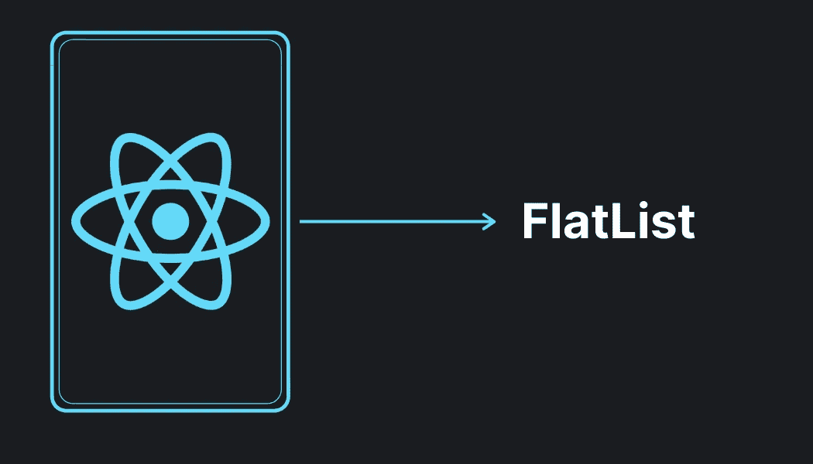
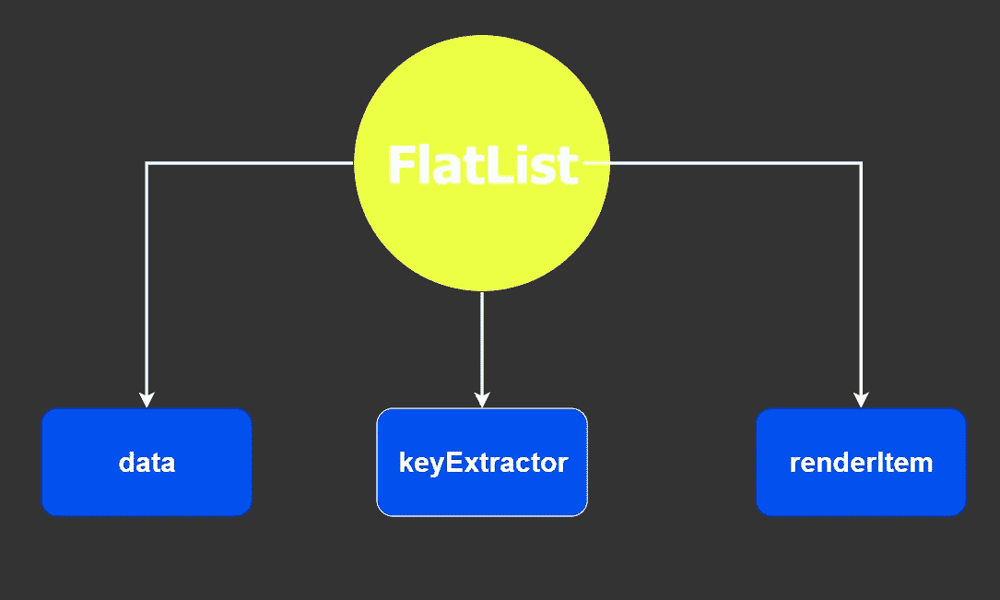
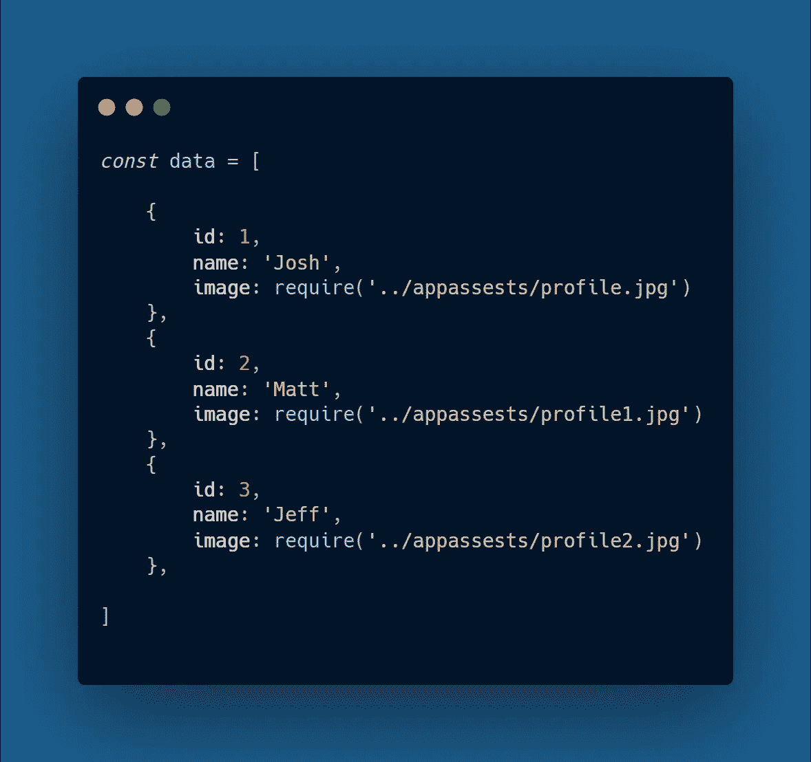
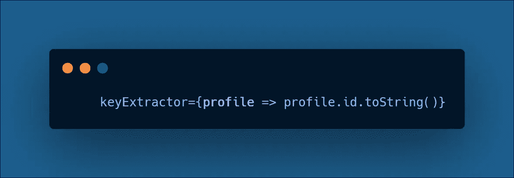
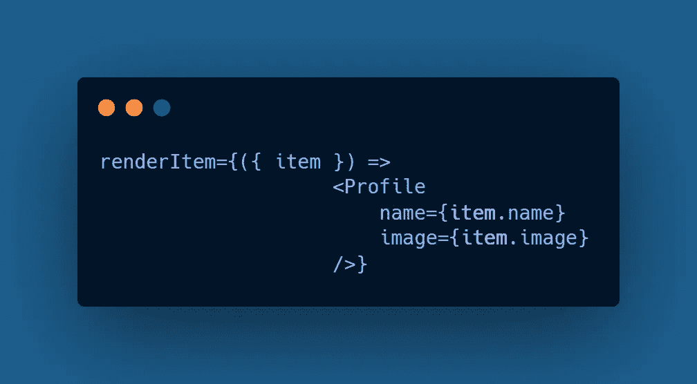
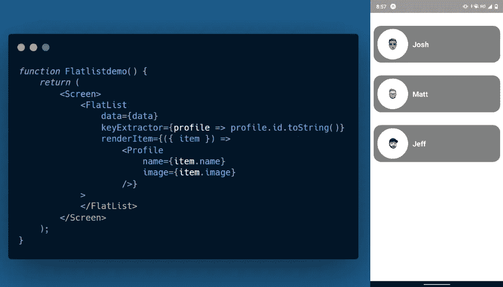
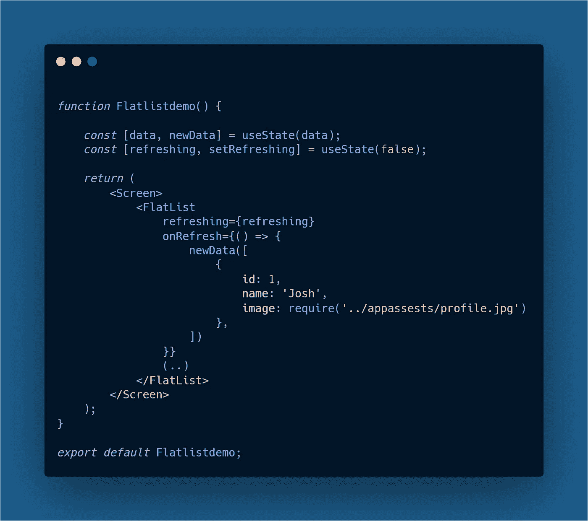
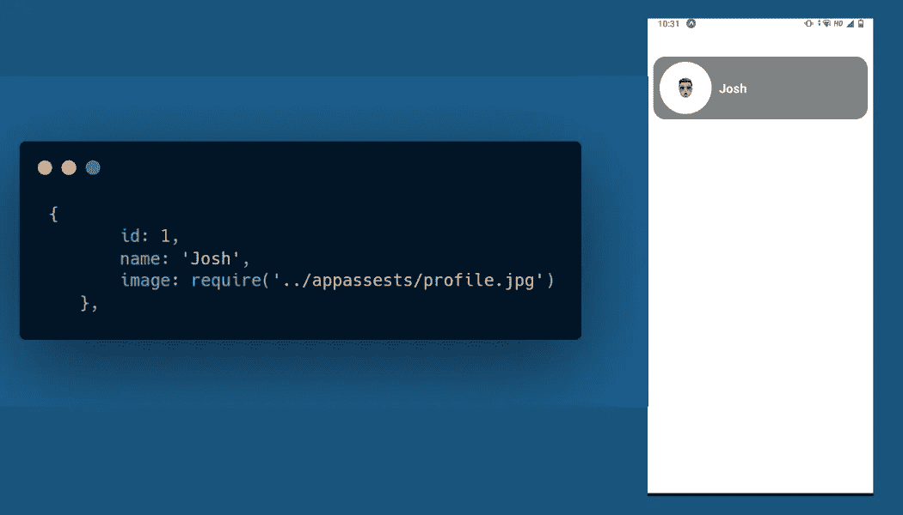
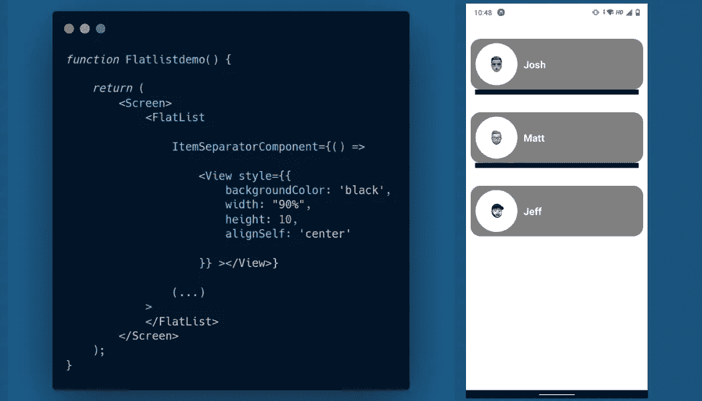
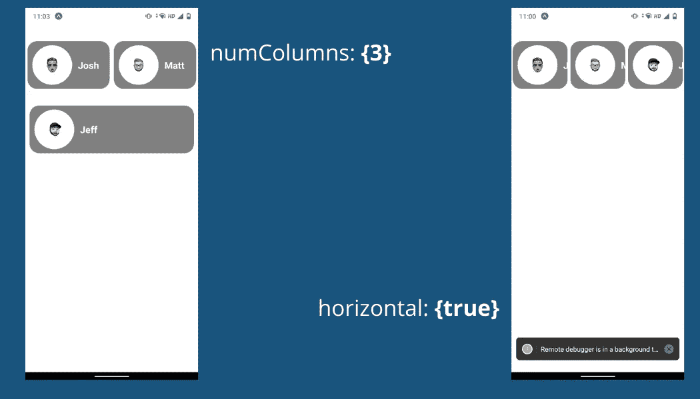

# 在 React Native 中使用 FlatList 组件

> 原文：<https://javascript.plainenglish.io/working-with-the-flatlist-component-in-react-native-c88fa2d3173c?source=collection_archive---------5----------------------->

## 在 React Native 中使用平面列表的最低要求

**FlatList** 组件是 ***React Native*** 中的核心组件之一，当涉及到在 FlatList 中渲染大量数据时，你必须记住很少的事情&为了学习如何使用该组件，我们将在演示中制作自己的 **FlatList** 组件。

在平面列表组件&中有很多**道具，我们将着眼于最少的道具数量来制作漂亮的平面列表组件。**

我们需要注意三个方面:

*   **数据:**简直就是一个普通的数组。
*   **keyExtractor:** 为指定索引处的给定项目提取唯一的键。
*   **renderItem:** 从数据中取出一个项目，并将其呈现到列表中。

## 数据

在 FlatList 组件中，我们需要将数据传递给**数据属性** &为了做到这一点，您可以简单地生成一个 **const** 并析构您的数据。例如，我在包含 FlatList 组件的函数组件之外定义了一个临时的**常量**。

*   id 属性将定义我们数据的索引，为了在平面列表组件中呈现任何内容，我们必须定义一个 id 属性，这样我们就可以安排在平面列表中呈现的项目的顺序。
*   **name** 属性只是一个**字符串值，我们稍后将在演示的 **Text** 组件中使用它。**
*   **image** 属性已经分配了 ***require*** 函数，该函数从我们的资产中传递 **Image** 组件中的图像。

## 密钥提取器

在我们将数据数组传递给 **FlatList** 组件之后，我们需要提供一个键值，它将负责确定我们的对象数组中的每个对象。例如，我有一个关键变量作为 profile，使用这个变量，我们可以在数据数组中使用分配的 id。

*请注意，您可以将* ***键*** *变量命名为任何您想要的名称，并且已经使用了****toString****方法来避免任何错误。*

## 渲染项目

当我们完成将键值和数据传递给我们的平面列表时，我们需要传递我们想要在平面列表中呈现的组件。

*   使用**项**值，我们可以将对象数组中的所有数据传递给任何其他组件。
*   注意 **Profile** 组件是外部的，我为这个演示用破坏的道具**构建(图像&名称)。**
*   你可以命名的项目价值任何你喜欢的。

在将这 3 个道具传递给我们的 FlatList 组件之后，我们获得了以下结果:

## 实施拉取刷新

拉刷新是渲染新项目的一个很棒的功能，要在 FlatList 中实现这个功能我们必须配置**刷新**&T6【onRefresh】道具。为了更好地理解，我们需要对代码做一些更改。

使用 **useState** 挂钩，我们定义了以下常量变量，我们将使用它来添加拉取刷新特性。

*   在 FlatList 组件中，我们必须传递两个值，才能使拉动刷新工作，**刷新** prop 是一个布尔值，使用 useState 挂钩将其设置为 false。
*   在 **onRefresh** 中，我们将传递新对象，该对象将在我们拉下 **FlatList** 后呈现。
*   函数 **newData** 负责更改 FlatList 中的对象值，因此现在我们下拉 FlatList 时，只有 id 为**1**的对象才会呈现。

因此，在我们的演示中，刷新 FlatList 时，仅呈现 Josh 的卡:

## ItemSeparatorComponent

使用这个道具，你可以在每个 FlatList 项目下面添加一个分隔符&为了实现这个，我们只需要传递一个自定义组件。

例如:在我们的演示中，我们添加了一个具有内联样式的视图组件。

## 水平和数量列

当我们必须在 FlatList 中水平和垂直呈现项目时，这两个支柱是非常必要的，两者都有自己的区别，并且可以很容易地实现。

**水平:**如果设置为 **true** ，则 FlatList 中的项目将以水平方式呈现，您也可以在该水平视图中滚动

**numColumns:** 此参数采用一个数字，该数字是 FlatList 用于以列呈现其项目的列数。

**numColumns & horizontal**