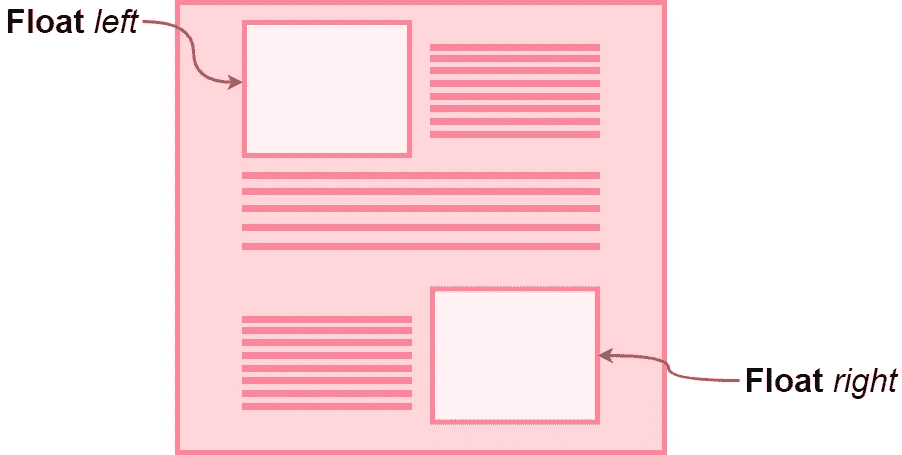
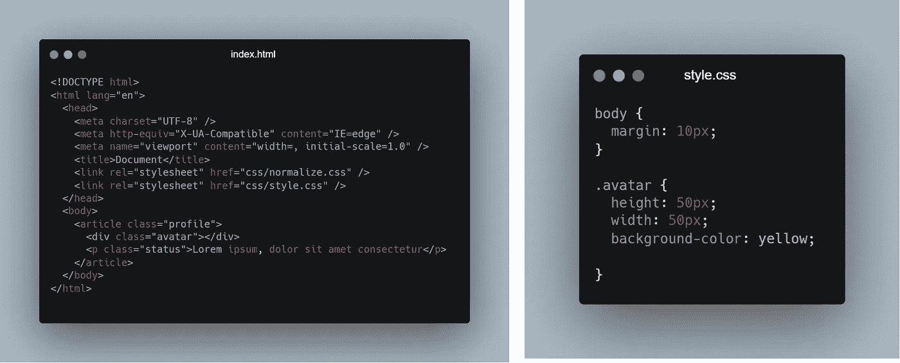
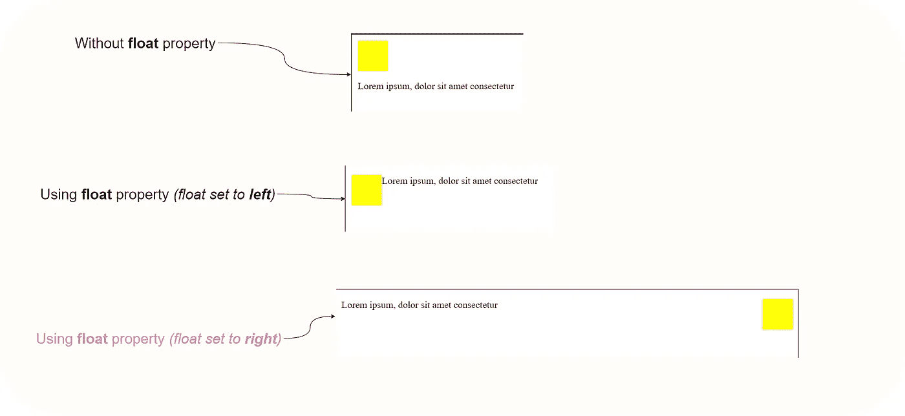
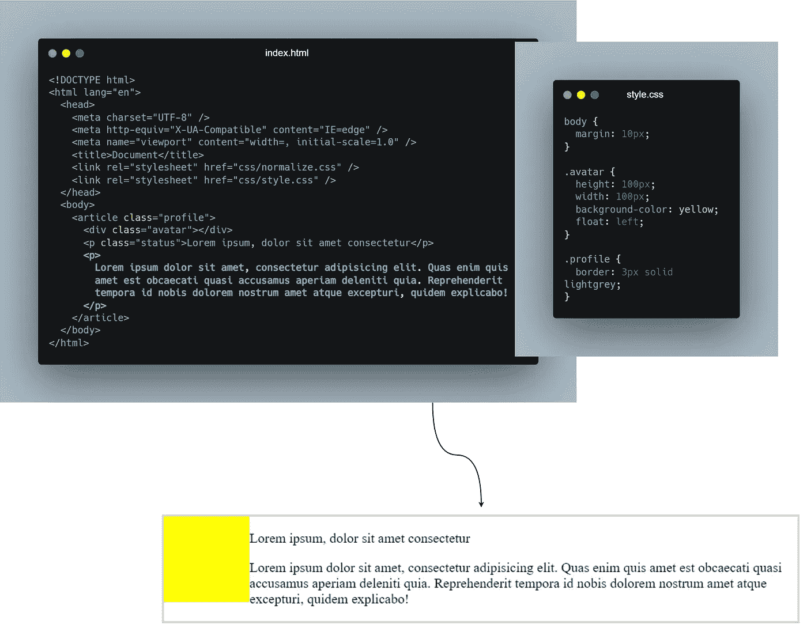
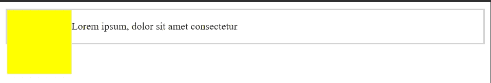
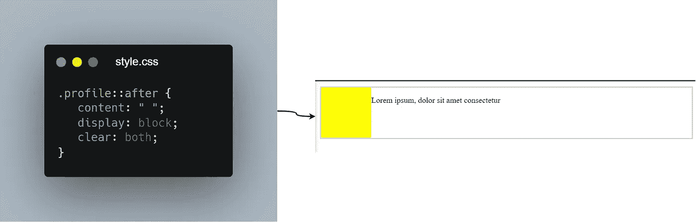

# 在 CSS 中使用 Float 属性

> 原文：<https://javascript.plainenglish.io/working-with-the-float-property-in-css-f73cf7525261?source=collection_archive---------8----------------------->

## 关于浮动元素你需要知道的一切

**float** 是一个 CSS 定位属性，在 CSS 中引入 Flexbox 后，开发者并没有真正使用 Float 属性，但仍然有数百万个网站使用 Float。如果你在维护这样的网站，你需要知道浮动属性。

为了理解浮动属性，您可以考虑一个打印布局，其中 ***图像*** 被设置到页面中，其中 ***文本*** 根据需要环绕它们。

> 类似地，在网页中，具有 CSS float 属性的元素就像打印布局中的图像，文本环绕在它们周围。

## 使用 Float 属性

可以像任何其他 CSS 属性一样使用 ***float*** 属性，在使用 float 属性时，请确保元素的层次结构正确，否则会太复杂。

***例如:***

*   我们有三个元素，一个**文章**，一个 **div** ，以及一个**段落**。他们的跟班为**简介**、**头像**、**状态**。为了使事情尽可能简单，我举了一个基本的*个人资料页面*布局的例子，这样你就可以更实际地联系问题。

*   此时，您可以观察到网页中的两个元素，基本布局为 ***块*** 元素，其中我们将 **div** ( *头像*)和**段落**(状态)元素对齐为块级元素。
*   然而，如果我们将**浮动**属性应用到我们的 **div** *(avatar)* ，所有的**文本**开始围绕 **div** 浮动，如下所示。

**Using the float property**

*   同样，如果我们将 float 值设置为**右**，则 ***div*** 移动到可用空间的右侧位置，所有的**文本**都围绕它浮动。

> ***注:*** *第三种情况下* ***正文*** *不在****div****附近，因为所有元素都是块级元素，占用了可能的空间。*

## 父折叠

使用浮动元素时，您必须面对的最大问题之一是 ***子*** 和 ***父*** 元素之间的折叠。由于父元素忽略了浮动元素，它们最终会折叠，结果，布局变得混乱。

***例如:***

*   假设我们在个人资料页面中添加了另一个段落元素。此外，我将一个 **3px 边框**应用到了 ***article*** 元素，这样可以清楚地理解问题。
*   此时此刻，布局没有任何问题，它看起来很好，没有问题。

*   但是如果我们移除多余的段落元素，我们会注意到父元素被折叠了。

**Parent Element (article) Collapses**

> 为了解决这个问题，我们有 3 个技巧，你可以用它来解决任何浮动元素的布局问题。

*   **Empty div 方法:**我们在 **parent** 元素后添加了一个空的 **div** ，但是我个人不推荐使用这种方法，因为它会降低 HTML 代码的语义，因为额外的 div 对于纯粹表示的页面没有上下文意义。
*   **溢出方法:**在这种情况下，我们将**溢出** CSS 属性应用于**父**元素，如果该属性在父元素上设置为 ***隐藏*** 或 ***自动*** ，那么父元素将展开以包含浮动。然而，这种方法有时会破坏语义 HTML 规则，我只推荐在个人项目中使用，而不是在生产级应用程序中使用。
*   **清除方法:**消除父折叠问题的最佳和最简单的方法之一是使用 CSS 中的 **clear** 属性。你只需要用下面给出的值来应用一个新的类。同样，你可以使用一个**伪选择器****(:after)*来清除浮动，而不是使用额外的类。*

**

***Using Pseudo Selectors***

* [## Docker 是如何工作的，为什么开发者需要它

### Docker 入门

javascript.plainenglish.io](/how-docker-works-why-developers-need-it-81b1eebaab5e)  [## 您应该订阅的 7 份编程简讯

### 作为程序员，你应该看看时事通讯

javascript.plainenglish.io](/7-developer-blogs-you-need-to-subscribe-as-a-code-newbie-b004ebc6dcf8)  [## 在 4 分钟内解释 4 个关键 CSS 属性

### 基本 CSS 入门

javascript.plainenglish.io](/4-key-css-properties-explained-in-4-minutes-9567d1b5af86) 

*更多内容请看*[***plain English . io***](http://plainenglish.io)*