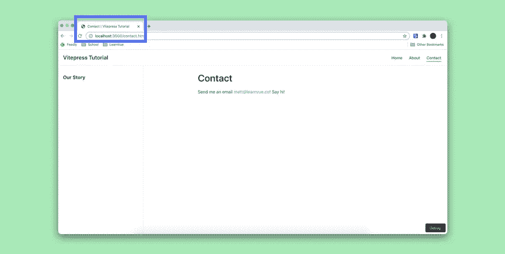

# 使用 Vitepress 快速编写漂亮的文档

> 原文：<https://javascript.plainenglish.io/write-beautiful-documentation-quickly-with-vitepress-a0cc4e6d25?source=collection_archive---------6----------------------->

任何将被其他开发人员使用的项目都需要一些惊人的文档。

对于任何文档来说，最重要的事情是得到良好的维护。

Vue 3 和新的 Vite 构建工具给了我们另一种方法。

**介绍 Vitepress。**

在这个快速教程中，我们将看到如何使用 Vitepress 快速为我们的 Vue 应用程序创建文档。

这是我们的应用程序结束时会有的内容。


激动吗？

我也是。让我们开始吧。

## 那么什么是 Vitepress 呢？

Vitepress 是一个构建在 Vite 之上的 Vue 驱动的静态站点生成器。

在其文档(使用 Vitepress)中被称为“Vuepress 的小兄弟”[，它比它的对手有一些优势。](https://vitepress.vuejs.org/)

*   基于 Vite 而非 Webpack，因此启动时间更快，热重装等。
*   使用 Vue3 减少 JS 有效载荷
*   轻量级

Vitepress 能够实现这些目标的一个原因是，它比 Vuepress 更有主见和更具体，而 vue press 在这些年变得更加复杂。

虽然它不打算完全取代 Vuepress 作为 Vue 的静态站点生成器，但 Vitepress 提供了一个轻量级的替代方案。对于像文档和简单网站这样的大多数项目，Vitepress 的特殊性和极简主义将使开发变得轻而易举。

## 好——让我们创建我们的 Vitepress 项目

要开始使用 Vitepress，我们首先要做的是创建我们的目录。

```
mkdir vite-hello-world
cd vite-hello-world
```

然后，我们希望初始化我们的包管理器并添加 Vitepress —对于本教程，我将使用`npm`。

```
npm init
npm i --save-dev vitepress
```

接下来，我们要将 Vitepress 脚本添加到 package.json 文件中。

```
"scripts": {
  "docs:dev": "vitepress dev docs",
  "docs:build": "vitepress build docs",
  "docs:serve": "vitepress serve docs"
},
```

好的——让我们打开`docs`文件夹，制作我们的第一个降价文件。

```
mkdir docs
echo '# Hello World' > docs/index.md
```

让我们运行我们的应用程序。

```
npm run docs:dev
```

我们已经创建了我们的网站！如果我们导航到`http://localhost:3000`，我们会看到我们的降价文件被呈现在网页上！


激动人心！让我们开始定制我们的网站，并使用更多的 Vitepress 功能。

## 定制我们的 Vitepress 网站

## Vitepress 导航

向 Vitepress 站点添加多个页面就像创建更多的 markdown 文件一样简单。

让我们在项目中创建几个页面和子目录——我们的`docs/` 目录现在应该是这样的。


当 Vitepress 创建我们的 SPA 导航时，它使用每个 markdown 文件的路径来创建一条路线。另外，任何文件夹中名为`index.md`的文件也可以被`/`引用。

例如，我们的文件结构转换为以下路径:

```
**## Routing!**

[docs/index.md](/) -> /

[docs/contact.md](/contact) -> /contact

[about/index.md](/about/) -> /about/

[about/our-story.md](/about/our-story) -> /about/our-story
```

在我们的降价文件中，我们有三种链接路线的方式。我们可以使用基本 url，添加`.md`或`.html`——所有这些都会正确地链接到正确的组件。

```
**### All these options work!**

[docs/contact](/contact) | 
[docs/contact.md](/contact.md) |
[docs/contact.html](/contact.html)
```


## 向我们的站点添加导航栏和侧边栏

Vitepress 给了我们一个很棒的默认主题。它很小，但功能强大，易于定制。

首先，让我们用侧边栏和导航条给我们的站点添加一些导航。

要做到这一点，我们需要创建一个配置文件——我们可以在一个`/docs/.vitepress/`文件夹中完成，这个文件夹将存放我们的 Vitepress 特定文件。我们的文件将被称为`./vitepress/config.js`，只需要导出一个 JS 对象。

```
module.exports = {
  title: 'Vitepress Tutorial', // appended to all page titles
}
```

在这个对象中，让我们添加一个名为`themeConfig`的属性，看起来像这样。

```
themeConfig: {
  nav: [

  ],
  sidebar: [

  ]
}
```

要向我们的导航栏添加元素，我们只需要向我们的`nav`数组添加格式为`{ text: 'ANCHOR-TEXT', link: 'PATH' }`的对象，让我们添加一个到我们的主页、联系人页面和关于页面的链接。

```
nav: [
  { text: 'Home', link: '/' },
  { text: 'About', link: '/about/' },
  { text: 'Contact', link: '/contact' }
],
```

添加到我们的边栏是完全相同的方式。让我们给一些标题添加链接。

```
sidebar: [
   { text: 'Our Story', link: '/about/our-story' }
]
```

回到我们的浏览器，我们现在可以看到 Vitepress 仅仅通过几行配置就生成了一个非常漂亮的导航栏和侧边栏。


我们可以用 Vitepress 侧边栏做的一件很酷的事情是根据我们所在的页面改变侧边栏。

假设我们希望我们的主页显示其标题，但我们希望所有其他页面显示我们刚刚制作的侧边栏。

我们要做的第一件事是创建并存储我们的`our-story`侧边栏作为一个变量。

```
const primarySidebar = [
  { text: 'Our Story', link: '/about/our-story' }
]
```

回到我们的`themeConfig`对象，我们想把我们的边栏改为一个对象，其中属性名是一个路径，值是一个边栏数组。

```
sidebar: {
  '/about/': primarySidebar, // everything in the /about/ subdirectory
  '/contact': primarySidebar, // contact page

  // we don't need to do anything to index
  // because the default sidebar is created via page headings
}
```

现在，如果我们查看站点，我们会看到我们的主页有一个不同于其他所有页面的侧边栏。

太棒了。

## Vitepress 中的内置元素

Vitepress 提供了对几个元素的支持，您可以在 config.js 中或者直接在 Markdown 中简单地在项目中声明这些元素。

在这里，我将只介绍一些我最常用的。[点击此处查看完整的元素列表。](https://vitepress.vuejs.org/guide/markdown.html)

## 代码块

当编写好的文档时，代码示例是至关重要的。Vitepress 提供了一种快速添加代码块的方法，还可以指定它使用的编程语言。

```
``` js
console.log('Hello World')
```
```


## 目录

添加目录是另一个让你的 Vue 静态站点容易导航的好方法

```
/docs/index.md[[toc]]
```


## Github 样式表

Vitepress 中的表格可能需要一点时间来适应，但是它的简单性和改变列对齐的能力使它很有价值。

```
| Headings      | Are           | Centered    |
| ------------- |:-------------:| -----:      |
| left align    | centered      | right align |
| zebra striped | rows          | easy        |
```


## 降价前沿配置

虽然我们可以用你的。/vuepress/config.js 为了创建站点范围的配置，有时我们需要对单个页面进行更多的控制。

令人欣慰的是，我们可以使用 markdown 文件顶部的 YAML 块来控制每个页面。Vitepress 让我们用三条虚线(`---`)包围这个块来声明它

例如，假设我们想更改标题，并从联系人页面中删除侧边栏。

```
---
title: Contact
---

**# Contact**
```

导航到我们的`https://localhost:3000/contact`–我们可以看到它工作了。



我们可以在这里配置许多不同的东西。[查看所有 Frontmatter 选项的文档。](https://vitepress.vuejs.org/guide/frontmatter.html)

## 部署您的 Vitepress 应用程序

我们已经看到，我们可以使用`npm run docs:dev`创建您的本地环境，但是如何构建您的生产应用呢？

首先，我们想要使用命令构建您的应用程序

```
npm run dev:build
```

默认情况下，构建输出将转到`/docs/.vuepress/dist`。我们示例中的 dist 文件夹如下所示。


然后我们可以将这个`dist`文件夹部署到我们想要的任何平台上。

如果我们想测试我们的构建是什么样子，我们可以运行 Vitepress 的 serve 函数来创建一个本地静态 web 服务器。

```
npm run docs:serve
```

## 结论

现在你知道了！

Vitepress 是确保你的文档保持最新的好方法。凭借其固执己见的设计，它为您维护静态站点提供了一种快速简单的方法。

我很想看看你对 Vitepress 的看法！

如果你有兴趣学习更多关于 Vue 3 的知识，下载我的免费的 Vue 3 备忘单，里面有一些基本的知识，比如组合 API、Vue 3 模板语法和事件处理。