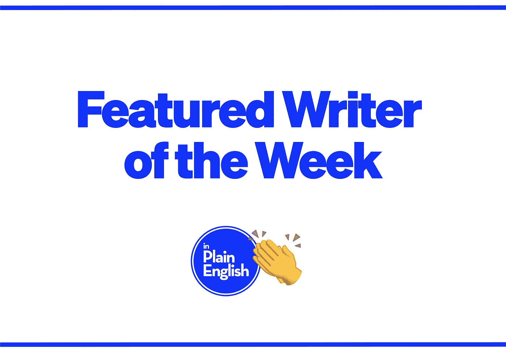

# 本周作家:弗洛里安·戈托

> 原文：<https://javascript.plainenglish.io/writer-of-the-week-florian-goto-851086f03c7d?source=collection_archive---------23----------------------->

*在这里的* [***说白了就是***](https://plainenglish.io) *，我们想利用尽可能多的方式来为我们敬爱的作家创作的优秀内容增加知名度。我们特别想奖励那些最近向我们的任何出版物提交了大量文章的作家。每周，我们都会选出一位作家来曝光。*

## 我们的本周作家是:[弗洛里安·戈托](https://gotoflorian-pro.medium.com/)🎉🎉

以下是他们上周的一些作品:

 [## 面向 JavaScript 开发人员的 TCP/IP 堆栈

### TCP/IP 协议组是当今最常用的网络通信模型。

javascript.plainenglish.io](/the-tcp-ip-stack-for-javascript-developers-fd59b5bb562d)  [## ES2015+ JavaScript 的惯用速记模式

### 你还在像 2014 年一样写 JavaScript 吗？

javascript.plainenglish.io](/idiomatic-shorthand-patterns-for-es2015-javascript-4f4c19ad5b12)  [## OWASP 的 Node.js 安全备忘单

### Node.js 应用程序开发过程中应遵循的最佳实践列表。

javascript.plainenglish.io](/nodejs-security-cheat-sheet-from-owasp-bbb4f143353f)  [## 从 OWASP 记录备忘单

### 介绍

javascript.plainenglish.io](/logging-cheat-sheet-from-owasp-9c23c58be67f)  [## JavaScript 开发人员的内容安全策略备忘单

### 介绍

javascript.plainenglish.io](/content-security-policy-cheat-sheet-for-javascript-developers-31e4804eff0c)  [## JavaScript 开发人员的传输层保护备忘单

### 介绍

javascript.plainenglish.io](/transport-layer-protection-cheat-sheet-for-javascript-developers-c45d5970bdf3)  [## JavaScript 开发人员的输入验证备忘单

### 介绍

javascript.plainenglish.io](/input-validation-cheat-sheet-for-javascript-developers-c883d875fc5a)  [## OWASP 的 NPM 安全最佳实践

### 在下面的 npm 备忘单中，我们将重点介绍 10 个 npm 安全最佳实践和生产力提示，非常有用…

javascript.plainenglish.io](/npm-security-best-practices-from-owasp-149568483d54) 

要想有机会在下周被特别报道，你所要做的就是向我们的四个出版物中的任何一个提交内容。你提交的内容越多，你就越有可能被关注。

有兴趣加入我们的写作团队吗？在这里了解更多**:**

* [## 如何用简单的英语写作

### 你对 JavaScript、Web 开发、软件开发、Python、AWS 或人工智能有热情吗？

javascript.plainenglish.io](/https-medium-com-javascript-in-plain-english-join-our-team-b0854ead7d14)*