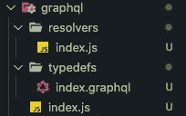
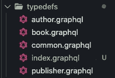

# 编写一个实际可扩展的 Node.js GraphQL 后端——完整的指南

> 原文：<https://javascript.plainenglish.io/writing-a-node-js-graphql-backend-that-actually-scales-a-complete-guide-part-1-setup-cddceae25bdc?source=collection_archive---------0----------------------->

## **第 1 部分:设置**

在网络开发领域，无论何时你要构建一个现代化的应用程序，你都有很多工具和框架可以选择来构建你的堆栈，通常，人们会拿走他们觉得舒服的任何东西，或者最新/流行的技术。

如果您以前经历过这种情况，您知道 GraphQL 是构建后端应用程序的一个流行的替代方案，您可能对它很感兴趣。

好吧，那时我很好奇，在用它进行了一些年和许多专业开发的项目之后，我可以向你保证，如果用正确的方法来做，GraphQL 是很棒的，这是我非常努力才弄明白的。


可能你已经知道了。有很多教程和 youtube 视频教你如何用 [GraphQL Apollo Server](https://www.apollographql.com/docs/apollo-server/getting-started/) 构建一个 Node.js 后端，也许你已经看过了。也可能不是。

本系列文章的最终目标不仅是向您展示如何以适当的方式从头开始构建，而且还向您展示如何扩展到实际的大型代码库。

尽管 GraphQL 已经证明自己是构建应用程序后端的成熟可靠的技术，但我认为它的流行程度并没有提高到应有的水平。人们仍然依赖旧的、但众所周知的 RESTful 模型 API，因为它仍然可用，而且他们通常认为 GraphQL 是一个过度工程化的解决方案，尽管人们对它的共识是积极的。


Source: [https://2020.stateofjs.com/en-US/technologies/](https://2020.stateofjs.com/en-US/technologies/)

似乎开发人员出于某种原因，并不真的喜欢构建 GraphQL 后端，但他们实际上喜欢使用它们。那么，我将在一系列文章中向您展示一种成功构建 GraphQL 后端的方法。

就拿这篇文章来说吧，当我开始使用 graphql 的时候，我可能就想拥有这篇文章。

## **你将学会如何……**

*   用 Express 从头开始使用 Node.js 来设置一个 Apollo 服务器(相信我，你会需要它)
*   构建查询结构，允许覆盖许多用例，同时仍然是可测试和可靠的
*   写指令
*   结构化并拆分代码，这样它就不会成为单个文件上的大块
*   以适当的方式对数据建模，并使用 ORM/ODM 将其连接到数据库
*   优化操作以避免使用 dataloaders 对数据库进行重复查询
*   通过架构使用和配置动态计算字段时要充分利用这一点

## **你不会学到如何……**

*   基本了解 GraphQL 类型和解析器。我会假设你已经知道这一点，但你想知道如何改进你的项目。本教程将面向初学者，但还有其他更好的资源来了解基元类型。
*   处理身份验证(这是针对另一篇完整的文章)
*   处理文件上载(与前一个相同)
*   林挺和代码风格(另一篇文章)
*   向您的模式和解析器添加测试(您知道…另一篇文章)
*   构建您自己的数据类型
*   部署

**注**:这部分教程之前的东西都可以在我的 [**公开回购**](https://github.com/ernestognw/graphql-backend/tree/part-1) 上找到

# **我们开始吧**

你要做的第一件事是创建一个新的文件夹并启动一个新的 npm 项目，你可以通过运行以下命令来完成:

```
mkdir graphql-backend
cd graphql-backend
yarn init -y
```

我们使用`-y`标志来避免配置设置，但是如果你想的话，你可以删除它。

对于本教程，我们目前将使用最新的 Javascript 语法，这将通过 [Babel](https://babeljs.io/) 来实现，这是一个 transpiler，它获取我们的 Node.js 现代代码并将其转换为与基本节点语法兼容的内容。我们不会深入研究它，但知道它的用途是很好的。

此外，要让热重载立即看到我们的应用程序中的变化，您可能需要添加 [nodemon](https://www.npmjs.com/package/nodemon) ，它将在每次更新时自动重启。

为了添加提到的工具，只需运行:

```
yarn add [@babel/core](http://twitter.com/babel/core) [@babel/node](http://twitter.com/babel/node) [@babel/preset-env](http://twitter.com/babel/preset-env) nodemon -D
```

*   **@babel/core:** 这是核心库
*   这将允许我们使用`babel-node`命令而不是传统的`node`命令来运行我们的代码。
*   最后，这是一个预置，包含了语言的最新添加，所以你不必担心手动添加新的语法

**重要提示:**如果您出于部署的原因计划创建一个生产构建(如前所述，我们没有涉及到这一点)，您应该添加`-D`标志，因此它们只是为开发环境添加的。

# **文件夹结构**

一旦你完成了我们的基本设置，你的文件夹中就有了基本文件(比如 yarn.lock 或者 package.json)。下一步是添加一个基本结构，我们将在未来对其进行扩展，但对于第 1 部分来说，这已经足够了:


我列出了将每个文件放在 graphql 文件夹之外的原因:

*   **index.js:** 我们正在根级别创建一个 index.js，这样我们就可以使用它来启动项目，由于我们的项目规模，这在目前是没有意义的，但是当我们开始添加数据库内容时，它将是有用的，并且在将来当您可能需要将 graphql 之外的额外功能添加到您的应用程序时，它将是有用的。
*   **app.js:** 这将是 express 应用程序的配置文件，我们将在 index.js 上初始化它
*   **config:** 配置文件夹有助于集中应用程序的一般设置，我们稍后还会对此进行扩展，但此时我们将创建一个环境文件夹来使用其中的环境变量。
*   **.env.*:** 我们的 env 文件将指定环境变量，使我们的应用程序在每个环境中表现不同，这取决于我们希望它如何工作。的。env 通过 **gitignore** 被忽略，而`.env.example`被保留以拥有所需环境变量的模板。如果你在团队中工作，这很有用
*   **。Babel RC:**Babel 的配置文件

现在有趣的部分是:在 graphql 文件夹中，我们将把我们的模式和解析器分离到文件夹中，因为我们将看到如何根据我们将要建模的资源把我们的代码分割到不同的文件中。这将允许你以一种舒适的方式发展你的代码库。

# 基本依赖关系

接下来，我们将添加我们的基本依赖项，以使我们的项目正常工作:

```
yarn add express apollo-server-express graphql [@graphql](http://twitter.com/graphql)-tools/schema dotenv
```

*   **express:** 它是一个极简的 HTTP 服务器，但是你可能已经知道了。我们使用它是因为**相信我。**在应用程序上实现不应由 graphql 处理的事情是有用的。通常，您需要为其他目的而不是数据访问公开端点，比如健康检查或身份验证。
*   **apollo-server-express:** 因为我们使用的是 express，所以需要使用 apollo 的 express 兼容版本。
*   **graphql:** 即使它没有直接用在我们的应用程序上，但它是几个库的对等依赖，所以你必须添加它。
*   **@graphql-tools/schema:** 我们将用它来构建和编译我们的模式
*   **dotenv:** 为了使您的应用程序适合在不同的环境下工作，您可能需要添加环境变量。我们将使用这种依赖性来读取它们

# 设置服务器

现在，在我们深入研究 graphql 文件夹配置之前，让我们只添加简单的代码来使我们的 express 应用程序工作。只需将下面的代码复制到相应的文件中，这样我们就可以有一个正常工作的 HTTP 服务器了。

首先，在 app.js 文件中创建一个基本的快速应用程序:

然后，用环境变量模板配置您的. env.example

现在，在中创建它的副本。env(记住这是隐藏的)，并根据需要进行配置。我正在添加我正在使用的设置:

然后，在 config/environment/index.js 文件中，读取这些环境变量，并导出它们。这是集中您的配置，然后在应用程序的不同组件上使用它的好方法:

现在，是时候配置您的。babelrc 文件，以便使用我们之前讨论过的预置-env

完成后，您只需在 index.js 上初始化您的应用程序

最后，将一个 npm 脚本添加到您的`package.json`中，这样您就可以运行整个程序了:


nodemon ./index.js — exec babel-node

然后，只需运行您的服务器并检查一切是否正常:

```
yarn dev
```

您应该会看到类似这样的内容:


# 设置我们的模式

至此，您已经有了运行 express(还不是 graphql)服务器的基本设置，您可以使用它来配置将来可能需要的主要内容。尽管看起来有很多文件夹和文件，但只要我们继续构建我们的应用程序，它就有意义。

从现在开始，我们将深入到在 graphql 文件夹中创建我们的 graphql 服务器的细节，但最终，我们将在未来添加一些额外的文件夹来连接我们的数据库，但现在，让我们解释我们将如何准备我们的 graphql 文件夹结构以正确伸缩。

首先，我们需要在 graphql/index.js 中准备好我们的 Apollo 服务器:

您会注意到我们正在使用从集中式环境中导出的 env 变量。这就是它的好处。您希望根据未来的环境定义不同的行为。在这种情况下，我们锁定了操场，只让它在我们的开发环境中工作。

另外，根据[官方 apollo 文档](https://www.apollographql.com/docs/apollo-server/getting-started/#step-3-define-your-graphql-schema)，你会发现我们需要一个由两个主要事物定义的模式:

*   **Typedefs** :我们数据的形状
*   **解析器**:数据计算和返回的方式

嗯，通常教程会解释如何配置这两个家伙，但我们会更进一步，将他们分开，这样我们就可以从一开始就有一个组织良好的代码库。



正如您之前看到的，我们在 graphql 主文件夹中定义了两个文件夹。这两个将帮助我们划分我们的代码。但是首先，让我们来看看我们要建模的数据:

## 建模数据


Entity-Relationship model

这是典型的图书作者示例的扩展版本，但是这里有一些额外的小东西，我们将在将来使用它们来涵盖更深层次的概念。

让我们看看，总的来说，我们的主要实体是:

*   出版者
*   作者
*   书

`WorksAt`实体不会通过 graphql 公开，因为它只是一个弱实体，它的存在只是为了创建多对多的关系，所以我们不会将它视为模式中的可查询字段。

## Typedefs

现在我们对数据是如何形成的有了很好的理解，让我们开始在下面不同的文件中创建我们的 typedefs:



您将看到，我们为要建模的每个实体都准备了一个. graphql 文件，以及一个`index.graphql`和一个`common.graphql`。我们将使用`index.graphql`来保存我们的根定义(理解为查询和变异)以及其他与特定实体相关的类型。`common.graphql`用于通用类型。

在我们的`index.graphql`上，我们将填写以下内容:

你会注意到`Date`标量。这必须声明，因为它不是 graphql 的本机类型，但是它包含在@graphql-tools 中，并且它将只使用这个声明。

**注意**:我们不会处理删除操作，因为这会产生其他数据可靠性问题，我们可以用不属于本教程范围的技术来解决这些问题。

现在，让我们用缺失的数据类型填充我们的实体 graphql 文件:

在我们的`common.graphql`中，我们将定义一个应用于每个实体的接口，因为每个实体都有相应的时间戳。

对于我们的作者，我们将定义数据库中指定的名称和 id 的类型，以及时间戳接口。此外，我们会将此事与出版商联系起来，但我们会看到如何在未来解决这种关系

对于我们的书来说，非常简单。与作者的关系要简单得多，所以我们可能会在以后处理这个问题。

最后，出版商和作者的情况差不多:

现在，我们将整个模式分成不同的文件。现在的问题是，*我们如何将所有这些放在一起？*

我们将创建一个脚本来处理 typedefs 模式中的每个文件。这将允许我们创建我们所拥有的模式的最终版本，以构建单个模式。

转到您的项目，在`graphql/index.js`文件旁边创建一个`schema.js`，我们将在这里处理所有内容:


在其中，我们将使用节点文件系统实用程序来读取文件的名称，然后将它们转换为一个字符串，连接它们，最后使用@graphql-tools/schema 将它们放在一起。

## 下决心者

至此，我们已经完成了 typedef，但是我们需要使用 resolver 函数用数据填充这些 typedef。这些将被构建在`resolvers`文件夹中我们正在解析的实体名称的子文件夹中。因此，让我们创建以下结构，然后，我们将深入探究这样组织信息的原因:


您会看到每个文件夹都有相同的结构，这就是为什么:

*   **index.js:** 我们将在以后使用这个文件挂载代码来解析这个单独的实体。当我们优化查询时，您可能会发现这很有用。现在，它将只公开来自突变和查询文件的默认导出。
*   我们将把每个解析突变的函数放在这里
*   我们将把每个解析查询的函数放在这里

关于每个文件的内部外观，这里有一个作者文件夹的示例:

queries.js:

mutations.js:

索引. js

请注意，此时我们甚至没有解决任何问题。这是因为我们将在下一篇文章中用实际的数据库数据填充数据。

从现在开始，我想如何填充剩余的文件会很清楚，所以我让你来做。

将所有这些分割成文件的主要原因是因为我们的目标是拥有一个可伸缩的应用程序。所以，即使看起来一切都是分离的。我向您保证，这将使您的代码正确地组织到与主题相关的文件中，并为将来的扩展提供足够的空间。

最后，让我们将这些解析器合并成您的`graphql/resolvers/index.js`文件中的一个对象。

现在，我们只需将解析器添加到我们的`graphql/schema.js`文件中，这样它们就可以一起工作了

然后，使用这个全新的模式，并将其添加到您在`graphql/index.js`的 Apollo 服务器中

最后，只需将 express 服务器作为中间件添加到 apollo 服务器中:

如果一切正常，您将在终端上看到和以前一样的消息，但是您实际上可以在`http://localhost:3000/graphql`检查您的模式:


请注意，如果此时请求数据，将会出现错误，因为解析器无法解析并返回您请求的任何内容，但是我们将在下一篇文章中解决这个问题。

# 包裹

在本教程的第 1 部分中，我们将:

*   为节点项目创建了一个基本设置
*   为了使用现代语法，增加了对巴别塔的支持
*   创建了一个配置文件来读取环境变量，因此我们可以根据配置使用它们来管理不同的行为
*   设置基本 express 服务器
*   使用我们的 express server 作为中间件，设置一个 graphql 服务器
*   模型化数据
*   定义了一个模式，为我们在一组组织良好的文件夹和文件中建模的数据提供服务
*   将每个文件合并到我们的主模式中

请记住，在这一点上的一切都可以咨询和审查到我的整个系列的公开回购中，[你可以在这里找到](https://github.com/ernestognw/graphql-backend/tree/part-1)。

[第二部分此处](https://js.plainenglish.io/writing-a-node-js-graphql-backend-that-actually-scales-bd5b3411b293)

*   在社交媒体上关注我: [@ernestognw](https://www.instagram.com/ernestognw/)

*阅读更多尽在*[***plain English . io***](https://plainenglish.io/)