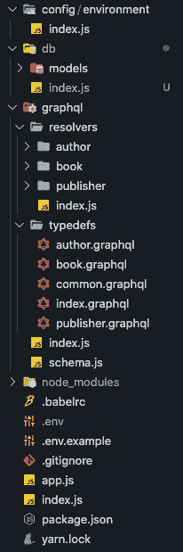
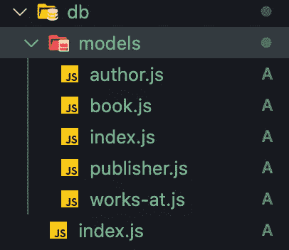
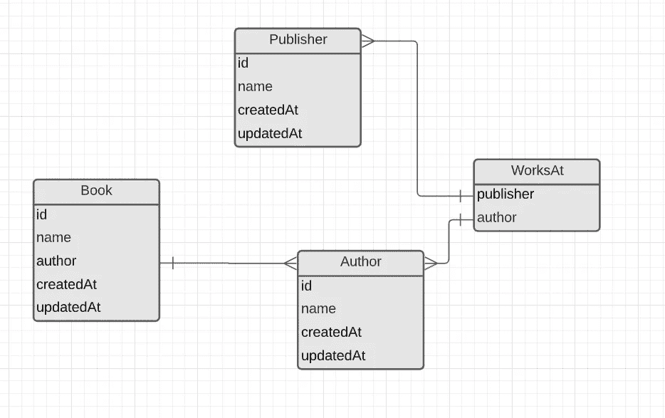
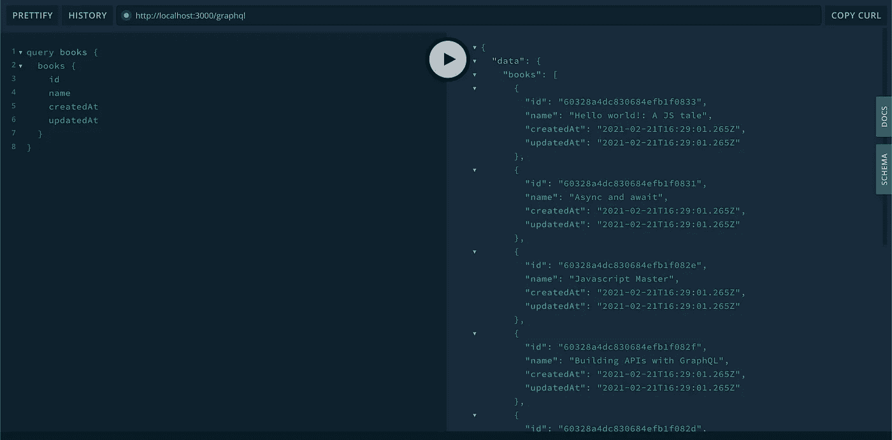
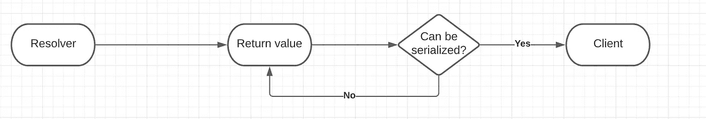
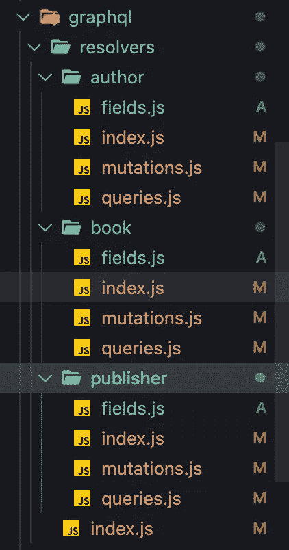

# 编写实际可伸缩的 Node.js GraphQL 后端

> 原文：<https://javascript.plainenglish.io/writing-a-node-js-graphql-backend-that-actually-scales-bd5b3411b293?source=collection_archive---------2----------------------->

## 第 2 部分:数据库和关系、ODM/ORM 和字段解析器

如果你还没有参加本教程第一部分的学习，我强烈建议你参加。尽管您将在这里看到的内容可以很容易地应用于每个 Node.js GraphQL 项目，但我将假设您有一个与我们在上一部分中构建的文件结构和模式相似或相同的文件结构和模式。


也就是说，让我们把之前构建的 GraphQL 服务器变成一个真正有用的服务器。

为了让我们的数据发挥作用，我们必须做的第一件事是选择一个数据库，为了简单起见，我将选择 [MongoDB](https://www.mongodb.com/) 。尽管这是一个 NoSQL 数据库，但我将把示例和模式附加到一个关系方法中，这样您就可以将同样的想法移植到您喜欢的任何数据库中。

因此，在我们开始之前，请将[mongose](http://mongoosejs.com/)添加到您的 repo 中，这是一个非常好的用于 MongoDB 的 ODM，它将帮助我们建模和访问我们的数据库。

```
yarn add mongoose
```

**注意:**安装并运行 MongoDB 是一个先决条件，但是，因为您可以自由选择任何您想要的数据库，所以我不会讨论 MongoDB 的安装。你也可以在这里查看。

# 连接我们的数据库

你记得我们的`index.js`文件吗？嗯，它本来是用来初始化的中心点。在本例中，我们将在初始化服务器之前，在同一个文件中初始化我们的数据库，这样数据可以立即可用。

让我们首先创建一个连接到数据库的实用程序，遵循为与应用程序域相关的所有内容创建一个文件夹的相同方法。之前我们创建了两个:`config`和`graphql`。现在，出于显而易见的原因，我们将创建一个名为`db`的文件夹。



我们还在我们的`db`文件夹中创建了另一个`models`文件夹，所以我们可以在其中建模我们的数据。现在，请将以下脚本添加到 index.js 中，以连接到我们的数据库:

您可能会看到从我们的配置中导入了一个新的环境变量。现在，它会抛出一个错误，因为它是不可用的，但我们稍后会修复它。

这个脚本的目的是创建一个到我们数据库的连接，但是对于保存我们记忆的连接是有用的，所以如果你使用它从另一个文件(比如种子或测试)连接，它不会创建另一个到数据库的连接。

如上所述，我们将在 index.js 中使用它:

如果您启用了您的服务器，您可能会看到一个错误，因为 mongoose 不知道如何连接到您的数据库，因为我们没有提供 URI 字符串来这样做。

让我们用`ctrl + c`关闭我们的服务器，并添加我们的环境变量(别忘了也把它放到你的`.env.example`文件中)

然后，使用它并将其从您的环境配置文件中导出:

现在，用`yarn dev`重启你的服务器，如果一切正常，你会看到你的服务器和数据库的连接。

# 为我们的数据建模

你注意到我们在`db`文件夹中放了一个`models`文件夹。嗯，这是您创建模型的地方。

创建一个 index.js，将其用作默认的导出文件，这样我们就可以像这样做:

```
import { Book, Author, Publisher } from 'your/models/path'
```

然后，为我们需要的每个模型创建一个文件。请记住我们在上一篇文章中展示的数据库图表。如果你想记起来，你应该这样做:



我们的 index.js 应该是这样的:

作者模型:

书籍模型

发布者模型:

最后但并非最不重要的一点是，我们与出版商和作者的联系很弱:

正如您可能已经看到的，mongoose 模式上的 timestamps 选项自动创建和管理 createdAt 和 updatedAt 字段。所以你不需要照顾它。

看看模式中的每个关系都有一个指向另一个模型名称的`ref`属性。这样做是为了让 mongoose 能够在内部知道如何创建表之间的连接。尽管我们不会在本教程中使用它们(因为它们只在我们调用时使用。在我们的模型中， [populate](https://mongoosejs.com/docs/populate.html) ()总是拥有它们是很有用的，所以我们最终可以使用 populate 来消费解析器中的关系数据。除非您在这里或者在每个单独的。填充您制作的。

除此之外，您应该很容易看到模型与我们之前定义的 typedefs 的对应关系。

# 解析数据

如果你已经走了这么远，太好了！您已经准备好开始向 GraphQL 服务器添加真正的功能，我们将从完成解析器开始。

首先要考虑的是，解析器有 3 个参数，允许我们构建解析器内部需要的规则，这 3 个参数是:

*   **父:**这是前一个解析器的结果，我们通常在主解析器中忽略这一点，因为前一个解析器是查询/变异定义，在第一级没有用。但是，假设您需要在 Book 内部创建一个解析器来计算它拥有的“兄弟”(相同作者的书籍)的数量。好吧，你会在这个参数中收到书本身。在那里，您可以使用它来构建另一个数据库查询，以满足请求或您想要的任何东西。
*   **Arguments:** 这是您从客户端提供给解析器的参数列表，显然，您可以使用它们来创建基于所提供参数的查询。
*   **上下文:**上下文就像一艘沿着解析器航行的宇宙飞船，它携带着可能对您使用很重要的数据，比如身份验证，或者在我们的例子中，数据定位器，我们将在下一篇文章中看到。


解析器是提供给模式的一个对象，它们表示类型和它们的字段，所以我们告诉模式*如何解析*一个类型中的特定字段，它们看起来像这样:

```
{
  ...
  Query: {
    field: (parent, arguments, context) => {}
  },
  Mutation: {
    field: (parent, arguments, context) => {}
  },
  AnyOtherType: {
    field: (parent, arguments, context) => {}
  },
  ...
}
```

乍一看，你可能会注意到我把`AnyOtherType`放在那里，还有常见的`Query`和`Mutation`。这是故意放在这里的，让你想知道它为什么会在那里。我们将在以后开始使用场分解器时讨论它……记住它们就行了。

所以，也就是说，让我们填写作者的解析器，然后，我会让你自己做下一个。而且，如果你有问题，记得有一个[公共回购](https://github.com/ernestognw/graphql-backend/tree/part-2)在那里你可以检查在这个特定的部分所做的一切。

`graphql/resolvers/author/queries.js`:

在完成我们的突变之前，让我们再看一下我们的数据库图表:



我们还没有考虑如何通过我们的 GraphQL 模式建立 WorksAt 关系。这是因为通常情况下，我不喜欢直接通过模式暴露脆弱的实体，但这是我的个人偏好，如果你愿意，你可以用另一种方式，但我强烈推荐以下解决方案:

虽然 WorksAt 是一个弱实体，因为它只服务于关联出版商和作者的目的，但它非常适合将这种关系附加到关系的一侧，例如，在本教程中，我们将认为每个 WorksAt 操作都是作者的操作，在自然语言中，您可以看到这好像我们从作者的角度谈论 WorksAt，类似于“将作者与他们的出版商相关联”。

当关系中有额外的信息时，例如角色，这尤其有用。在那里，您可以询问用户在特定出版物中的角色。

记住这一点，让我们在 GraphQL 模式中添加一个额外的查询 typedef `addAuthorToPublication`:

然后，让我们在`graphql/resolvers/author/mutations.js`中为作者添加突变:

我会让你完成剩下的，你只需要复制已经为作者提供的解决方案，并相应地进行修改。

> 一如既往，如果你想检查我做了什么，去[回购](https://github.com/ernestognw/graphql-backend/tree/part-2)。

# 播种数据

为了继续，我们需要一些数据来处理，所以，我将为您提供一个种子脚本，所以您不需要担心数据。在你的`db`文件夹中创建这个文件，在一个新的文件夹中，名为`scripts`:

然后，您可以将以下脚本添加到您的`package.json`中:

```
"db:seed": "babel-node ./db/scripts/seed.js"
```

然后，运行:

```
yarn db:seed
```

你的数据库里会有这些数据。每当您想要重新启动数据时，都可以重复此操作。

现在，我们上 [http://localhost:3000](http://localhost:3000) 开始查询一些数据:

```
query books {
  books {
    id
    name
    createdAt
    updatedAt
  }
}
```



您会注意到您的数据现在是可用的，但是如果我们试图请求我们的模型的连接关系呢？例如，请求一本书的作者，比如:

```
query books {
  books {
    id
    name
    createdAt
    updatedAt
    **author {
      id
      name
    }**
  }
}
```

由于您的模型不能自动填充关系，您将会遇到一个错误，因为解析器试图返回 author 字段中的 id，而不是一个对象。

为了解决关系，我们需要利用 GraphQL 字段解析器…

# 关系和字段解析器

在使用 REST APIs 时，建模关系的方法是选择在数据服务器端填充一个深度级别，或者只是返回 id，这样客户端就可以构造另一个查询来完成数据。

```
// Server-side populated data
[
  ...
  {
    "id": "60328a4dc830684efb1f0833",
    "name": "Hello world!: A JS tale",
    "createdAt": "2021-02-21T16:29:01.265Z",
    "updatedAt": "2021-02-21T16:29:01.265Z",
    "author": {
      "id": "60328a4dc830684efb1f082b",
      "name": "Cynthia"
     }
   },
  ...
]// Only id returned
[
  ...
  {
    "id": "60328a4dc830684efb1f0833",
    "name": "Hello world!: A JS tale",
    "createdAt": "2021-02-21T16:29:01.265Z",
    "updatedAt": "2021-02-21T16:29:01.265Z",
    "author":  "60328a4dc830684efb1f082b"
   },
  ...
]
```

这两种选择都有明显的缺点。在第一个解决方案中，您正在做所谓的*过度提取*，这意味着无论您的客户端需要什么，您总是在填充关系，因此，以一种可能不必要的方式影响性能。

另一种解决方案意味着您正在进行所谓的*欠填充，*这意味着您永远不会填充关系，然后，您的客户端必须收集那些引用并创建另一个请求来填充数据，这导致了一系列串联查询中的最坏情况。

众所周知，GraphQL 可以避免这个问题，但是，它到底是如何做到的呢？

## 展示现场解析器

每当你向 GraphQL 返回一个东西时，它会试图解析它，直到它达到一个不可序列化的值，这意味着，任何可以在 JSON 中返回的东西。例如，如果在解析器中返回一个承诺，GraphQL 将一直等待，直到该承诺被解析，无论从该承诺返回什么，都会尝试再次序列化，如果是另一个函数或承诺，则重复该过程。



对我们来说，这意味着我们可以返回函数来解析模式树中的下一个值，最棒的是 **GraphQL 不会尝试解析客户端没有请求的字段，**这太棒了，因为我们可以利用这一优势对关系进行建模，使解析器自动适应客户端的任何请求。

例如，在我们的《解析器》一书中，我们可以这样做:

看看我们如何在`books.author`中返回一个函数。这只有在客户端请求特定字段时才会执行，但问题是我们必须对每个返回一本书的解析器重复这一操作，而这并不是我们想要实现的可伸缩性。这是场分解器进入场景的地方。

**注意:**我们不打算保留之前要点中的书籍解析器，所以，你可以把它恢复到原来的状态。

你还记得当我们谈论解析器时，我放回的`AnyOtherField`吗？这就是奇迹发生的地方。

**字段解析器**允许我们为特定类型中的特定字段定义解析器。在 book 示例中，我们可以提供一个函数来解析 author 字段，告诉我们的模式在`Book`中有一个名为`author`的字段，我们会处理它。类似于下面的形状:

```
{
  ...
  Query: {
    field: (parent, arguments, context) => {}
  },
  Mutation: {
    field: (parent, arguments, context) => {}
  },
  **Book: {
    author: (parent, arguments, context) => {** // Hi GraphQL, 
      // this fields is something you can't handle naturally. 
      // So we'll take care of it. **}
  },**
  ...
}
```

这很棒，因为我们不必关心在每个返回一本书的解析器中返回一个函数，我们只需要声明一个字段解析器，GraphQL 就会知道为了填充那个字段，它需要调用我们的自定义函数。

转到您的`resolvers/index.js`文件并添加:

我们刚刚在 Book 下添加了一个新的字段解析器，它返回一个承诺，返回我们正在搜索的作者。看，我们使用解析器的父参数**，**，这意味着当它被执行时，父参数就是书本身，所以我们可以将作者从 id 转换成实际的对象。

现在，无论您只请求一本书还是许多书，您都可以填充作者的数据，而无需在每个解析器中处理这些数据。这甚至适用于你要还书的突变(比如说`createBook`或`updateBook`)

# 重组字段解析器

接下来，我们将把这些字段解析器传递到相应的文件夹，这样我们就可以(再次)做好一切准备。

让我们在每个解析器文件夹中创建一个`fields.js`文件，这样我们可以将字段解析器放在那里，然后将其导出并合并到`resolvers/index.js`中



让我们用我们已经拥有的内容填充图书字段:

现在你有了概念，我将挑战你从出版商到作者的关系建模，反之亦然。**提示:**您可以查询 WorksAt 模型，然后返回关系的元素。

如果你想知道怎么做，我给你看:

最后要做的是将它们从各自的`resolvers/<entity>/index.js`中重新导出，并将它们添加到主解析器索引文件中，如下所示:

如果你想测试这一点，你可以去操场开始玩数据。您会注意到，您可以请求任何深度的数据，如下所示:

```
query authors {
  authors {
    id
    publishers {
      id
      authors {
        id
        publishers {
          authors {
            id
            publishers {
              id
              authors {
                id
                publishers {
                  id
                }
              }
            }
          }
        }
      }
    }
  }
}
```

尽管可能需要几秒钟才能完成，但您可能认为这会导致性能问题，您是对的，但是我们将在本系列的下一部分解决这个问题。

# 包裹

在本教程的第 2 部分中，我们将:

*   增加了对 ORM/ODM 的支持
*   使用我们的 ORM/ODM 根据我们的 GraphQL 模式对我们的数据建模
*   创建 seeders 来用测试数据填充我们的数据库
*   了解了解析器的工作原理
*   为查询和突变创建了解析器
*   了解了数据实际上是如何从 GraphQL 返回的
*   添加了字段解析器来完善模型之间的关系

请记住，在这一点上的一切都可以咨询和审查到我的整个系列的公开回购中，[，你可以在这里找到](https://github.com/ernestognw/graphql-backend/tree/part-2)。

*   在社交媒体上关注我: [@ernestognw](https://www.instagram.com/ernestognw/)

[此处第 3 部分](/writing-a-node-js-graphql-backend-that-actually-scales-d20c920a4494)

*详见*[***plain English . io***](https://plainenglish.io/)