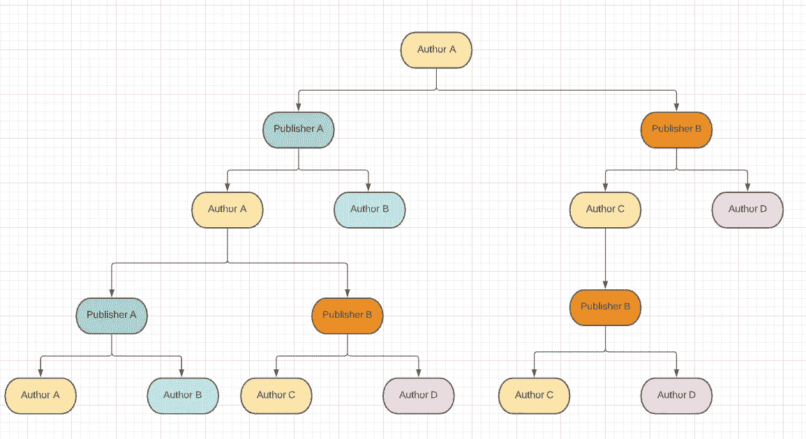
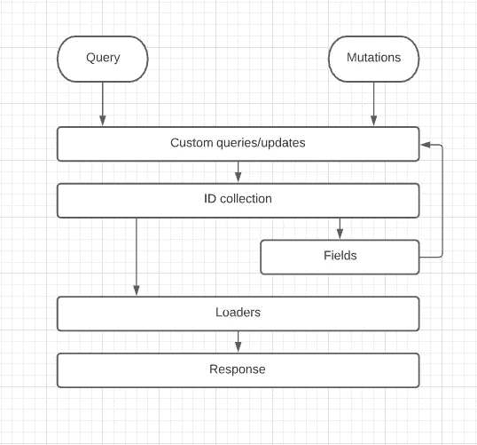

# 编写实际可伸缩的 Node.js GraphQL 后端

> 原文：<https://javascript.plainenglish.io/writing-a-node-js-graphql-backend-that-actually-scales-d20c920a4494?source=collection_archive---------4----------------------->

## 第 3 部分—分页和数据加载器

如果你到了这一步，恭喜你！到目前为止，您已经拥有了一个功能完整的服务器，它通过 GraphQL 在最后一节上公开数据。但是，如果你想扩展你的应用，你还需要学习更多，小学徒。


如果你是随机来到这里的，我鼓励你查看一下本教程的[第一部分](/writing-a-node-js-graphql-backend-that-actually-scales-a-complete-guide-part-1-setup-cddceae25bdc)和[第二部分](/writing-a-node-js-graphql-backend-that-actually-scales-bd5b3411b293)，这样你也许能够理解我们在谈论什么，尽管这些知识可能适用于任何用相同堆栈编写的后端。


为了继续我们此刻已经构建的内容，您应该还记得我们创建了允许 GraphQL 在数据库中从实体到实体进行无限连接的关系。

这正是我们想要的，但它有一些问题，如何大和沉重的操作可能会得到，我们将需要应用一些额外的策略来解决这个问题。

开始之前，请记住，我们在这里看到的一切都是公开的[在主回购](https://github.com/ernestognw/graphql-backend/tree/part-3)这里

让我们首先了解如何改进 GraphQL 模式与数据加载器之间的关系

# 数据加载器

[Data Loader](https://www.npmjs.com/package/dataloader) 是 npm 的一个库，它为您提供了一个对不同数据源进行批处理请求的实用程序，允许您通过避免重复请求来提高 GraphQL 应用程序的性能。

用他们自己的话说:

> DataLoader 是一个通用实用程序，可用作应用程序数据提取层的一部分，通过批处理和缓存为各种远程数据源(如数据库或 web 服务)提供一个简化且一致的 API。

为了理解为什么这对我们很重要，让我们看一下之前的查询:

```
query authors {
  authors {
    id
    publishers {
      id
      authors {
        id
        publishers {
          authors {
            id
            publishers {
              id
              authors {
                id
                publishers {
                  id
                }
              }
            }
          }
        }
      }
    }
  }
}
```

这里发生的情况是，每当我们更进一步，我们将不得不重新查询数据来填充关系，但是，如果数据已经被请求了呢？我们怎么知道呢？更重要的是，如何进行优化？

假设我们的数据库中有以下关系图:



这个图表示的操作是一个作者查询，在这个查询中，我们请求它的出版商、这些出版商的作者，然后是这些作者的出版商，等等…你明白了。

类似于我们对运行的查询所做的，这是填充结果树，结果树可能会呈指数级增长。问题不在于规模本身，而在于我们所做的操作。

我把相同的颜色放在重复的记录上，这样你可以看到我们有多少重复的数据。所以，每次我们请求 GraphQL 填充一个关系，你都要再次查询你的数据库来得到你已经在内存中的结果。如果有某种缓存来检查我们在启动查询之前是否已经填充了一些数据，这不是很神奇吗？

这就是数据加载器的好处。

它获取一组键(id ),将它们存储在缓存中，一旦我们的查询到达末尾，DataLoader 就运行一个查询来获取提供的每个键的相应结果，然后填充空白区域。

要添加它，只需:

```
yarn add dataloader
```

# 用数据加载器填充上下文

还记得每个解析器的第三个参数吗？上下文？太好了！

它将用于为我们发出的每个请求创建数据加载器，但是，等等，我们是在为每个请求创建加载器吗？是的。

原因很简单。每个加载器都有一个缓存，一旦某些数据发生变化，这个缓存就需要失效，否则，加载器将返回它第一次被请求时收到的相同记录，而没有数据的新变化。

建议创建加载器来完成请求，然后删除它们，这样下一个查询可能会再次准确。出于这个目的，我们需要一些可以传送到每个解析器的东西，这样它就可以为 GraphQL 模式中的每个实体携带一个加载器，这就是上下文。

根据 [Apollo Docs](https://www.apollographql.com/docs/apollo-server/api/apollo-server/#context) 的说法，上下文是*一个对象或一个创建对象的函数，*所以我们可以提供一个函数来创建我们的请求加载器，然后在对象内部传递它们

让我们在 graphql 文件夹中创建一个`context.js`文件，这样我们可以添加一些代码来填充`graphql/index.js`中的 ApolloServer:

**注意:**我们没有为 WorksAt 创建 loader，因为它是一个弱实体，所以这意味着它没有主键来查询，即使 MongoDB 分配了一个主键，我们的模式也不知道这些 id 是什么。所以，现在，这是没有用的，但我们稍后会深入探讨。

我们只导出上下文函数，它返回一个包含加载器的对象。然后，我们还创建了一个实用函数，为提供的每个模型创建一个加载器。

`createLoader`函数以一个模型作为参数，在操作中用相同的$构造加载器。因此，它接收 id，然后在一个查询中将提供的每个 id 加载到数据库中。

MongoDB 的一个缺点是，对于$in 操作中提供的 id，它不能保证项目返回的顺序。因此，我们需要将它们映射在中间，以避免将来得到混合的结果。

然后，对于每个加载器，我们返回一个`.one`和`.many`，因此您可以将它们用于单个或多个 id。请注意，我们将它们转换为字符串。这是一种形式，您可以在使用它们时这样做，但通常更容易的是传递 mongo 返回给您的 id，它不是字符串而是 ObjectId。

最后，只需导入上下文并将其添加到您的 Apollo 服务器中

# 使用我们的装载机

概括地说，数据加载器就像一个缓存层，可以避免重复查询。酷毙了。那么，我们基本上在哪里都可以应用，但是最好先分析一下在哪里可以应用。

例如，如果我们将它们应用到我们的主单个解析器中，比如`books`或`book`，此时可能是正确的，但是由于加载器**只接收 id**，如果我们想要以特定的方式过滤数据，会发生什么呢？我们不能。

这就是为什么尽管数据加载器很棒，我还是建议在以自定义方式查询或修改数据之后使用它们，这样我们就可以调整查询以接收不同的参数，这是我们将在下一篇文章中使用的。



This is the recommended flow to use the loaders

让我们把这些知识应用到作者身上，然后，剩下的就交给你自己去完成了。

我将从查询开始。你不会注意到太多的变化，但是装载机的使用:

如您所见，我们首先查询作者，然后他们返回加载器。这些看起来像是我们再次复制查询，因为加载器将再次获取数据并返回它，在某种程度上，我们是这样，但让我详细说明一下这种情况。

假设您有一个来自客户端的类似这样的查询:

```
query customQuery {
  authors {
    id
    name
    createdAt
    updatedAt
  }
  publisher {
    authors {
      id
    }
  }
  books {
    author {
      id
      name
    }
  }
}
```

在这种情况下，看看我们是如何请求不同地方的作者的。也就是说，即使我们在`authors`解析器上复制查询，它也将有助于为同一请求上的其他查询填充缓存。

你可能会说，使用加载器比只返回结果更有效的情况不太可能出现。你完全正确。就我个人而言，我不喜欢在主查询中使用加载器，我会直接返回`Author.find()`，但是如果查询中更深层次的内容到达了我们已经获取的作者，它会再次从数据库中请求它，然后，即使我们在开始时保存了副本，它也会再次发生。

你也可以说我们可以只返回`loaders.author.many()`，但是因为我们没有键，这不会得到预期的结果，而且，这也剥夺了我们向`.find()`函数传递参数以创建更详细和有用的查询定义的机会。

我建议您分析哪一个更好，这样您就可以决定是否使用这个级别的加载器，但是，出于本指南的目的，我将保留它们，只要向我保证您意识到了这个问题，并且您也可以在您的项目中管理它。

只是尝试复制不太可能的查询

现在，让我们来看看突变:

最后，对于字段:

正如我告诉你的，我会让你填充剩余的实体，但你可以随时检查回购来复制我们在这里所做的。

现在，如果你去操场，再次运行你的深度查询，你会看到时间上的轻微改善

```
query authors {
  authors {
    id
    publishers {
      id
      authors {
        id
        publishers {
          authors {
            id
            publishers {
              id
              authors {
                id
                publishers {
                  id
                }
              }
            }
          }
        }
      }
    }
  }
}
```

这是因为查询没有像以前那样激增。唯一的问题是我们无法在我们的领域中优化`WorksAt.find`，这是因为它是一个弱关系，我们不知道它的键。

使用 mongo 可以通过将这个实体保存在作者的模式中的一个数组中来改进这一点，但是这不可能在每个数据库中都实现，所以我决定不深入研究这个问题。但是，您总是可以尝试找到一种方法，将关系的键保存在您的作者模型中的某个位置，这样您就可以使用特殊的加载器或其他工具来优化该查询。

数据加载器真正出彩的地方是，当你有数千条记录和一个非常深入的查询时，可能会有一些重复，正如我们之前谈到的，但关键是要获得可伸缩性，如果你愿意，加载器允许你的 GraphQL 查询很好地伸缩。

此外，如果您需要对查询的执行深度设置限制，我建议您查看[graph QL-depth-李米](https://www.npmjs.com/package/graphql-depth-limit) t

现在我们已经优化了获取数据的方式，让我们添加另一个优化来避免我们的查询随着数据库的增长而增长:分页。

# 页码

如果您的数据库开始增长，您可能会面临这样的问题:单个查询会返回数据库中的每一条记录，导致您的前端应用程序变慢，并且您的用户会抱怨。

分页非常好，因为对于相同的查询执行，它将保持我们的执行时间相对固定，因此我们可以为客户端提供可靠的响应时间，并且，我们可以利用它来限制某些深度级别上可能发生的查询爆炸。

有许多方法可以对查询进行分页，甚至官方的 apollo 文档也建议您以某种方式进行分页，无论是偏移分页还是游标分页，但是让我向您展示我个人的分页方法，以及它如何为您的客户提供额外的有用信息。

每当你在一个网站上分页时，你通常需要关于你的数据的额外信息，比如页数，项目总数，以及是否有额外的页面。这是我们的起点。

我们将在 GraphQL 模式的`common.graphql`文件中定义两个新类型，因为它们用于每个实体。

类型`Info`保存了我们需要的关于分页的信息，它是在我们将`QueryParams`作为参数传递给我们的查询之后生成的，它将被附加到我们在查询定义上进行的每个常规查询，例如下面形式的`books`或`authors`:

```
type Authors {
  info: Info!
  results: [Author]!
}...type Query {
  authors(params: QueryParams): Authors!
  ...
}
```

你知道我要去哪里吗？

让我们重新配置我们的 graphql 文件来保存我们的新类型以及我们的`index.graphql`来使用它们作为返回值:

We add Authors type

We add Books type

We add Publishers type

Adapt every plural query

下一步是调整我们的查询解析器以正确处理这种分页，因此，我将再次向您展示如何在 author 查询中做到这一点，并让您尝试在剩下的查询中做到这一点，但是，与往常一样，您可以使用解决方案检查 repo。

这里没有什么可谈的，让我们逐一讨论:

1.  为什么我们同时返回信息和结果的函数？如果你还记得的话，我们讨论过 graphql 如何解析一个字段，它在发送之前检查返回值是否可序列化，如果不可序列化，它将只在客户端请求时执行它:这是关键。您应该能够只请求计数而不获取整个列表，或者返回分页的结果而不计算数据库中的总数。
2.  **为什么我们要为参数定义默认值？**这是因为查询参数并不是获取结果所必需的，我们只是提供了一个默认的第 1 页，其中有 20 个标准结果。如果你愿意，你可以移动它。
3.  **如果我们在每个解析器上计算页数和总计数，有另一个实用函数不是更好吗？**没错，我通常在 graphql 中用@指令来做这个。你可以以后再尝试，但我认为这是这个系列的基本内容。

一旦您填充了模式的每个复数解析器，您将拥有一个分页和优化的模式，公开您数据库中的数据，并且您已经准备好用它构建一些前端。

为了知道一切都已正确设置，请到您的操场运行以下查询:

```
query {
  authors(params: { page: 1, pageSize: 2 }) {
    info {
      count
      next
      prev
      pages
    }
    results {
      id
    }
  }
  books(params: { page: 2, pageSize: 4 }) {
    info {
      count
      next
      prev
      pages
    }
    results {
      id
    }
  }
  publishers(params: { page: 1, pageSize: 1 }) {
    info {
      count
      next
      prev
      pages
    }
    results {
      id
    }
  }
}
```

您可以用不同的查询参数在任何深度开始使用它。

# 包裹

在本系列的第 3 部分中，我们:

*   了解 graphql 深度查询
*   实现了数据加载器来优化我们的查询在处理复杂关系时的伸缩方式
*   用这些数据加载器填充我们的 GraphQL 上下文来提供数据
*   在我们的查询第一层讨论了查询重复的困境
*   向我们的模式添加了一个分页方法
*   实现了缺省分页，以避免意外的大查询

请记住，在这一点上的一切都可以咨询和审查到我的整个系列的公开回购中，[你可以在这里找到](https://github.com/ernestognw/graphql-backend/tree/part-3)。

——埃内斯托 G.
在 IG 上关注我: [@ernestognw](https://www.instagram.com/ernestognw/)