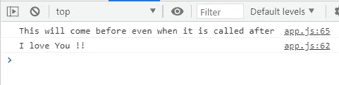

# 使用 Async 和 Await 在 JavaScript 中编写异步代码

> 原文：<https://javascript.plainenglish.io/writing-asynchronous-code-in-javascript-using-async-and-await-5d43ddcfa31b?source=collection_archive---------16----------------------->

## 用例子学习写异步 JavaScript。


Photo by [Nubelson Fernandes](https://unsplash.com/@nubelsondev?utm_source=medium&utm_medium=referral) on [Unsplash](https://unsplash.com?utm_source=medium&utm_medium=referral)

# 介绍

JavaScript 是一种单线程编程语言。这意味着它有一个调用堆栈和一个内存堆。正如预期的那样，它按顺序执行代码，并且必须先执行完一段代码，然后才能进入下一段。然而，由于 V8 引擎，JavaScript 可以是异步的，这意味着我们可以一次在代码中执行多个任务。

在本文中，我们将了解如何使用 Async 和 Await 使 JavaScript 代码异步。让我们开始吧。

# 同步与异步

在开始之前，我们先来谈谈同步代码和异步代码的区别。

JavaScript 中的同步代码将从文件的顶部开始，一路执行到底部，每一行都按顺序执行，直到它到达底部，然后停止。例如，如果一个函数需要一段时间来执行或必须等待某个东西，它会同时冻结所有东西，因为 JavaScript 中的同步代码一次只能执行一个任务。它会一直等到某个特定的语句执行完毕，然后移动到下一个语句。

另一方面，异步代码也将从文件的顶部到底部开始执行。但在执行过程中，它会遇到一些异步函数，在这些函数中，它会分离出异步代码，并与其余代码同时执行。

用 JavaScript 编写异步代码有多种方式，比如回调、承诺和 async/await。在本文中，我们将使用 Async 和 Await。

# 异步和等待

引入 Async 和 Await 是为了减少嵌套回调带来的麻烦。

下面是一个使用 Async 和 Await 的异步代码示例:

```
**async** function functionName(){
  let value = **await** functionReturningPromise();
}

// ES6 syntax
let functionName = **async** () => {
   let value = **await** functionReturningPromise();
}
```

这是一个使用 Async 和 Await 的异步函数的例子。

异步函数是用关键字`**async**` 声明的，并且关键字`**await**`允许出现在这些函数中。需要记住的一点是，关键字`await`只能在`async`函数内部使用。

让我们看看下面的例子:

```
// async functions can be called befoe declaration. **myDisplay()**;**async** function myDisplay() {
  let myPromise = new Promise(function(myResolve, myReject) {         setTimeout(function(){ myResolve("I love You !!");}, 3000)
  });
  console.log(**await** myPromise);
}// This will come before the promise even when it is called after.
console.log("This will come before even when it is called after"); 
```

*输出:*



The chrome console.

正如你所看到的，承诺将出现在字符串之后，即使我们在函数中在字符串之前调用它。那是因为承诺需要 3000 毫秒才能执行。异步代码不会等待它，所以字符串会在承诺之前出现。即使函数在声明之前被调用，它仍然工作，因为它是一个异步函数。

# 用异步提取并等待

有时，您需要从 API 中获取数据，以便在您的应用程序中使用。fetch API 允许您这样做，但是我也建议让您的 fetch 调用异步。因为如果 fetch 调用花费了大量时间，且您的代码不是异步的，它将停止其他代码的执行并影响您的应用程序的性能。

看看下面的例子:

*同步码:*

```
function getUser(name){
 fetch(`https://api.github.com/users/${name}`)
  .then(function(response) {
    return response.json();
  })
  .then(function(json) {
    console.log(json);
  });
};

//get user data
getUser('yourUsernameHere');
```

*异步代码:*

```
**async** function getUserAsync(name) 
{
  let response = **await** fetch(`https://api.github.com/users/${name}`);
  let data = **await** response.json()
  return data;
}

getUserAsync('yourUsernameHere')
  .then(data => console.log(data));
```

并非所有浏览器都完全支持使用 Async 和 Await。所以你要意识到这一点，在开发的时候检查自己的需求。

# 结论

用 JavaScript 编写异步代码是所有开发人员都应该具备的技能。至少你需要知道如何处理承诺和异步/等待。

# 更多阅读

[](https://medium.com/javascript-in-plain-english/5-useful-and-tricky-javascript-questions-4b50b5106a2b) [## 5 个有用而棘手的 JavaScript 问题

### JavaScript 中需要知道的一些棘手问题。

medium.com](https://medium.com/javascript-in-plain-english/5-useful-and-tricky-javascript-questions-4b50b5106a2b)