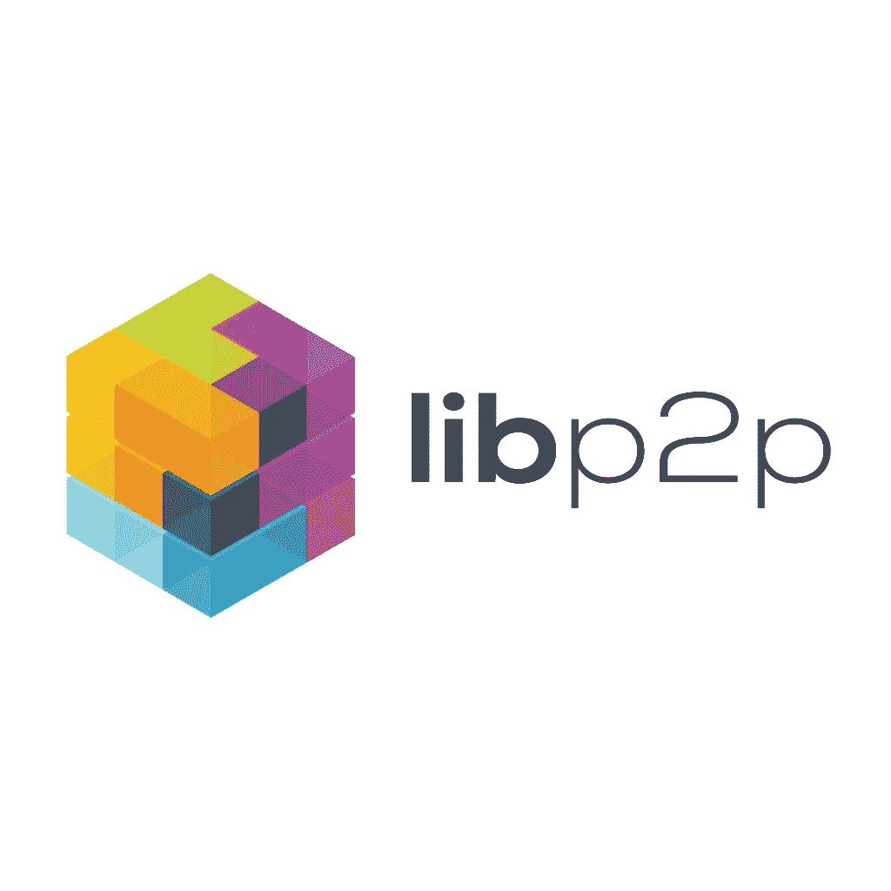

# 用 JavaScript 编写分散式应用程序— Libp2p 基础

> 原文：<https://javascript.plainenglish.io/writing-decentralized-applications-in-javascript-libp2p-basics-4fa46c5dae8a?source=collection_archive---------3----------------------->



Source: [https://discuss.libp2p.io/](https://discuss.libp2p.io/)

[Libp2p](https://libp2p.io/) 是最著名的 p2p 图书馆之一。它是[星际文件系统](https://ipfs.io/)的基础，也将是[以太网 2.0](https://github.com/ethereum/consensus-specs/blob/dev/specs/phase0/p2p-interface.md) 的基础，所以如果您想开发分散的应用程序，这是一个很好的选择。

在本文中，我将展示 libp2p 的基本概念，我们将使用 libp2p 和 vue.js 的 JavaScript 实现开发一个基于浏览器的(不需要自己的服务器)聊天应用程序。

## PeerId

[PeerId](https://docs.libp2p.io/concepts/peer-id/) 是 libp2p 的主要元素之一。它有点像比特币或以太网地址，由密钥的公钥部分生成。像比特币地址一样，它是唯一的，可以通过私钥对消息进行签名，私钥可以通过与 peerId 关联的公钥进行验证。您可以通过[对等 id](https://www.npmjs.com/package/peer-id) 实用程序生成一个 peerId。

您可以通过 npm 简单地安装对等 id:

```
sudo npm i peer-id -g
```

安装后，您只需通过对等 id CLI 工具生成自己的对等 id:

```
peer-id
{“id”: “QmPMKmmRyepsh4Wq24msEdeGJQWSszy7eWNSjL53bxz3sS”,“privKey”: “CAASqAkwggSkAgEAAoIBAQC6/4DQXtW9HYbx5wPNbcsNbwMITH8Mg70O+zhQ9t9w/9Z7BuOzwQqu/ABaRclkl1FIuGfIayKSzqkczYkdY3I6bMUtn8dyHuJi1JzJj5PtaGfK81ra6hNvkVRqttYKJdgpPdGWCa6ouRbFPf3l0w2sK0ejf1Im/h4bAL1ltgZK7G+fXZTlUdAoEvQJja3bl9b47zqWiq+oVaez7uBhemrJQ6Ao09Tlr/RpVfbsc48NAczuDqh9nZzUq27LQEu9OXOf6xk/hPaDcof0ubQs9REXDCcDq01Cg6dQ5odKKHcT9hTeytZlvzfZZgleU8pME9r1EVpG5aEMn5qC0zfoe3PTAgMBAAECggEAWBoa+ZFEyHYJ5xy9WOMaoLilyBoqXZ4Py+gmj1bQzS9sQMhtLXqM6waFsAJjMUZtoIJpOy7muh4t5QkdScBZyBcJC0bVM/pDFOcw+3Hu8xKWnDLtomhYQd9J04FS9LMB1eRvQ25KYOnbRZDAd7BpJ624cdqBvSdKzdQaZ7pL2q4d/P1DUVLVfNDHzHlHyiLoxL1Ilm5YQtGGA3PwTLmSMqWGPvrzK4n0qL2rXUMbio0wf7w3lWDnBNQpncwdcPqUSTPDItwa2GNImH5yZRIF/vP2Qdky7LvNoxIzr+UhyQ6s2YSfRLwgnSPNL4IRuRaUWCtFprdaMd/x65xkBDVP2QKBgQDqXV922hbpMWgGPUco0uv7C8UApWiA/TP95pDzJuoD/SL0pn15QQrPMYTbOf32DrwC/sVMuuIbStqJd8RSApTsQO48KiPgmJM6WgD35umlYpmPQh8djvhPTe3nCadoxy+40i7NuuDde9AtvDlqwti4t1E/6lnYNZecbrXnT3ELZwKBgQDMQryboWcrUS+pfrJADtNiBOBtAAIQz7aHZRmk9ZFY7L8ekSB1Cuee4/FXswkrie+jE1rGbV97OQ1f6qW10SkoN64OIs8AVx408MxLdEejLg0vLwjEqEVXE2Wc1/TkOuEOpsrniKgisIZThrdC2RhmOqtaKRnAWz761ypCluP8tQKBgQCzqzV+Zh9eUpQPBHdDIr/qS9GRdz0wdeyf31yMK+8Hc86Sg/h5NpXU1X+mmUTKl+0m1q3m7vZcOfxjmr+Up4oHvJdm5F9w1Uc5WrqXUh0Yvwg+PVChVnOiSHnzvwDqYJmDNQ7QhU3SPhMQnNXftNR0d4UAXObXy+4Y7P7i/5IITQKBgQCtIxh6Frq7lep/kjwHXknA+P8+hVY658YBSCoPkHOuW6a4gy1u6FpibTZCLyjjtdzhbuNv9H+NlFOI7P2fevaW93Na2hh6Yl3hZAbXIm4inENirkyRXUzBPVjRNKCI4HuqDqlIzqYuGVES9crbJ+etp6ddGh+Q1AczWjShEwOXTQKBgF2cuW8w7ghAXapb2BKQU9bZTMAevohw6cxEmajNngVGSGMQJIJdhEoaGUXdtBOpOxAfYdycegf9VkPraVERXAbCMDk5mAh4Aor1SsHUDnQ7VKMLQfGzH3Jfk2TpXqy/11rJlLAl05LCyAeHGLVM4CQrvpLOIeM5n6j/3QWO3Jdh”,“pubKey”: “CAASpgIwggEiMA0GCSqGSIb3DQEBAQUAA4IBDwAwggEKAoIBAQC6/4DQXtW9HYbx5wPNbcsNbwMITH8Mg70O+zhQ9t9w/9Z7BuOzwQqu/ABaRclkl1FIuGfIayKSzqkczYkdY3I6bMUtn8dyHuJi1JzJj5PtaGfK81ra6hNvkVRqttYKJdgpPdGWCa6ouRbFPf3l0w2sK0ejf1Im/h4bAL1ltgZK7G+fXZTlUdAoEvQJja3bl9b47zqWiq+oVaez7uBhemrJQ6Ao09Tlr/RpVfbsc48NAczuDqh9nZzUq27LQEu9OXOf6xk/hPaDcof0ubQs9REXDCcDq01Cg6dQ5odKKHcT9hTeytZlvzfZZgleU8pME9r1EVpG5aEMn5qC0zfoe3PTAgMBAAE=”}
```

调用 peer-id 将生成一个 JSON，该 JSON 包含私钥和公钥，id 是一个多哈希公钥。此 id 是您唯一的对等地址。

## 多重散列

[Multihash](https://docs.libp2p.io/reference/glossary/#multihash) 是 libp2p 和 IPFS 使用的一种面向未来的哈希格式。它由两部分组成。前 2 个字符是定义哈希算法的哈希头，第二部分是哈希本身。在上面的例子中(在 peerId JSON 的 id 部分)，Qm 表示它是一个 SHA-256 哈希，第二部分是 base58 编码的 256 位哈希。

## 多地址

[多地址](https://docs.libp2p.io/reference/glossary/#multiaddr)类似于一个 HTTP URL，但是它更通用。多地址是可以指向主机、服务、对等体等的协议/值对的列表。让我们看看一些例子:

/ip4/1 . 2 . 3 . 4-此多地址指向一台主机

/ip4/1.2.3.4/tcp/80 —这指向主机的 tcp 端口 80

/DNS 4/example . com/udp/123-这指向 example.com 的 UDP 端口 123

/P2P/qmbekwsuzandmwjffgyq8 uaqrmkjasat 8 vagockv1x—这指向一个 peerId

/ip4/7 . 7 . 7 . 7/tcp/4242/P2P/qmyyqso 1 C1 ym 7 orwxlyvcrrm 2 emxftanf8 wxmme 7 dwjhx5n—此多地址准确地指向一个主机和一个 TCP 端口，我们可以在此端口与给定的对等方通信

现在我们知道了基础知识，让我们继续实现。Libp2p 是一个模块化的网络堆栈，有许多实现。在本文中，我将使用可以在 node.js 或您的浏览器中的服务器端运行的 JavaScript 实现。让我们看一些代码来理解 js-libp2p 是如何工作的:

```
‘use strict’
const Libp2p = require(‘libp2p’)
const TCP = require(‘libp2p-tcp’)
const { NOISE } = require(‘@chainsafe/libp2p-noise’)
const createNode = async () => {
  const node = await Libp2p.create({
    addresses: {
      listen: [‘/ip4/0.0.0.0/tcp/4321’]
    },
    modules: {
      transport: [ TCP ],
      connEncryption: [ NOISE ]
    }
  })
  await node.start()
  return node
}
```

上面的例子展示了如何启动一个 libp2p 节点。Libp2p.create 方法在这里有两个选项。第一个是节点将监听的地址。在这种情况下，节点将监听每个 IP 地址和 4321 端口。第二个选项是模块的定义。Libp2p 是一个强模块化的堆栈。每个模块都由一个接口定义，你可以自由选择使用哪个，或者你可以创建自己的模块。堆栈的每个部分都是模块化的。您可以定义传输层、加密，您可以定义自己的对等点发现机制，等等。在这种情况下，我们将使用 TCP 传输和噪声加密。

上面的代码在 node.js 中运行良好，但是在 web 浏览器中，不可能打开服务器端口。为了解决这个问题，libp2p 可以使用中继服务器，中继服务器可以打开所需的服务器端口，并将流量转发到浏览器。

```
this.libp2p = await Libp2p.create({
  addresses: {
    listen: [
     "/dns4/wrtc-star1.par.dwebops.pub/tcp/443/wss/p2p-webrtc-star",
     "/dns4/wrtc-star2.sjc.dwebops.pub/tcp/443/wss/p2p-webrtc-star",
    ],
  },
  modules: {
    transport: [Websockets, WebRTCStar],
    connEncryption: [NOISE],
    streamMuxer: [Mplex],
    peerDiscovery: [Bootstrap],
    dht: KadDHT,
  },
  config: {
    peerDiscovery: {
      [Bootstrap.tag]: {
      enabled: true,
      list: [
"/dnsaddr/bootstrap.libp2p.io/p2p/QmNnooDu7bfjPFoTZYxMNLWUQJyrVwtbZg5gBMjTezGAJN",
"/dnsaddr/bootstrap.libp2p.io/p2p/QmbLHAnMoJPWSCR5Zhtx6BHJX9KiKNN6tpvbUcqanj75Nb",
"/dnsaddr/bootstrap.libp2p.io/p2p/QmZa1sAxajnQjVM8WjWXoMbmPd7NsWhfKsPkErzpm9wGkp",
"/dnsaddr/bootstrap.libp2p.io/p2p/QmQCU2EcMqAqQPR2i9bChDtGNJchTbq5TbXJJ16u19uLTa",
"/dnsaddr/bootstrap.libp2p.io/p2p/QmcZf59bWwK5XFi76CZX8cbJ4BhTzzA3gU1ZjYZcYW3dwt",
      ],
      },
    },
    dht: {
      enabled: true,
    },
  },
});
```

这个更复杂的示例使用 wrtc-star1.par.dwebops.pub 和 wrtc-star2.sjc.dwebops.pub 服务器作为通过 webrtc 协议的中继。这些服务器是由 libp2p 社区提供的，仅用于测试。如果你正在构建一个真实世界的应用程序，你应该[安装你自己的 webrtc star 服务器](https://github.com/libp2p/js-libp2p-webrtc-star/blob/master/DEPLOYMENT.md)。

另一个新事物是引导节点。这些节点是对等点发现的起点。当您的节点启动时，它将首先连接到这些节点。在连接之后，我们的节点将获得也连接到引导节点的其他节点地址，并且它将连接其中一些节点，因此在引导之后，不再需要引导节点，p2p 网络自动构建。示例中的引导节点也是由 libp2p 社区提供的。通过定义不同的引导节点，您可以定义自己的独立 p2p 网络。

我最后想说的是 DHT。[分布式哈希表](https://en.wikipedia.org/wiki/Distributed_hash_table)是存储在节点上的分布式键/值存储。这个键/值存储用于存储 peerId 的当前互联网地址。它有点像 DNS 系统，DNS 服务器存储域名的 IP 地址。DNS 也像 DHT 一样是分布式的，但是在这种情况下，我们使用 peerId 代替域，使用端点的多地址代替 IP。

```
let peerId = PeerId.parse(this.otherPeerId);
let result = await this.libp2p.peerRouting.findPeer(peerId);
this.otherPeerMultiaddrs = result.multiaddrs;
```

上面的例子说明了，如何通过 peerId 找到一个对等体。peerRouting 模块的 findPeer 方法试图通过 peerId 发现对等体，如果找到了，则多地址将出现在结果中。

现在，我们可以在浏览器中启动自己的节点，并找到其他对等点。下一步是与他们沟通。

首先，我们必须定义一个协议并处理传入的连接。这有点像在传统客户机-服务器应用程序中打开服务器端口。

```
this.libp2p.handle('/chat/1.0.0', 
  ({ connection, stream, protocol }) => { 
    this.remotePeerId = connection.remoteAddr.getPeerId(); 
    pipe( 
      stream, 
      (source) => { 
        return (async function* () { 
         for await (const buf of source) 
           yield array2str(buf.slice()); 
        })(); 
      }, 
      async (source) => { 
       for await (const msg of source) { 
        this.messages.push(“> “ + msg); 
       } 
      } 
    ); 
});
```

上面的代码定义了“chat/1.0.0”(这是协议的标准格式)协议，并处理到它的传入连接。处理函数有 3 个参数，其中 2 个。是最重要的，来流。JavaScript 流是非常棘手的事情，但是希望有一些好的工具来处理它们。在本例中，我们使用了管道函数。管道的第一个参数是流，最后一个参数是消费者。中间的参数可以是流转换器。在我们的例子中，我们通过 array2str 函数转换流元素，因为流是二进制的，我们需要简单的 UTF8 字符串。最后一个函数(消费者)只是从流中读取消息并将它们写出来。

现在我们在浏览器中有了可以互相查找的节点，并且我们有了一个聊天协议处理器。最后一步是从一个对等体连接到另一个对等体，并在聊天协议上发送一些消息。

```
const { stream, protocol } = await this.libp2p.dialProtocol( 
  peerId, chatProtocol 
); 
this.chatQueue = pushable(); 
pipe( 
  this.chatQueue, 
  (source) => { 
    return (async function* () { 
      for await (const msg of source) yield str2array(msg); 
    })(); 
  }, 
  stream 
);
```

Libp2p 有一个 dialProtocol 方法用于连接其他对等点。该方法有两个参数。目标 peerId 和协议标识符。方法的结果是一个流，所以我们再次使用管道函数。管道的第一个参数是可推送的。Pushable 是一个可以作为流读取的队列。我们会将聊天消息推送至该队列。管道的第二个阶段是一个转换器，它调用 str2array 将字符串消息转换为二进制形式。管道的最后一级是流本身。

让我们看看完整的代码。我用的是 Vue，因为它简洁易读。

可以在[https://thebojda . github . io/js-libp2p-browser-chat/index . html](https://thebojda.github.io/js-libp2p-browser-chat/index.html)上在线测试。在 2 个浏览器选项卡上打开此 URL。将一个选项卡的 peerId 复制到另一个选项卡，然后按“查找”按钮。如果一切顺利，浏览器节点将在其他选项卡中找到另一个节点。然后按下“拨号协议”按钮，您就可以开始在两个选项卡之间聊天。

Libp2p 是很多 p2p 应用的基础。我希望这个简短的介绍能帮助你开始开发自己的 p2p 应用程序(也许是一个新的共享经济应用程序，或者是你自己的新区块链)。所以，让我们开始编码吧…

*更多内容尽在*[plain English . io](http://plainenglish.io/)