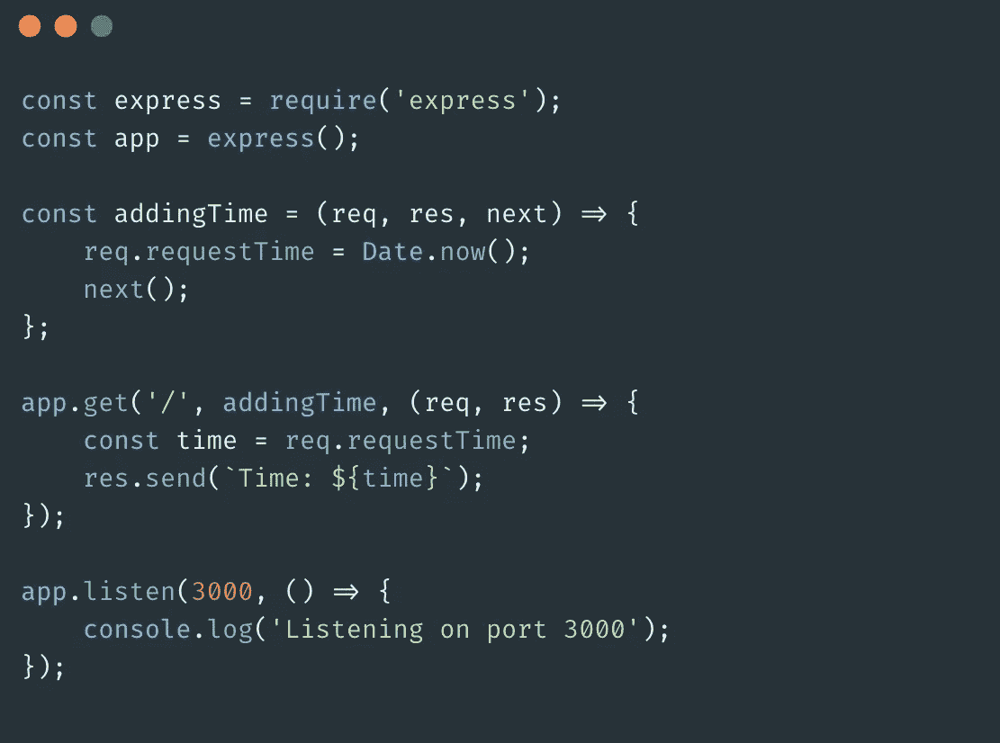

# 如何为 Express 应用程序编写中间件

> 原文：<https://javascript.plainenglish.io/writing-middleware-for-express-apps-775153b4e6b?source=collection_archive---------7----------------------->

Photo by [Anthony Riera](https://unsplash.com/@frenchriera?utm_source=medium&utm_medium=referral) on [Unsplash](https://unsplash.com?utm_source=medium&utm_medium=referral)

这篇文章将让你清楚地了解 Express 中的*中间件*，它的用法以及它对我们的 Express 应用程序的影响。对于初学者来说，中间件的概念可能很难一下子掌握，但是一旦你理解了，它就不是最难的事情了。有几个关键的事情需要了解，了解它们将使您的 Express 生活变得更加轻松。

所以，说够了。让我们看看什么是中间件功能。

根据 Express [docs](https://expressjs.com/) ， ***中间件*** 函数是在应用的请求-响应周期中访问[请求对象](https://expressjs.com/en/4x/api.html#req)(`req`)[响应对象](https://expressjs.com/en/4x/api.html#res) ( `res`)和`next`函数的函数。现在让我们把这个不太清楚的定义分成更小的部分，这将帮助你更快地理解中间件的概念。

中间件是介于请求和响应之间的东西。正如官方定义所述，它可以访问请求和响应对象。它可以运行*任何*代码，*更新*请求或响应对象，调用*下一个*中间件函数，或者可以完全*终止*请求和响应的循环。

让我们看一个例子:

在上面的例子中，我已经使用了 *app.use()* 方法来传入中间件函数。app.use() 将执行任何请求类型，如 GET、POST、PUT 等。我们通常的 *req，res* 参数保持不变，但是还有一个' *new'* 回调参数。你可以给它起任何你想要的名字，但是 *new* 是用来声明它的标准名字。它所做的是，在运行我们放在中间件中的任何代码之后，它调用下一个与请求匹配的函数。

此外，由于我们还没有指定路径，只要服务器启动并运行，这个中间件将应用于任何路径的任何请求。有点普通。但是如果我们要更具体一点，我们可以想出这样的东西，

WRT 在上面的例子中，假设我们从浏览器向[http://localhost:3000/cats](http://localhost:3000/cats)发送 GET 请求。在请求到达 GET 路由之前，它会通过我们定义的中间件。该步骤将*‘这是我的第一个 cat 中间件’*打印到控制台。因为我们已经在中间件中调用了 *next()* ，所以 express 然后搜索任何匹配的路由，继续我们的中间件来执行。因为有一个 GET 路径，它的路径是' */cats'* ，所以它将被调用，并且' meowzy' 将被输出到控制台。

现在，假设我们通过 [postman](https://www.postman.com/) 向[http://localhost:3000/cats](http://localhost:3000/cats)发送了一个 POST 请求。它不会触发获取路线。但是尽管如此，我们放置在 *app.use()* 中的中间件功能将被触发，并且*‘这是我的第一个 cat 中间件’*将被打印出来。

如果我们忽略了从我们的中间件函数中调用 *next()* ，*所有的*其他的路由都将被忽略，因为 *app.use()* 会捕获每个对 app 的请求。因此调用 *next()* 是非常必要的，除非我们想结束请求-响应循环。

关于我们应该只把我们的中间件放在 *app.use()* 里面，没有硬性规定。这完全取决于你想要达到的目标。您还可以使用 *app.get()* 来整合中间件，如下例所示。

“嘿”将在我们向 [http://localhost:3000/](http://localhost:3000/) 发出 get 请求时显示，我没有包括 *next()* ，因为没有其他路由。

既然我们已经看到了中间件如何影响我们的应用程序，我将展示中间件如何更新 *req* 和 *res* 对象。假设我们想要向 req 对象添加一个名为'`requestTime'`'的新属性，该属性将捕获 Date.now()的值。

在上面的例子中，我已经向名为'`requestTime'.`'的 *req* 对象添加了一个新属性。如果我们发送一个匹配的 GET 请求，那么首先添加该属性，并通过 GET 路径将其值打印到控制台。

此外，如果我们想对 GET 请求只使用中间件函数*和*，上面的例子可以简化成这样。

我将该功能提取到一个单独的函数中，并将其作为一个*回调*传递给我们的 GET 路由。 *app.get()* 在 path 之后接受回调，由于我已经在 addingTime 函数中添加了 *next()* ，其余的回调(老好人 *req* ， *res* 回调)将在流中执行。

好了，关于 Express 中间件就这些了。下次见！

*更多内容请看*[***plain English . io***](http://plainenglish.io/)