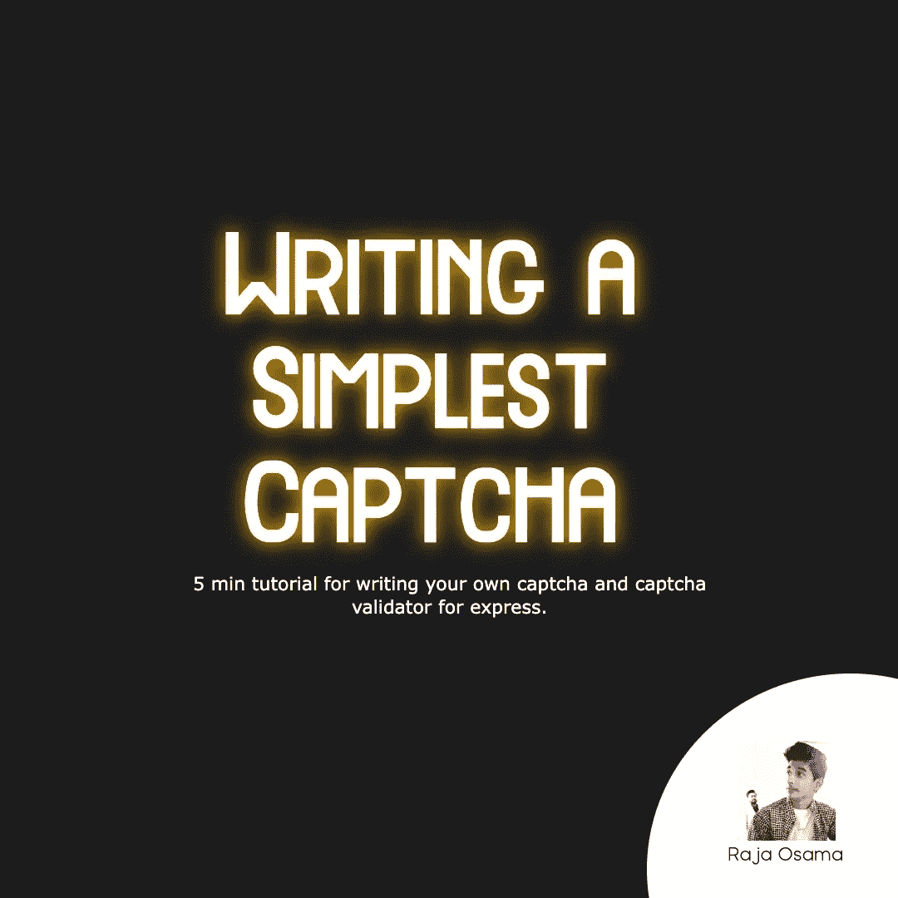

# 用 Express 编写验证码验证程序

> 原文：<https://javascript.plainenglish.io/writing-the-simplest-captcha-validator-for-express-2a3f1411ec0e?source=collection_archive---------2----------------------->



最近我的任务是创建一个验证码服务，在每次表单提交之前，你的服务器都会验证验证码。我不允许使用谷歌验证码，因为他们都有一个自定义的用户界面。

所以我问自己，如何创建验证码，什么是验证码？对我来说，captcha 是一个有限的字符串，它根据客户端输入进行验证，验证后让用户看到他想要的东西，通常是图像，因为如果是文本，可以在客户端找到。

每个服务器中都有一个会话的概念，我使用过很多 PHP，所以我对什么是会话有一个很好的概念。因为你几乎一直都在用。与会话类似，我们也可以轻松地在 express 上实现会话。下面是在 express 服务器中实现会话的代码。

```
var cookieParser = require("cookie-parser");var session = require("express-session");app.use(cookieParser("Your secret key"));app.use(session());
```

回到验证码，要求是一个有文字的图像，比如说 6 个字符写在上面。下面是生成随机字符串的函数的代码。

```
export function RANDOMWORDS(length) {  
 var result = '';   var characters = 'ABCDEFGHIJKLMNOPQRSTUVWXYZabcdefghijklmnopqrstuvwxyz0123456789';    

 var charactersLength = characters.length;  for (var i = 0; i < length; i++) {    
  result += characters.charAt(Math.floor(Math.random() *    
  charactersLength));  
 } return result;
}
```

好的，下一步是把图像转换成文本，所以我们要用一个库，因为我很擅长这个。

```
const textToImage = require("text-to-image");
await textToImage.generate(`  ${RANDOMWORDS(6)}  `, {
maxWidth: 100,
});
```

上面的图像很容易被任何 OCR 图像解码。您可以尝试寻找另一种方法来处理稍微复杂的图像。

现在，让我们也来处理 express 部分。

```
app.get("/generate/captcha.png", async function (req, res, next) {var captcha = RANDOMWORDS(6)
var sess = req.session;
sess.captcha = captcha;const dataUri = await textToImage.generate(`  ${captcha}  `, {
maxWidth: 100,
});const im = dataUri.split(",")[1];
const img = Buffer.from(im, "base64");res.writeHead(200, {
"Content-Type": "image/png",
"Content-Length": img.length,
});res.end(img);});
```

上面的代码将生成一个新的验证码，每次点击端点都会生成一个新的会话，它将返回一个 png 图像，上面写有文本。

要验证验证码，您可以执行以下操作。

```
var captcha = req.body.captcha;if (!captcha) {
return next("invalid");
}if (captcha != req.session.captcha) return res.send("invalid");
```

就是这样！

— — — — — — — — — — — — — — — — — — — — — — —

找自由职业者？通过 Fiverr 雇用我。

— — — — — — — — — — — — — — — — — — — — — — —

*更多内容尽在*[***plain English . io***](http://plainenglish.io)