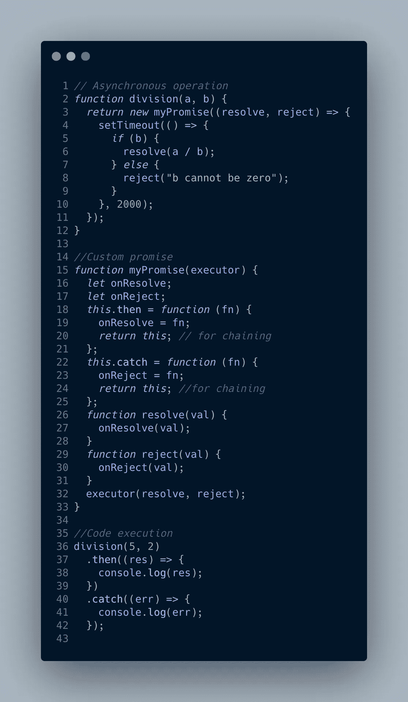
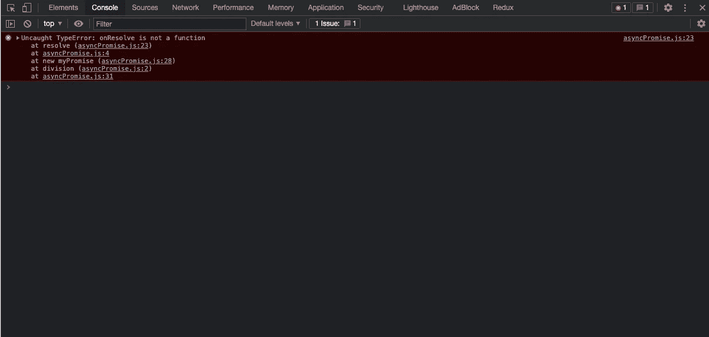
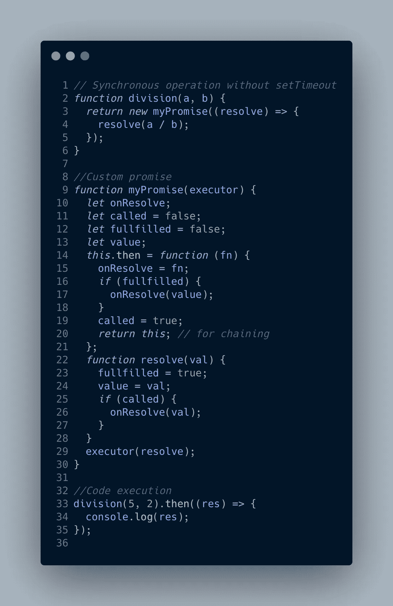

# 在 JavaScript — JavaScript 面试系列中写下你自己的承诺

> 原文：<https://javascript.plainenglish.io/writing-your-own-promise-in-js-javascript-interview-series-b95c88bc1456?source=collection_archive---------9----------------------->

Photo by [Andrew Petrov](https://unsplash.com/@andrewwwpetrov?utm_source=medium&utm_medium=referral) on [Unsplash](https://unsplash.com?utm_source=medium&utm_medium=referral)

Promises 是 ES6 最大的新增功能之一，它构成了许多基于异步方法的 Javascript 库的基础。事实上，这是所有 Javascript 访谈中经常遇到的话题。有时候，求职者需要用 Javascript 写下自己的承诺(也称为 polyfill ),尤其是当你为亚马逊、脸书等大公司面试时。对于公司来说，这是衡量候选人对 JS 核心概念理解的一个很好的方式。

在我们开始之前，我想请你读一下下面的文章，对承诺有一个清楚的了解。

 [## Javascript 中的承诺——Javascript 访谈系列

### 承诺是 Javascript 中最重要的主题之一，是作为 ES6 的一部分引入的。它经常被问到…

wasefs.medium.com](https://wasefs.medium.com/promises-in-javascript-javascript-interview-series-fd65be7cb0b2) 

假设你知道关于承诺的一切，现在是开始的时候了

# **多填承诺**

考虑一个异步方法，用 2 秒的延迟将两个数(a，b)相除。我们尝试使用 Promise polyfill (myPromise)来执行这个操作。请仔细阅读下面的代码

Figure 1\. Asynchronous event executed with custom promise

让我们一步一步地检查这段代码。

1.  在第 36 行执行异步函数 *division(a，b)* ，其中 a = 5，b = 2。
2.  该函数返回一个承诺(myPromise)。因为 myPromise 是一个构造函数，所以用“new”关键字创建并返回 myPromise 的一个实例。
3.  myPromise 函数接受一个*执行器*函数作为参数(定义在第 3 行。第 12 行)由于 setTimeout 函数而异步。
4.  当使用“new”关键字创建实例时，还会调用并执行 myPromise 函数，并返回“this”。点击阅读更多关于‘new’关键字和构造函数[的内容。返回的 this 用于调用必要的函数，如 *then()* 和 *catch()* 。](https://docs.microsoft.com/en-us/previous-versions/msdn10/ff852808(v=msdn.10))
5.  由于*执行器*函数是异步的，因此*执行器*函数虽然在第 32 行因“new”关键字而被执行，但由于其异步特性(由于 setTimeout ),不会立即被执行。
6.  *执行器*函数接受两个参数*解决*和*拒绝*，这在第 26 行中描述。和第 29 行。分别是。*解析*功能执行 *onResolve* 功能。然而，这个函数还没有被定义，因为 *then()* 方法(第 18 行。)分配给它某个功能(第 19 行。)尚未调用。因此，我们处于一个不安全的区域。然而，由于 executor 函数的异步特性，我们有足够的时间通过调用 *division(5，2)中的 then()方法，将 *onResolve* 的状态从未定义更改为 *then()* 方法中描述的函数。然后()*。
7.  当在函数 divide(5，2)上调用 *then()* 方法时，执行 *then()* 方法(在第 18 行之间描述。和第 20 行)。无论*括号中描述的是什么函数，then()* 方法都会附加到之前描述的 *onResolve* 变量上。因此现在 *resolve* 不再有未定义的 *onResolve* 变量。
8.  当 setTimeout 到期后*执行器*函数准备就绪时，在第 6 行调用*执行器*函数中的 *resolve()* 函数(因为 b 不等于零)。
9.  就这样，我的承诺被解决了。

唷！！！这太过分了。现在，如果 executor 函数没有 setTimeout 方法会怎样。

这个还能用吗？

可悲的🥲 🥲 🥲 **不！！！！！因为我们没有足够的时间走出不安全的区域。**

我们在浏览器中得到以下错误

Figure 2\. Errors for promise without setTimeout

为了处理这种情况，我们需要如下修改 myPromise 函数。(我只对已解决的承诺进行了修改，但对于拒绝也可以考虑类似的方法)。

Figure 3\. Synchronous event executed by custom promise.

这里的执行顺序与前面描述的一样。然而，这里我们有三个额外的变量(值、调用和实现)。

1.  如果 *then()* 函数在 *resolve* 函数之前执行，那么我们将在 *then()* 方法中描述的函数存储在 onResolve 函数中，并将名为的*变量设置为 true(第 19 行),表明调用了 *then()* 函数。然而，如果在执行 *then()* 函数之前实现了承诺，那么我们会立即调用 *onResolve* 函数，其中包含 *then()* 函数中描述的函数以及存储在变量 *value* 中的值(第 24 行)。*
2.  如果 *resolve* 函数在 *then()* 函数之前执行，则 *fulfilled* 变量被设置为 true，表示承诺已履行，解析值( *val* )存储在 *value* 变量中。此外，检查是否使用名为的变量*调用了 *then()* 函数。如果是，则将执行 *onResolve* 功能，因为该功能现在已经可用。*

图 3 中描述的代码。是 Promise polyfill 的完整而充分的版本。

在开始自己尝试这段代码之前，请花些时间再次阅读这篇文章。

希望你喜欢这篇文章。请在下面的评论区分享你的意见和疑问。

*更多内容请看*[***plain English . io***](http://plainenglish.io/)