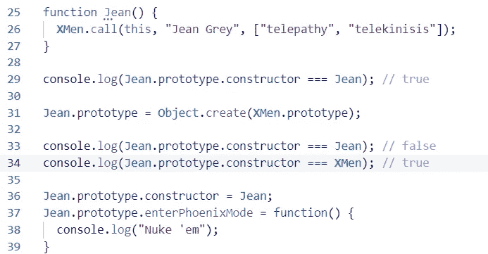
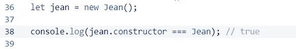
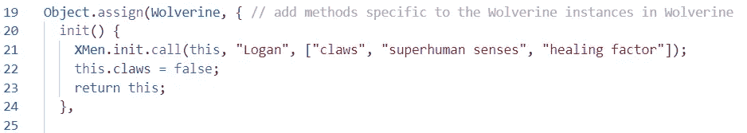
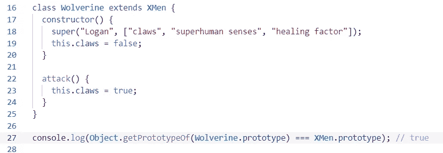

# 让我们探索一下 JavaScript 的对象创建模式

> 原文：<https://javascript.plainenglish.io/x-ploring-javascripts-object-creation-patterns-b76ae803b9b0?source=collection_archive---------6----------------------->

## 使用一个独特的例子来指导在 JavaScript 中创建对象的不同方法。

为了全面理解 JavaScript 中的各种对象创建模式，在本文中，我们将通过一个示例来探究它们。不过，让我们先来定义它们:

1.  **对象工厂或工厂功能模式**
2.  **构造者/原型或伪经典物体构造模式**
3.  **链接到其他对象的对象(OLOO)模式**
4.  **ES6 类**

好吧。因此，我们将使用所有不同的模式来创建一些 x 战警，以了解他们在实践中是如何工作的，以及他们的差异和相似之处。

1.  **对象工厂** 对象工厂(又名工厂函数)也许是最简单的对象创建模式。我们定义了一个函数，该函数返回一个对象，该对象具有我们希望实例具有的属性和方法。如果我们想为一些属性提供自定义值(例如，让我们的实例具有唯一的状态)，我们可以通过将值作为参数传递给函数来实现。

在这个例子中，我们创建了一个`createXMen`工厂函数，它返回一个具有两个属性和两个方法的对象。在`createWolverine`和`createJean`工厂中，我们使用`Object.assign`方法赋予工厂的实例以`createXMen`提供的属性和方法，并赋予它们一些独特的状态和功能。

这样，我们可以在`wolverine`和`jean`上调用`callProfessor`和`displayPowers`。这种范例的一个缺点是，由上述所有工厂函数创建的对象都有自己的所有方法的副本(如第 45 行所示)。现在这只是一个小例子，但想象一下有成千上万的 x 战警对象；这会给系统内存带来相当大的负担。

另一个缺点是我们不能确定`wolverine`和`jean`是什么类型的对象(第 46 行)。`instanceof`操作符不支持工厂功能。为什么？嗯，根据 [MDN 文档](https://developer.mozilla.org/en-US/docs/Web/JavaScript/Reference/Operators/instanceof):“`instanceof`**操作符测试查看构造函数的`prototype`属性是否出现在对象的原型链中。”由于对象工厂和它的实例之间没有继承关系，`instanceof`在这里对我们没有用。**

****2。构造函数/原型模式**
也称为伪经典对象构造模式，这种模式利用构造函数及其`prototype`属性来创建相同类型的对象，这些对象从构造函数的原型继承它们的行为(方法)。我们还可以通过使用`Object.create`重新分配“子”构造函数的`prototype`属性来引用从“父”构造函数的函数原型继承的对象，让构造函数从其他构造函数继承，如下所示(第 19 和 29 行):**

**这里发生了很多事情，但我们只强调最重要的部分:**

1.  **我们使用`new`操作符调用构造函数。`new`隐式地创建并返回一个新对象，而不需要我们显式地从构造函数返回任何东西。我们想要添加到这个新对象中的属性被添加到构造函数中，因为`new`也为构造函数中的`this`设置绑定到新创建的对象。
    除此之外，`new`设置构造函数实例的内部`[[Prototype]]`属性，指向由构造函数的`prototype`属性引用的对象。简单地说，实例继承自构造函数的原型。因此，我们可以在`Jean.prototype`中添加属性和方法，例如，`Jean`的所有实例都可以访问它们。这就是为什么我们可以在`jean`上调用`enterPhoenixMode`，即使对象本身没有定义这样的方法，如第 48 行所示。**
2.  **如前所述，我们可以有子类型:从父构造函数继承的构造函数。在这个例子中，`Wolverine.prototype`和`Jean.prototype`继承自`XMen.prototype`。因此，`Wolverine`和`Jean`的实例可以将方法调用委托给它们的祖先`XMen.prototype`(第 38 和 45 行)。**

**注意第 20 行和第 30 行？在将`Wolverine.prototype`和`Jean.prototype`重新分配给这些继承自`XMen.prototype`的新对象之前，它们都指向另一个拥有`constructor`属性的对象，该属性分别指向构造函数`Wolverine`和`Jean`。**

****

**The constructor property before and after reassigning the function prototype to a new object**

**当我们重新分配`Jean.prototype`来引用一个继承自`XMen.prototype`的新对象时，旧对象及其所有物被垃圾回收。因此，当我们引用上图中第 33 行`Jean.prototype`上的`constructor`时，它不再引用预期的函数对象。实际上，`Jean.prototype`引用的对象中不再有`constructor`属性。因此，JS 在对象的原型`XMen.prototype`中寻找它，它(像任何构造函数的原型一样)定义了那个属性。然而，`XMen.prototype.constructor`指向`XMen`，所以那也是`Jean.prototype.constructor`评估的(第 34 行)。为了解决这个问题，我们在新的`Jean.prototype`中手动添加一个`constructor`属性，并让它指向`Jean`。这样，如果我们以后想知道谁创建了`Jean`的实例，我们可以简单地访问`jean.constructor`(其中`jean`是`Jean`的实例):**

****

**Accessing constructor on jean gives us the constructor function that created it**

****3。“对象链接到其他对象”模式的工作方式与我们见过的其他模式有些不同:它不使用函数；相反，它创建一个原型对象，给定类型的所有对象都将从该对象继承它们的状态和方法。我们可以通过使用一个通常称为`init`的方法来区分几个实例的状态，并将我们想要的值作为参数传递给它。用一个例子更好地解释:****

**在这个范例中，`XMen`、`Wolverine`和`Jean`仅仅是对象本身。为了让它们的实例继承它们，我们利用了`Object.create`静态方法，该方法创建了一个空对象，并设置其内部的`[[Prototype]]`属性指向它作为参数接收的对象。在第 45 行，我们实例化了一个由`jean`引用的新对象，它继承了在`Jean`上定义的属性和方法。**

**好的，那么`.init()`呢？对于将状态(属性)添加到我们的实例中来说,`init`方法(按照惯例称为这个方法)是必要的。让我们分解第 2-6 行:**

**在`XMen`上定义了这个`init`方法，它有两个参数，`name`和`powers`。在该方法中，当我们调用`init`时，我们在由`this`引用的对象上定义了两个也被称为`name`和`powers`的属性，并将传入的参数赋值给它们。这个方法是伪经典构造模式中构造函数的“模拟”。我们在`XMen`的一个实例上调用`init`，并赋予它一个个性化的状态。**

**现在，如果我们需要像以前一样创建一个子类型`XMen`，我们可以创建一个继承了`XMen`所有方法的对象，再次使用`Object.create`(第 17 和 31 行)。随后，我们直接在由`Wolverine`引用的对象上添加`Wolverine`特定的方法(第 19–29 行)。请注意，我使用`Object.assign`只是为了避免一个接一个地定义所有的方法，但这是不必要的。**

****

**The init method of the Wolverine object**

**第 21 行发生了很多事情，所以我们也来澄清一下:**

**还记得我们如何在构造函数/原型模式的第 15 行调用父构造函数来将它提供的状态添加到`Wolverine`的实例吗？这也是我们在这个例子的第 21 行所做的。然而，现在`XMen`只是一个对象，所以我们需要调用的是`XMen`对象的`init`方法，它负责向`XMen`的实例添加状态。**

**最后，在第 58 行，我们可以看到`instanceof`也不能用于确定这个范例中实例的类型。然而，一种变通方法是使用`Object.getPrototypeOf`至少确定一个对象是否是一个实例的原型。**

****

**Access jean’s prototype to determine its type, indirectly**

****4。ES6 类**
类只不过是语法糖；从本质上来说，它们只是伪古典创作模式的变体。JavaScript 中的类甚至不是一种独特的数据类型，它们只是函数对象。然而，它们更容易使用，因为它们抽象了构造器/原型模式的一些实现细节。例如，要让一个类的原型从一个超类的原型继承，我们所要做的就是在类名后面使用`extends`关键字。将函数原型重新分配给一个从超类型的`prototype`属性继承的对象就是这么多了。回到我们的例子:**

**绝对干净多了。因此，一个类的`constructor`方法工作起来就像一个构造函数(我想这就是它的名字):它负责向类实例添加属性。我们在它下面定义的方法，在类体内，是实例方法，并且是在幕后由类的`prototype`属性引用的对象上定义的。比如`attack`住在`Wolverine.prototype`。**

**`extends`关键字做了构造函数/原型示例中第 19 行和第 29 行所做的事情。不再需要在子类的`prototype`中重新定义`constructor`属性——JS 为我们处理了这个问题。**

****

**Wolverine’s prototype inherits from XMen’s prototype property**

**第 18 行的关键字`super`在功能上替代了构造器/原型模式示例中的第 15 行。当我们调用子类的`constructor`方法中的`super`时，它会调用父类(`XMen`)的`constructor`方法，并将其中定义的属性添加到`this`当前引用的对象中:`Wolverine`的新实例。**

**我们在`constructor`特殊方法之后定义的方法是在每个类的函数原型上定义的，就像我们之前做的一样:`Wolverine.prototype.attack = function() {...}`。这意味着`Wolverine`和`Jean`的所有实例分别将它们的方法调用委托给它们的原型`Wolverine.prototype`和`Jean.prototype`，而不是携带它们自己的每个方法的副本。**

## **比较和对比**

*   **构造函数和类都创建对象，使用`instanceof`操作符或通过访问实例上的`constructor`属性可以很容易地追溯到它们的创建者。它们也是内存高效的，因为它们的实例从它们的`prototype`属性继承(通常是所有的)方法。**
*   **对象工厂帮助我们创建多个相同类型的对象，但事后却无法确定它们是否属于给定的类型。它也是内存密集型的，因为它的每个实例都有自己的所有方法的副本。**
*   **OLOO 模式介于两者之间:它比对象工厂更有效，因为我们创建的原型对象定义了实例将通过原型委托访问的所有必要方法。然而，它不像类和构造函数那样，提供一种非常直接的方法来识别原型对象实例的类型。**

***更多内容请看*[***plain English . io***](http://plainenglish.io/)**