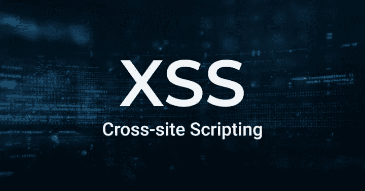

# XSS 漏洞、类型以及防范方法

> 原文：<https://javascript.plainenglish.io/xss-loopholes-their-types-and-ways-to-be-protected-from-them-f0dd9006e9dd?source=collection_archive---------18----------------------->

## 什么是跨站点脚本(XSS)缺口，它们的类型，以及如何防止 XSS 攻击？

大家好，在这篇文章中，我们将了解什么是 XSS 漏洞以及如何使用它们，以及很多我们将在本文中谈到的东西。

XSS 漏洞是跨站点脚本的缩写，是 web 程序中普遍存在的安全漏洞，通过这些漏洞，攻击者可以注入恶意代码，通常由 JavaScript 和浏览器执行代码命令组成，当受害者重新加载页面时。

至于攻击者使用它来注入恶意代码的方式，有很多种，其中最著名的是受害者，通过点击带有反射 XSS 的取消链接，首先使 XSS 存储在网站的一个页面上，攻击者等待受害者浏览这个页面。

黑客利用 XSS 的漏洞来窃取 cookies 或所谓的文件的定义的链接，如果意思是正确的，窃取你的信息，或者他们也可以把你的浏览器变成一个含有恶意程序的恶意网页，在病毒的情况下，他们可以窃取你的密码，也可以利用这些漏洞绕过防火墙或你的浏览器的防火墙， 这只是攻击者可以通过 XSS 漏洞进行的攻击之一，而不是全部，因此对如何利用漏洞没有单一的限制。

## ***🔰XSS 缺口的类型有哪些:***

**1️⃣稳定 XSS 漏洞**

已修复的 XSS 漏洞是 XSS 最危险的漏洞类型，因为攻击者任何时候进入页面都会被修复，这意味着任何进入的内容都存储在数据库中，例如，有人可以进入任何页面添加评论，而网站不受保护，所以这使他很容易注入代码，任何进入页面的人都可以看到黑客所做的工作。

2️⃣ **不稳定的 XSS 漏洞**

不稳定的 XSS 漏洞是最常见的类型，并且依赖于私人输入，因此它们不存储在数据库中。网站的访问者看不到黑客或攻击者做了什么，因为代码没有存储在数据库中，攻击者可以与特定的受害者共享这些代码。

**3️⃣基于 Dom 的 XSS 漏洞**

通过基于 Dom 的 XSS 漏洞，攻击者可以通过在发送特定值的地方执行脚本来控制页面。

## 🔰如何避免这些差距:

**1️⃣** 防止这些漏洞的第一种方法是通过清除任何恶意代码或尝试注入来检查输入。

2️⃣您必须检查编码并指定输入编码，并保留所需的字符编码，以便浏览器检查输入的编码类型。

**3️⃣** 第三种方法是你必须激活 HTTPonly，这将提醒浏览器阻止脚本代码读取 cockies，从而防止它窃取它。

> 结束了

*更多内容尽在*[***plain English . io***](http://plainenglish.io/)