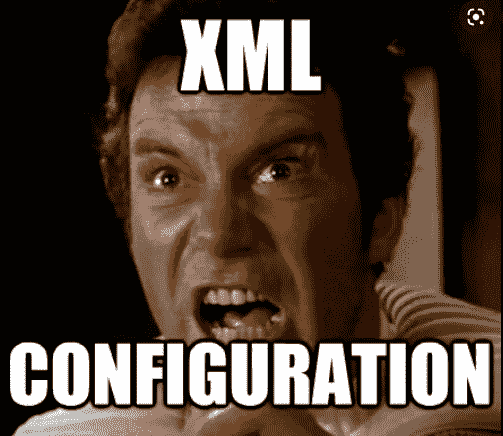
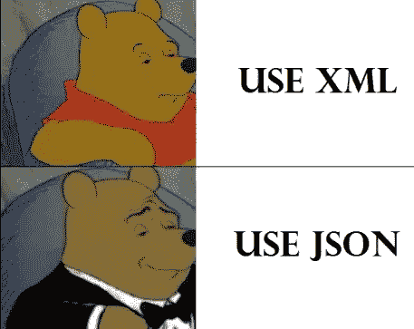

# YAML vs JSON vs XML:选择哪一个？

> 原文：<https://javascript.plainenglish.io/yaml-vs-json-vs-xml-what-to-choose-4c7a72417ff4?source=collection_archive---------1----------------------->


Photo by [Ferenc Almasi](https://unsplash.com/@flowforfrank?utm_source=medium&utm_medium=referral) on [Unsplash](https://unsplash.com?utm_source=medium&utm_medium=referral)

在你的代码库或者日常工作中，你会经常遇到这些格式，但是很多时候，我们不理解它们之间的区别。这在管理代码中的配置和属性时变得尤其重要。我将尽我所能来解释这些，以帮助您了解针对您的具体情况应该使用哪一种。

# **XML**

XML 代表*可扩展标记语言，并且(顾名思义)是一种与 JSON 或 YML 不同的标记语言。*

它还可以用于以结构化格式存储数据/配置。

XML 使用标签来定义结构，就像 HTML 一样。



## XML 的优势

*   XML 是一种通用语言，它可以很容易地从一个公共语法中实现不同的格式。
*   模式是为自定义类型的验证和创建而存在的，而命名空间可以避免元素之间的冲突。
*   XPath 和 XQuery 简化了对 XML 文档的复杂查询。

## XML 的缺点

*   XML 语言是冗长的，通常包含冗余的语法，正如你在下面的例子中看到的。
*   更高的详细程度会增加存储容量和带宽需求。
*   由于元素的描述性，不容易被人理解。

**例子**

```
<?**xml** version="1.0"?>
<myInfo>
<firstName>Sumeet</firstName>
<lastName>Bhalla</lastName>
<Age>100</Age>
<Address>
<street>100 fake St</street>
<apartment>111</apartment>
<city>Rogers</city>
<state>AR</state>
</Address>
<string-array name="carsOwner">
<item>ferrari</item>
<item>lambo</item>
<item>bmw</item>
</string-array>
</myInfo>
```

# **JSON**

JSON 代表 *JavaScript 对象符号，是最常见的*数据序列化语言，通常用于在 web 应用程序中传输数据，但它也可以用于各种其他应用程序。

JSON 以字符串的形式存在——当您想要通过网络传输数据时，这很有用。当您想要访问数据时，需要将它转换为本地 JavaScript 对象。有一些预定义的方法可以根据您的需要将数据作为字符串或 JSON 进行字符串化或解析。

一个 JSON 字符串可以存储在自己的文件中，基本上只是一个扩展名为`.json`的文本文件，和一个`application/json`的 [MIME 类型](https://developer.mozilla.org/en-US/docs/Glossary/MIME_type)。

它基本上是一个键值对，很像 java 中的散列表



## JSON 的优势

*   与 XML 相比，由于语法更紧凑，因此更易于阅读。
*   有限标记的简单语法。
*   快速系统和语言解析。
*   JSONPath 和 XPath 一样，可用于复杂的查询。

## JSON 的缺点

*   有限的数据类型支持，仅包含*字符串、数字、JSON 对象、数组、布尔值和空值*。
*   没有名称空间、注释或属性支持。
*   简单的结构可能不支持复杂的配置。

**示例**

```
{
  "myInfo": {
    "firstName": "Sumeet",
    "lastName": "Bhalla",
    "Age": "100",
    "Address": {
      "street": "100 fake St",
      "apartment": "111",
      "city": "Rogers",
      "state": "AR"
    },
    "carsOwner": ["ferrari", "lambo", "bmw"]
  }
}
```

关于 JSON，需要记住一些事情

*   JSON 纯粹是一个具有指定数据格式的字符串——它只包含属性，不包含方法。
*   **JSON 要求在字符串和属性名称周围使用双引号**。单引号除了包围整个 JSON 字符串之外是无效的。
*   **即使是一个放错位置的逗号或冒号也会导致 JSON 文件无效**。您应该小心验证您试图使用的任何数据。
*   JSON 实际上可以采用任何有效包含在 JSON 中的数据类型的形式，而不仅仅是数组或对象。因此，例如，一个字符串或数字将是有效的 JSON。
*   不像在 JavaScript 代码中，对象属性可以不加引号，在 JSON **中，只有带引号的字符串可以用作属性**。

# **YAML**

YAML 代表 *YAML 安标记语言。*

YAML 是另一种数据序列化语言 JSON 的严格超集。但因为它是 ***严格的*** 超集，它可以做 JSON 能做的一切，甚至更多。一个主要的区别是，换行符和缩进在 YAML 实际上意味着什么，这与使用括号和大括号的 JSON 不同。

此外，JSON 也可以转变成 YAML。YAML 本身也可以在其配置文件中包含 JSON。

YAML 使用缩进来定义结构化数据。所以 YAML 的每个街区都有不同的白色空间。


## YAML 的优势

*   语法具有很强的可读性。
*   紧凑的语法，使用 Python 风格的缩进来表示结构。
*   支持与语言无关的对象类型。`int`、`binary`、`str`、`bool`等定标器或`map`、`set`、`pairs`、`seq`等系列。

## YAML 的缺点

*   缩进格式容易出现语法和验证错误。
*   由于缺乏跨所有语言的特性，某些类型的可移植性可能不存在。
*   由于 YAML 的声明性质，调试很困难。
*   断点和类似的功能不存在。

**示例**

```
myInfo:
  firstName:Sumeet
  lastName: Bhalla
  Age:100
  Address:
    street:100 fake St
    apartment":111
    city":Rogers
    state:AR
  carsOwner:
    - ferrari
    - lambo
    - bmw
```

## **结论**

有许多配置语言，每一种都有其优点和缺点。

简单的应用程序和环境受益于结构化配置。随着配置复杂性的增加，一种语言相对于另一种语言的缺点也在增加。这时候为了更好的可读性和可维护性，选择正确的语言就变得很重要了。因此，一旦复杂性开始增加，从一开始就选择正确的语言将为您省去很多麻烦。

## **良好参考文献**

[](https://www.csestack.org/yaml-vs-json-vs-xml-difference/) [## YAML vs JSON vs XML |他们之间的区别是什么？

### YAML、XML 和 JSON 是广泛使用的数据序列化语言。在这篇文章中，我将列出不同之处…

www.csestack.org](https://www.csestack.org/yaml-vs-json-vs-xml-difference/) [](https://octopus.com/blog/state-of-config-file-formats#advantages-of-json) [## 配置文件格式的状态:XML 与 YAML、JSON 与 HCL - Octopus Deploy

### 了解可用的不同配置文件格式以及何时应该使用它们。

octopus.com](https://octopus.com/blog/state-of-config-file-formats#advantages-of-json) [](https://circleci.com/blog/what-is-yaml-a-beginner-s-guide/) [## 什么是 YAML？初学者指南

### YAML 是一种易于理解的数据序列化语言，经常被用来创建配置文件和工作在…

circleci.com](https://circleci.com/blog/what-is-yaml-a-beginner-s-guide/) 

*更多内容看*[***plain English . io***](http://plainenglish.io/)