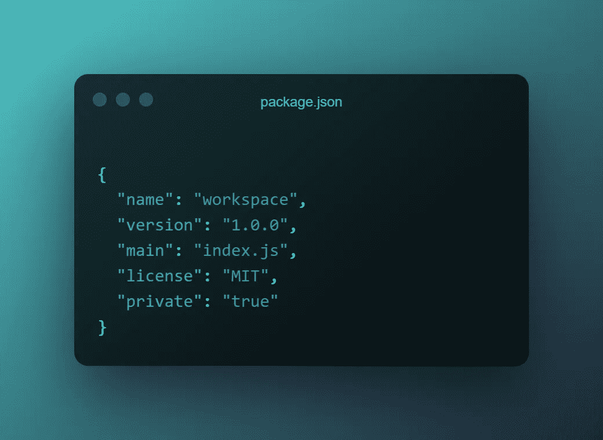
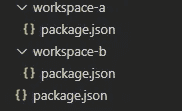
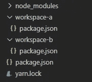

# 纱线工作空间:创造完美的 Monorepo

> 原文：<https://javascript.plainenglish.io/yarn-workspaces-create-the-perfect-monorepo-d0b6295e6838?source=collection_archive---------7----------------------->

## 如何使用 yarn workspaces 创建一个非常酷的 monorepo？

Yarn Workspaces 是一个非常强大的工具，可以创建令人难以置信的 monorepos。今天，你将学习如何创建你自己的纱线工作空间 monorepo！


Photo by [frank mckenna](https://unsplash.com/@frankiefoto?utm_source=medium&utm_medium=referral) on [Unsplash](https://unsplash.com?utm_source=medium&utm_medium=referral)

# 🐣第一步

在本教程中，您将学习:

*   如何安装纱线
*   使用纱线设置项目
*   创建纱线工作空间
*   管理单一回购

## 安装纱线

当然，第一步是确保你安装了纱线。如果不是这样，那么您可以通过运行`npm install -g yarn`来全局安装它。

## 创建新项目

安装 Yarn 后，我们将创建一个新项目。进入一个新文件夹，运行以下命令。

```
yarn init -y
```

## 使我们的项目私人化

前面的命令将在您的文件夹中生成一个`package.json`文件。我们需要改变这个文件中的一个东西！

请不要跳过这一步，这一点很重要！

> 注意`private: true`是必填项！工作区不应该被发布，所以我们增加了这个安全措施来确保没有东西会意外地暴露它们。

给你的对象添加`"private": "true"`参数。

你的`package.json`看起来应该和这个差不多。



Make sure your package.json has the private flag!

## 添加两个工作区

让我们给我们的`package.json`添加两个工作区。通过添加`workspaces`参数可以做到这一点。为了简单起见，我们将称它们为`workspace-a`和`workspace-b`。

您的`package.json`现在应该看起来像这样。


Add an array of workspaces to your package.json

之后，我们将创建实际的工作区。重要的是，要像在 workspaces 数组中一样对它们进行命名。

*   添加两个新文件夹，并将其命名为您的工作区。
*   在每个文件夹中添加一个`package.json`，并确保它们的`name`与工作区相同！

如果你按照教程，那么你的文件夹结构应该是这样的。



## 添加一些依赖项

为了看到工作空间的真正威力，我们需要添加一些依赖项。我们将手动完成这项工作，这样更容易展示我们工作区的强大功能。

让我们添加以下依赖项:

*   工作区-a
    - dotenv
    - express
*   工作空间-b
    - dotenv

这样，我们就有了一个在两个工作空间中都存在的依赖项，而且是唯一的！

**工作空间-A**

**工作区-B**

## 安装我们的依赖项

完成所有这些设置后，是时候展示工作区的真正威力了！

现在你所要做的就是在你的项目的根目录下运行`yarn install`,让奇迹发生吧！

Yarn 安装两个工作区的依赖项，并创建一个共享的 node_modules 文件夹。



# 🦹‍♂️有些很酷的把戏

## 在工作区中调用脚本

如果你想从你的项目的根目录调用一个工作空间的脚本，那么你可以毫不费力地做到。

让我们给我们的`workspace-a`添加一个新脚本。

如果您希望从项目的根目录运行这个打印脚本，那么您需要做的就是通过`yarn workspace`调用它。调用我们的`print`脚本是这样工作的

```
yarn workspace workspace-a print
```

想让它变得更简单吗？你可以把`yarn workspace`命令放在你的根`package.json`的`scripts`对象中。

## 工作空间模式匹配

在我们的例子中，我们在一个数组中声明了所有的工作空间，但是 yarn 也支持全局模式匹配。

假设我们希望将`packages/`目录中的每个文件夹都视为一个独立的工作区，那么我们的模式应该是这样的。

祝你有美好的一天！💛

## *延伸阅读*

[](https://bit.cloud/blog/painless-monorepo-dependency-management-with-bit-l4f9fzyw) [## 使用 Bit 进行无痛 monorepo 依赖管理

### 简化 monorepo 中的依赖关系管理，以避免虚拟依赖关系和版本问题。了解…

比特云](https://bit.cloud/blog/painless-monorepo-dependency-management-with-bit-l4f9fzyw) 

*更多内容看* [***说白了。报名参加我们的***](https://plainenglish.io/) **[***免费周报***](http://newsletter.plainenglish.io/) *。关注我们关于* [***推特***](https://twitter.com/inPlainEngHQ) ， [***领英***](https://www.linkedin.com/company/inplainenglish/) ***，***[***YouTube***](https://www.youtube.com/channel/UCtipWUghju290NWcn8jhyAw)***，以及****[***不和***](https://discord.gg/GtDtUAvyhW)*** *对成长黑客感兴趣？检查出* [***电路***](https://circuit.ooo/) ***。***