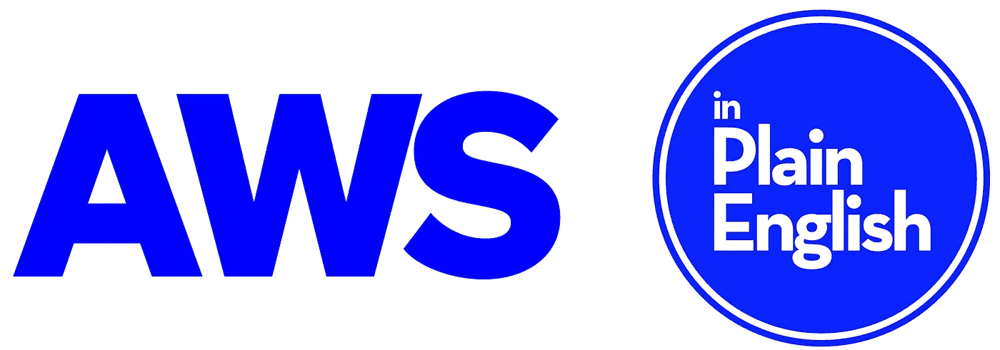

# 你问了，我们听了！

> 原文：<https://javascript.plainenglish.io/you-asked-we-listened-a9628d891503?source=collection_archive---------14----------------------->

## 随着云计算的不断发展，说白了也是如此。

我们想在网上创建一个空间，在那里你可以了解所有与 AWS 和云计算相关的最新信息。所以，事不宜迟，我们自豪地用简单的英语介绍我们的新出版物**！**

**我们仍在筹备中，但与此同时**如果你能关注我们的出版物，我们会非常高兴:**[**https://AWS . plain English . io**](https://aws.plainenglish.io)**

****

**[**https://aws.plainenglish.io**](https://aws.plainenglish.io)**

**除此之外，我们还在去年用简单的英语发布了 Python。你们中的许多人已经知道了这一点，但是对于我们最近的朋友，我们也希望你们能跟随这份出版物！[**https://python . plain English . io**](https://python.plainenglish.io)**😊****

****如果您想加入这些出版物的写作团队，请发送一封简短的电子邮件至**submission s[at]plain English[dot]io**,告知您的 Medium 用户名和您希望加入的出版物名称。****

****最后，感谢您一直以来的支持。你帮助用简单的英语创造了今天。❤️****