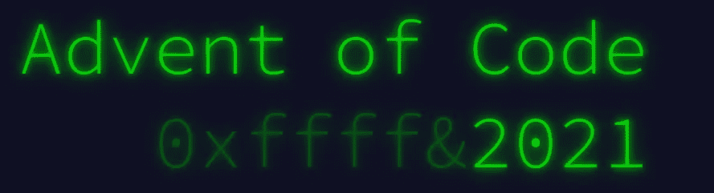
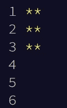
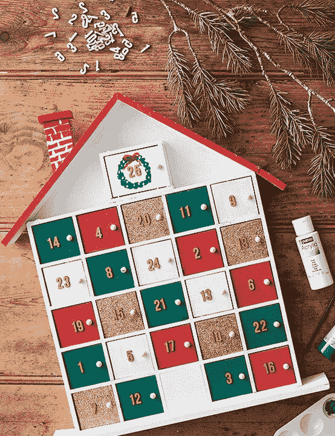

# 你不需要为没有完成《代码降临》而感到内疚

> 原文：<https://javascript.plainenglish.io/you-dont-need-to-feel-guilty-for-not-completing-advent-of-code-d5a2a5349163?source=collection_archive---------7----------------------->

## 我不知道哪些开发者需要听到这些，但这是真的。

我喜欢代码出现的想法。

在圣诞节前夕，每天鞭策自己解决两个逻辑难题是一个有趣的想法。

也许你有开发者朋友，你可以和他们竞争，看谁能最快完成拼图。

也许你参与了“代码高尔夫”并致力于写出最有效的解决方案。

《代码降临》是一个很棒的想法，它讲述了一个可爱的节日故事，并挑战你的编程技能。但是对于许多开发者来说，有一片巨大的乌云笼罩着它。

## 你们中有多少人真正在 25 天内完成了《代码降临》？

从我的经验来看，大多数人都不会——**我自己坚定地包括**。大约在第五天之后，挑战开始变得更加深入，需要更多的思考能力。如果你像我一样，那么你会试着在一天的工作中完成一天的谜题。有时候这种思考能力是不存在的。

所以你错过了一天。没什么大不了的，对吧？你明天会弥补的。然后明天来了，突然你宁愿放松看电视，也不愿花一个小时在 4 个谜题上。

如此循环往复，直到你意识到现实中没有任何方法可以让你赶上今天。沮丧的是，你停止看新的拼图，并开始幻想明年，以及这次你将如何完全跟上它。

**也许这有点戏剧性**。但是我知道我个人从来没有完全完成过代码的问世，更不用说在 25 天的时间里了。那么参加有什么意义呢？

## 用你自己的方式定义成功

If your AoC looks like this, you are in good company.

如果你花超过 25 天的时间来完成代码的问世，真的有关系吗？在 26 天内完成它会让你之前的工作变得毫无意义吗？当然不是。参加 AoC 已经 4 年多了，我发现**重要的是过程，而不是目的地。**

虽然我承认我对那些在 25 天内完成 AoC 的人有些印象深刻(向你们这些疯狂的人致敬)，但我不会拿自己和他们相比。用我自己的话来说，成功不是遵守这个任意的期限，而是推动自己，努力提高自己的逻辑编程能力。从 AoC 中获益的唯一的人是你。我从未按时度过 AoC 的第 10 天——对一些人来说，这是一次失败。对我来说，这意味着我已经鞭策自己，并达到了这样一个点，我已经把所有的时间/努力投入到 AoC 中，并准备为回报付出。我个人看不出花费数小时完成所有 50 个挑战仅仅是为了说你已经做到了有什么意义——但是如果你这样做有价值，那就去做吧！就像我说的，这是关于个人对成功的定义。

## 意图和压力

Advent calendars, unlike Arrays, start at 1.

在某种程度上，我认为 AoC 的整个噱头是 25 天的窗口是一种耻辱，因为它暗示了一些人为的压力。我们之所以知道它是假的，是因为在 25 天的窗口期后，AoC 网站…保持开放。它不会关闭并告诉你你已经错过了机会。它允许你按照自己的节奏继续工作。我也认为很多人带着奇怪的意图尝试 AoC。为了在 Github 上展示“2021 代码的来临”而参与进来是很不幸的。我完全可以尝试拥有一个强大的投资组合，但我认为如果你的主要动机是提高你的能力，而不是给招聘人员留下深刻印象，你会从 AoC 中获得更多。

## 结论

没有完成代码的降临是**罚款**。成功对不同的人有不同的意义，只要你从参与 AoC 中受益，那么你就是真正的赢家。所以，如果你曾经被收集 50 颗星星的艰巨任务所困扰，试一试，为你的成就感到骄傲，不管你到了哪里！

*如果您喜欢这篇文章或觉得它有用，请随意。或者，你可以在 Medium* [*这里*](https://jamesmbrightman.medium.com/membership) *支持我或者给我买一杯* [*咖啡*](https://ko-fi.com/jamesbrightman) *！非常感谢所有的支持。*

*更多内容看* [*说白了就是*](http://plainenglish.io/) *。报名参加我们的* [*免费周报在这里*](http://newsletter.plainenglish.io/) *。*