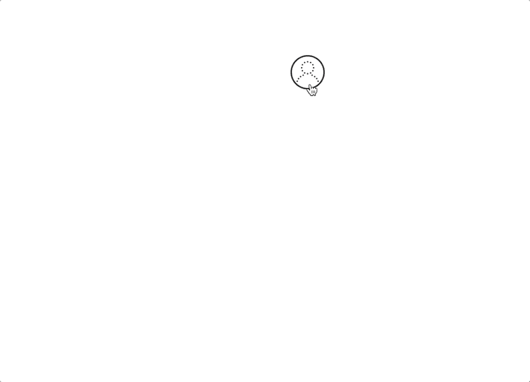
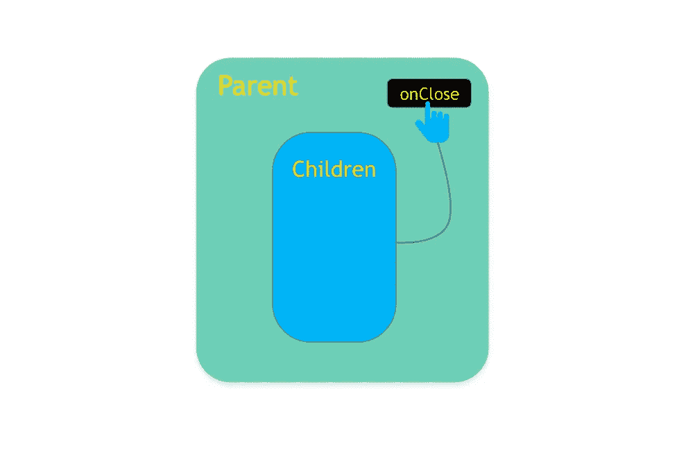
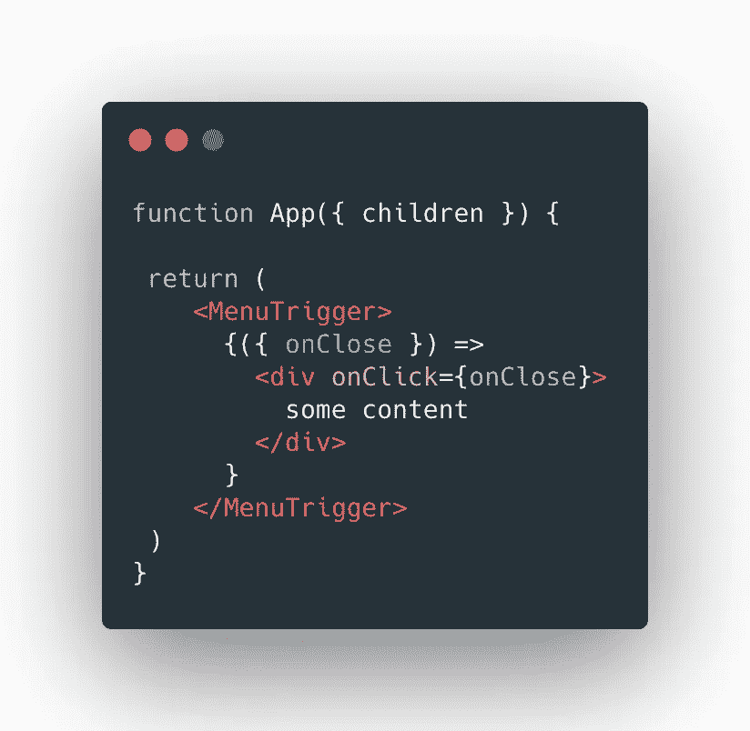

# 您可能不需要 React 应用程序中的提供者

> 原文：<https://javascript.plainenglish.io/you-might-not-need-a-provider-338d31358435?source=collection_archive---------20----------------------->

## 很多时候我们使用 React 上下文 API 来共享自顶向下的状态。然而，可以采用一种简单的方法来代替。

一个常见的场景是当我们想要从其子组件控制一个组件状态时。不知道我在说什么？坚持下去，你会得到它，我保证。

让我们直入主题吧。你在下面看到的就是我们所说的菜单触发器。所以当用户点击用户图标时，菜单内容就会出现。

我们希望以这样一种方式构建这个组件，即我们可以传递菜单的任何内容，并且能够在用户单击菜单的任何项目时关闭它。

# 设计组件

A children component ‘pressing’ onClose on its parent

这里的关键是使用儿童道具来实现我们想要的。如果非要举例说明我在这篇文章中所写的全部内容，那就是下面这个片段:

在上面的代码中，我只保留了重要的部分。基本上你所看到的是一个组件，它带有一个“儿童”道具，如果它是一个函数，我们将在其中注入`onClose`函数。否则，它只是作为组件的内容呈现。

这个简单的技术允许许多可能性。当我有一个组件不需要在应用程序的很多地方公开它的状态，而是只需要一两个可以从子组件访问的回调时，我经常使用这个方法。

你可以这样使用它:

# 我想要更多

没问题。我创建了一个代码沙箱，你可以在里面玩代码，我还使用了`react-transition-group`来创建一个更好的感觉，当组件在屏幕上出现或消失的时候。这是:

【https://codesandbox.io/s/interesting-forest-nj1yz? fontsize = 14&hide navigation = 1&theme = dark

# 结论

我绝对不是在这里重新发明轮子。这种技术遍布 React 社区，它通常不仅用于传递回调，还用于传递数据给子组件。反应消费者就是一个很好的例子。可以查一下 React 官方文档看看。

我希望这篇文章能帮助你避免使用 Context API 或 Redux 创建复杂的状态管理结构，因为你可以调整你的代码，这样孩子就有能力了😄。

如果你有任何问题或建议，请在下面的评论中告诉我。

*👉在我的媒体上关注我，支持我，直接获得最新文章:*[*@ fernandoabolafio*](https://medium.com/@fernandoabolafio)*🛎*

*👉在 Twitter 上关注我*[*@ ox Fernando*](https://twitter.com/oxfernando)*我们聊聊天吧。我发布关于 React、NextJs、Remix.run 和其他很酷的 WebDev 技术的文章。🐤*