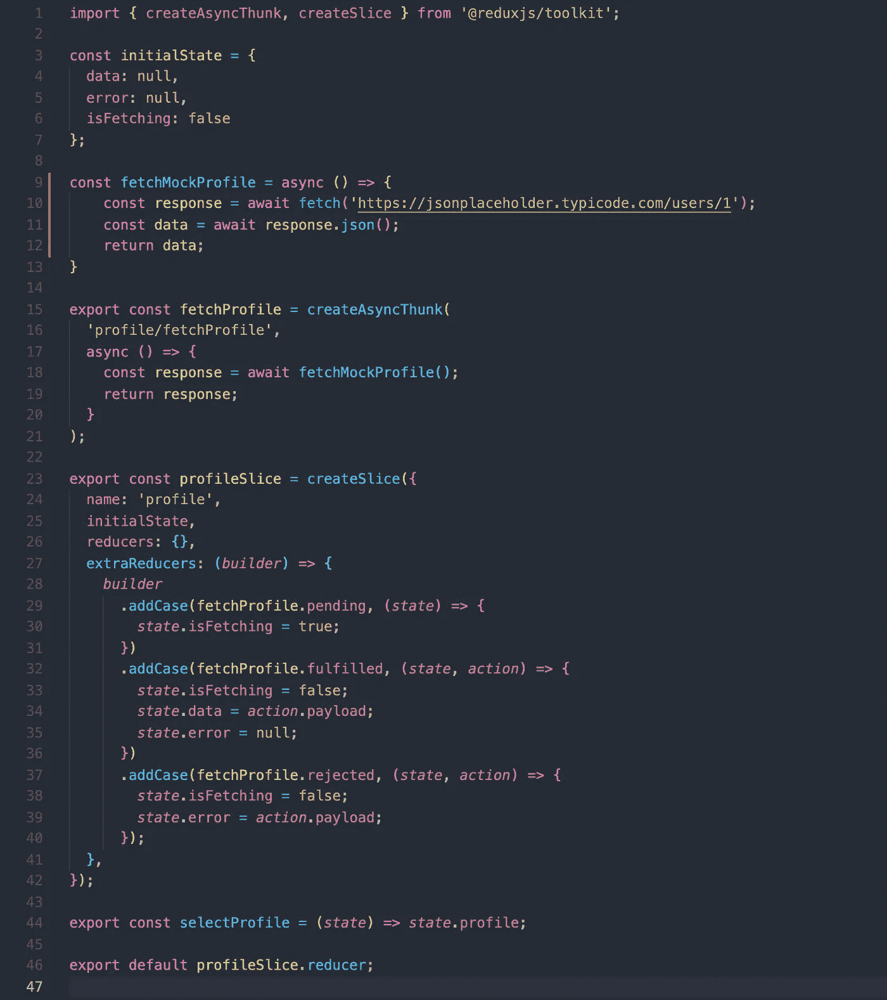
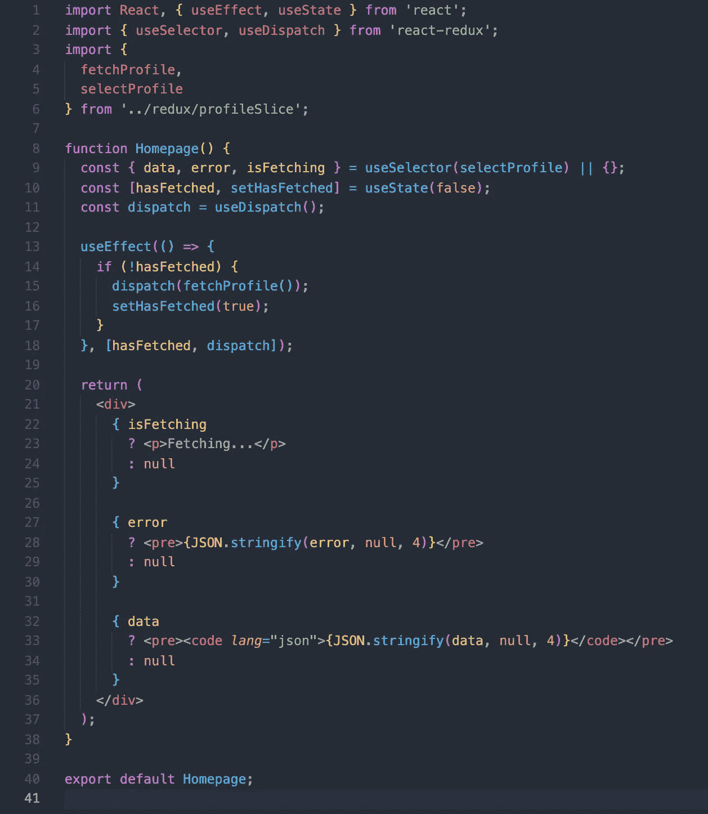
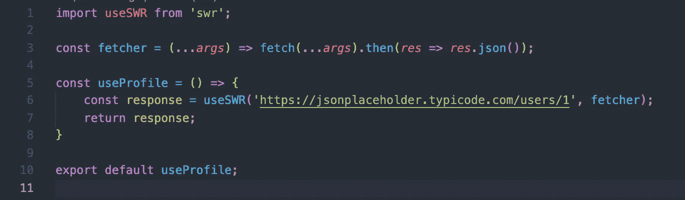
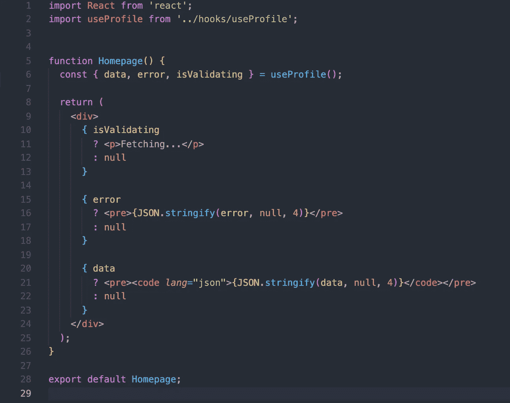

# 你可能不需要 Redux

> 原文：<https://javascript.plainenglish.io/you-might-not-need-redux-a9b6be495949?source=collection_archive---------16----------------------->


Photo by [Beatriz Pérez Moya](https://unsplash.com/@beatriz_perez?utm_source=medium&utm_medium=referral) on [Unsplash](https://unsplash.com?utm_source=medium&utm_medium=referral)

我不认为找到一个**不**使用专用状态管理库的现代 web 应用程序会特别困难——公平地说，它很可能会是 Redux。

状态是 web 开发世界中很难弄清楚的事情之一。有很多选择，包括 React 在内的大多数前端库也提供开箱即用的状态管理。但是，如果设计和实施不正确，糟糕的状态会很快导致延迟、头痛和技术债务。这通常意味着一个项目将有许多样板代码、reducers、actions、providers，甚至更多——占用一堆单独的文件和太多的函数，所有这些函数都相互通信，以便在状态树的某个黑暗角落将布尔值从`true`更改为`false`。

公平地说，Redux 提供了真正优秀的 Redux Tookit，它在减少大量代码方面做得非常好，让开发人员工作起来更加愉快。还有值得注意的 *thinner* 状态管理库比如 [Zustand](https://github.com/pmndrs/zustand) 值得一探究竟！

在这篇文章中，我将演示一种与 API 交互的方法，并跟踪一些事情，例如我们是否在等待响应，我们有什么数据，以及是否有任何错误。

# **Redux 方式**

传统上，我会用状态管理库来跟踪这些东西；尤其是如果在我们的组件层次结构中，需要跨越多个组件的信息，而这些组件又相隔几层。

因此，让我们构建一个与 API 交互的简单应用程序，并使用 Redux 和 Redux Toolkit 来管理其状态。

我将使用`create-react-app`和`redux`模板快速启动一个 React + Redux 应用程序:

```
$ npx create-react-app my-app —-template redux
```

这个创建的应用程序可以在[这里](https://github.com/phobos101/blog/tree/2a5c3932d61717bfb5e68a3b83edb97af14ac277/you-might-not-need-redux)找到。

我们有一个所有 Redux 位都将使用的主存储，计数器组件本身，计数器的 API，最后是计数器片。如果你不熟悉这个术语，切片处理所有以前用动作、缩减器和选择器处理的东西。你可以在 [RTK 文档](https://redux-toolkit.js.org/api/createSlice)网站上了解更多。尽管切片很神奇，但它仍然有大量的代码，需要大量的抽象，这使得它不是最直观的构造。

我将修改代码，这样主页将通过 Redux 获取并显示用户:



src/redux/profileSlice.js



src/pages/Homepage.js

完整的代码示例可以在[这里](https://github.com/robwilson1/blog-examples/tree/276ecc8662075da9869f34179445466c53baa7e2/you-might-not-need-redux/src)找到。

# 介绍 SWR

SWR 包是一个强大的数据读取库，它被用作一个 React 钩子。多个组件可以调用钩子，传入一个标识符来订阅特定的 HTTP 响应。幕后有这么多聪明的东西，它真的带走了很多样板代码，同时给了我们很多开箱即用的选项。

在这个例子中，我们将从 Redux 例子中保留的唯一东西是获取模拟用户的 API 调用。我们将对其稍加修改，使其成为 SWR fetcher，如下所示:

```
**const** fetcher = (...args) => fetch(...args).then(res => res.json())
```

如果我们愿意，我们可以简单地将所有的逻辑保存在“主页”组件中，不再进一步抽象，或者，我们可以将这个逻辑抽象到一个定制的钩子中，并将其命名为`useProfile`。



src/hooks/useProfile.js



src/pages/Homepage.js

SWR 钩子的导入、取出和消耗总共是 3 行。这个 HTTP 调用的惟一标识符是 URL 字符串，它作为钩子的第一个参数提供。如果另一个组件要调用`useProfile`，SWR 不会复制 HTTP 调用。还有大量的配置选项和对更高级用例的支持。

完整的代码示例可以在[这里](https://github.com/robwilson1/blog-examples/tree/da886c8473895bd7d8158636b72b7a9edc6e3c30/you-might-not-need-redux/src)找到。

在实际项目中，我已经删除了数百行 Redux 和 React 上下文代码，以支持这种最小的内存占用和强大的替代方案，从而使代码更容易阅读和维护。你可以在 SWR 官方文档页面[找到更多信息。](https://swr.vercel.app/docs/getting-started)

编码快乐！

*更多内容请看*[***plain English . io***](http://plainenglish.io/)