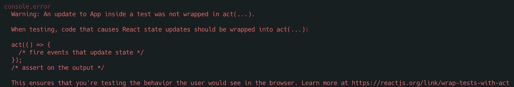
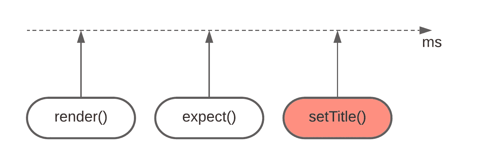
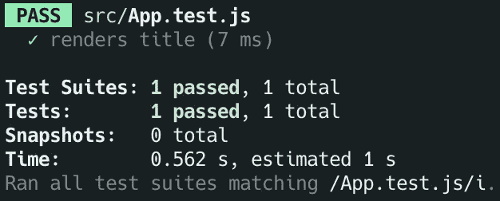

# 您可能不需要在反应测试中采取行动()

> 原文：<https://javascript.plainenglish.io/you-probably-dont-need-act-in-your-react-tests-2a0bcd2ad65c?source=collection_archive---------0----------------------->

## 你应该做的是。

Photo by [Marek Novotný](https://unsplash.com/@pilgrim) on [Unsplash](https://unsplash.com/photos/sAYjHNsD0rI)

**TL；DR** 如果您发现自己将`act()`与 RTL ( `react-testing-library`)一起使用，您应该看看是否可以改用 RTL 异步实用程序:`waitFor`、`waitForElementToBeRemoved`或`findBy`。

React 希望所有可能导致状态更新的测试代码[都包含在](https://reactjs.org/docs/test-utils.html#act) `[act()](https://reactjs.org/docs/test-utils.html#act)`中。

*但是等一下*，标题不是说我们应该**而不是**使用`act()`吗？嗯……是的，因为`act()`是样板，我们可以用`[react-testing-library](https://testing-library.com/docs/)`去掉🚀

## `act()`解决了什么问题？

这样想:当测试中发生什么事情时，例如，某个按钮被点击，React 需要**调用事件处理程序，更新状态，然后运行** `**useEffect**`。由于[反应状态更新是异步的](https://reactjs.org/docs/design-principles.html#scheduling)，反应必须知道何时做所有这些事情。这就是为什么`act()`是必要的。

如果你想挖掘得更深，有一个[惊人的读数](https://github.com/threepointone/react-act-examples/blob/master/sync.md)。

## `react-testing-library`已经在`act()`中包装了实用程序

每次使用`render()`、`userEvent`、`fireEvent`时，都是[已经将](https://testing-library.com/docs/preact-testing-library/api/#act)包裹在`act()`中。**实际上是什么意思？**

这意味着每次您使用这些实用程序之一时，所有组件的相关状态更新都会被刷新。额外的同步`act()`不会改变*任何东西*。

如果你不相信我，看看这个例子:

[https://codesandbox.io/s/late-frost-3j2sr?file=/src/App.js](https://codesandbox.io/s/late-frost-3j2sr?file=/src/App.js)

*注:所有例子都是基于一个新鲜的* `*create-react-app*` *。*

如你所见，我们没有使用`act()`，新标题在点击后被刷新。

我提到**同步**T2 是有原因的。事情开始变得棘手了🙊

# 😈异步组件

每当状态更新被**调度** **异步**(例如，在承诺解决之后)**，**测试就不能再保持同步。否则，React 将警告我们状态更新没有被包装在`act()`中。

让我来说明我的意思。我们将从 API 中获取标题，而不是在单击按钮时设置标题:

[https://codesandbox.io/s/act-warning-7y357?file=/src/App.js](https://codesandbox.io/s/act-warning-7y357?file=/src/App.js)

这个测试不仅会失败，而且还会产生臭名昭著的`An update to App inside a test was not wrapped in act(...).`警告。

为什么会出现这种情况？答案与 [**事件循环**](https://flaviocopes.com/javascript-event-loop/) 的关系比与 React 的关系更大。

你可能已经注意到测试同步地做所有的事情。它没有`await`或承诺链。出于这个原因，`setTitle(title)`进入**任务队列**(也称为**消息队列** ) ，并且只有在调用栈清空之后才被执行**。在另一端，`expect(screen.getByText("Fetched")).toBeInTheDocument()`进入**调用栈**，这意味着它在状态更新被调度之前运行！**

setTitle() goes into task queue, hence executes later than expect()

好吧，但是为什么要警告呢？毕竟，`render()`导致了状态更新，它被 RTL 包装在`act()`中，所以我们应该是好的，对吗？😧

不完全是。由于`render()`是一个同步函数，它只刷新同步状态更新。

简而言之:

*   测试失败，因为状态更新被安排在断言之后**。**
*   打印警告是因为状态更新计划在测试完成后**进行。**

## 这怎么解决？

🔴让我从一个不正确的例子开始:

[https://codesandbox.io/s/hide-act-warning-7e1b2?file=/src/App.test.js](https://codesandbox.io/s/hide-act-warning-7e1b2?file=/src/App.test.js)

这解决了我们两个的问题。它隐藏了警告，也使测试通过，但它带来了其他问题:

*   这只是因为状态更新发生在事件循环的下一个节拍。
*   `act()`这里没有什么特别的，只是隐藏了警告。

事实上，为了展示这种解决方案的粗糙本质，请看另一个例子。它还隐藏警告并使测试通过。看起来没什么意义吧？语义上，这两者差别不大。

[https://codesandbox.io/s/hide-act-warning-2-r9tlq?file=/src/App.test.js](https://codesandbox.io/s/hide-act-warning-2-r9tlq?file=/src/App.test.js)

为了证明我的第一点，`This only works because the state update happens in the next tick of the event loop`，考虑一个例子，我们`await`一个额外的承诺。

[https://codesandbox.io/s/hide-act-warning-3-oezlf?file=/src/App.js](https://codesandbox.io/s/hide-act-warning-3-oezlf?file=/src/App.js)

它会使测试失败！

## ✅使用 RTL 异步实用程序

好消息是在这些场景中没有必要使用`act()`。我们可以使用[与 RTL](https://testing-library.com/docs/dom-testing-library/api-async) : `waitFor`，`waitForElementToBeRemoved`和`findBy`查询一起提供的函数。

[https://codesandbox.io/s/testing-async-the-proper-way-jvedu?file=/src/App.test.js](https://codesandbox.io/s/testing-async-the-proper-way-jvedu?file=/src/App.test.js)

或者是`waitFor`变型:

[https://codesandbox.io/s/testing-async-the-proper-way-2-5b5qu?file=/src/App.test.js](https://codesandbox.io/s/testing-async-the-proper-way-2-5b5qu?file=/src/App.test.js)

两种变体都通过了测试，它们没有上述问题。

## 如果我在一个事件后获取会怎样？

如果异步调度的状态更新发生在`useEffect`或事件处理程序中，没有区别。在测试中，我们可以等待事情发生后的**，而不是等待事情发生后的`render()`。**

让我们重温第一个例子，但这次我们将异步更新状态:

[https://codesandbox.io/s/testing-userevent-the-proper-way-6zs7o?file=/src/App.test.js](https://codesandbox.io/s/testing-userevent-the-proper-way-6zs7o?file=/src/App.test.js)

正如你所看到的，状态更新被安排在用户点击之后，而不是在`useEffect`中，从测试的角度来看，这并没有太大的变化。`act()`中的`userEvent`包装和`render()`包装一样差。

## 是否存在使用`act()`不可避免的情况？

是的，可能会有某些情况。例如，您可能希望安排一个去抖功能的状态更新。在这种情况下，使用 jest 的假计时器并将`jest.runAllTimers`或`jest.advanceTimersByTime` 包装在`act()`中似乎是一种合理的方法。

我建议在这里阅读更多关于棘手案件的信息。

# 🚪结论

在大多数情况下，`react-testing-library`使得`act()`中的包装测试代码变得不必要。此外，这样做可能会导致其他问题。相反，请尝试使用 RTL 异步实用程序，它们应该可以满足您的大部分需求。

在[eslint-plugin-testing-library v4](https://github.com/testing-library/eslint-plugin-testing-library/issues/186)中提供`no-unnecessary-act`规则的工作已经在进行中，但是在撰写本文时，它仍然是一个正在进行中的[工作](https://github.com/testing-library/eslint-plugin-testing-library/issues/259)。希望它能尽快完成。

我非常感谢你花时间阅读这篇文章，我希望你学到了一些新的东西🙂

在 [LinkedIn](https://www.linkedin.com/in/tomas-zaicevas/) 、 [GitHub](https://github.com/zaicevas) 、 [Twitter](https://twitter.com/tozaicevas) 中随意**连接**与我

# 资源

*   `act()` [单据](https://reactjs.org/docs/test-utils.html#act)
*   [RTL 文件](https://testing-library.com/docs/)
*   [RTL 异步公用事业](https://testing-library.com/docs/dom-testing-library/api-async)
*   [更深入地洞察](https://github.com/threepointone/react-act-examples/blob/master/sync.md) `[act()](https://github.com/threepointone/react-act-examples/blob/master/sync.md)` [所做的事情](https://github.com/threepointone/react-act-examples/blob/master/sync.md)
*   `no-unnecessary-act` eslint 规则 [GitHub 发布](https://github.com/testing-library/eslint-plugin-testing-library/issues/259)
*   [JavaScript 事件循环](https://flaviocopes.com/javascript-event-loop/)
*   事件循环到底是什么？|菲利普·罗伯茨| JSConf 欧盟
*   [修正了 RTL 创作者的“没有被包裹在 act(……)”警告](https://kentcdodds.com/blog/fix-the-not-wrapped-in-act-warning)
*   [把东西包在](https://kentcdodds.com/blog/common-mistakes-with-react-testing-library#wrapping-things-in-act-unnecessarily) `[act](https://kentcdodds.com/blog/common-mistakes-with-react-testing-library#wrapping-things-in-act-unnecessarily)` [不必要地](https://kentcdodds.com/blog/common-mistakes-with-react-testing-library#wrapping-things-in-act-unnecessarily)

*更多内容请看*[***plain English . io***](https://plainenglish.io/)