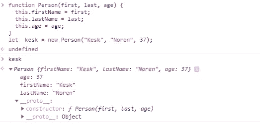
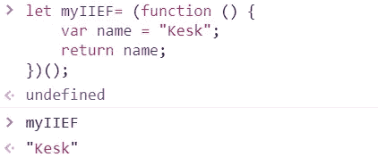
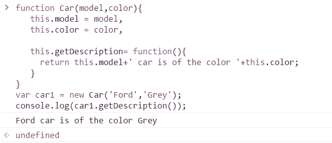
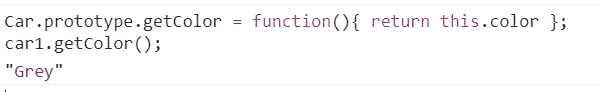
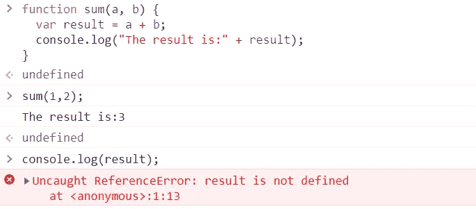
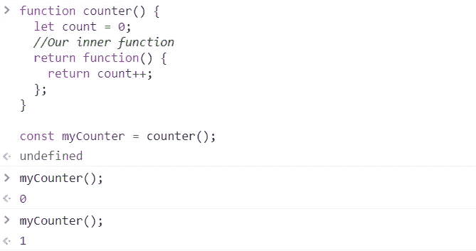
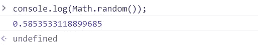
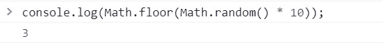
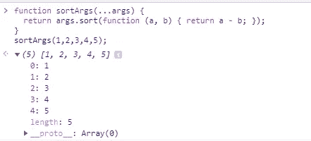
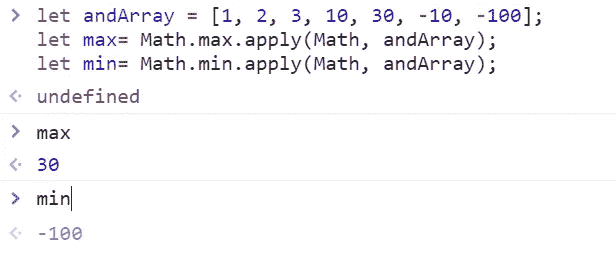

# JavaScript 中你应该知道的 13 个概念/技巧

> 原文：<https://javascript.plainenglish.io/you-should-know-these-13-concepts-tips-in-javascript-9592cc0d89c1?source=collection_archive---------16----------------------->

## 提升等级的基本概念和技巧


JavaScript 有它的批评者和追随者，但很明显它是当今使用最广泛的语言之一，而且，我要说的是，它很有趣，因为你可以对它应用大量的技巧。在这篇文章中，我收集了一些你应该知道的基础知识和一些技巧和提示。

# 简而言之，基本概念

1.  创建一个对象构造函数。
2.  创建一个生命(立即调用函数表达式)。
3.  原型。
4.  范围。
5.  关闭。

# 方便的提示

1.  得到一个介于 x 和 y 之间的随机数。
2.  将 arguments 对象转换为数组。
3.  获取数字数组中的最大值或最小值。
4.  避免使用 eval()。
5.  避免使用函数构造函数。
6.  避免与()一起使用。
7.  将超时设置为 XMLHttpRequests。
8.  使用普通 JS 来加快操作速度。

# 简而言之，基本概念

## 1.创建对象构造函数

构造函数类似于常规函数，但是我们用 new 关键字来使用它们。如果您想用相同的方法和属性创建相似的对象，构造函数很有用。按照惯例，我们将构造函数的名字大写，以区别于常规函数。

```
function Person(first, last, age) {
  this.firstName = first;
  this.lastName = last;
  this.age = age;
}let  kesk = new Person("Kesk", "Noren", 37);
```



Result in the Google Chrome dev console.

在构造函数中，这没有值。它是新对象的替代对象。当创建新对象时，此的值将成为新对象。

## 2.创建一个**生命**(立即调用函数表达式)

IIEF 是一种一旦创建就立即执行函数的方法。它们很有用，因为它们不会污染全局对象，并且是隔离变量声明的一种方式。

语法:

```
(function () {
    statements
})();
```

示例:

```
let myIIEF= (function () {
    var name = "Kesk";
    return name;
})();//Immediately creates the output.
myIIEF;
```



Result in the Google Chrome dev console.

## 3.原型

原型是 JavaScript 对象相互继承特性的机制。所有 JavaScript 对象都从原型继承属性和方法。

```
function Car(model,color){
   this.model = model,
   this.color = color,

   this.getDescription= function(){
     return this.model+' car is of the color '+this.color;
   }
}var car1 = new Car('Ford','Grey');console.log(car1.getDescription());
//Ford car is of the color Grey
```



Result in the Google Chrome dev console.

向“汽车”原型添加一个新方法:

```
Car.prototype.getColor = function(){ return this.color };car1.getColor();
```



Result in the Google Chrome dev console.

```
console.log(car1.__proto__ === Car.prototype );
//true
```

“prototype”是在用 new 创建对象时用来构建 __proto__ 的对象。

__proto__ 是查找链中用于解析方法、属性等的实际对象。

## 4.范围

JavaScript 中的函数为使用 var、let 和 const 声明的变量定义了作用域。

让我们在函数体内声明一个 var 变量:

```
function sum(a, b) {
  //"sum" function scope
  var result = a + b; 
  console.log("The result is:" + result); 
  //The result is: 3
}sum(1,2);
//3console.log(result); 
//throws ReferenceError
```



Result in the Google Chrome dev console.

sun()函数体创建了一个作用域。变量“result”在函数范围内是可访问的，但在函数范围外是不可访问的。

## 5.关闭

*闭包是与对其周围状态(词法环境)的引用捆绑在一起(封闭)的函数。换句话说，闭包允许您从内部函数访问外部函数的范围。在 JavaScript 中，闭包是在每次创建函数时创建的。*

当内部函数可以访问其外部函数变量和参数时，就创建了闭包。内部函数可以访问:
1。自身的变数。
2。外部函数的变量和参数。
3。全局变量。

```
//Our outher function
function counter() {
  let count = 0;
  //Our inner function  
  return function() {
    return count++;
  };
}const myCounter = counter();
myCounter(); // 0
myCounter(); // 1
```



Result in the Google Chrome dev console.

# 方便的提示

## 1.获取 x 和 y 之间的一个随机数

要获得 0 到 1 之间的随机数，请使用 Math.random 函数:

```
console.log(Math.random());
```



Result in the Google Chrome dev console.

如果我们想要一个 1 到 10 之间的随机数，我们必须将数学结果相乘。随机乘以 10，然后向上或向下取整:

```
console.log(Math.ceil(Math.random() * 10));
```



Result in the Google Chrome dev console.

## 2.将 arguments 对象转换为数组

JavaScript 中的 arguments 对象在大多数情况下就像一个数组，但它实际上不是一个数组对象。因为它完全是另外一个东西，它没有 Array.prototype 中有用的函数，比如 forEach、sort 或 filter。

```
function sortArgs(...args) {
  return args.sort(function (a, b) { return a - b; });
}sortArgs(1,2,3,4,5);
//[1,2,3,4,5]
```



Result in the Google Chrome dev console.

## 3.获取数字数组中的最大值或最小值

使用这个技巧可以很容易地得到一系列数字的“最小值”和“最大值”:

```
let andArray = [1, 2, 3, 10, 30, -10, -100]; 
let max= Math.max.apply(Math, andArray);
let min= Math.min.apply(Math, andArray);
```



Result in the Google Chrome dev console.

## 4.避免使用 eval()

您应该避免使用它的主要原因不仅是性能问题，而且主要是安全问题。从字符串中评估 JavaScript 代码是危险的，因为该字符串可能包含将在用户机器上运行的恶意代码。

如果您试图评估用户的输入，可能会导致无限循环或删除文件。在 Node.js 中这样做会删除当前目录中的所有文件！

```
const userInput = `require("child_process").exec('rm -rf ./*')`;eval(`console.log("User input: ${userInput}")`);
```

我们有安全字符串评估的第三方备选方案，或者我们可以使用全局函数()来编写我们自己的自定义评估函数。

## 5.避免使用函数构造函数

## 6.避免使用 with()

with 语句为一组语句设置默认对象。

语法:

```
with (expression)
  statement
```

我们应该避免使用 with()主要有三个原因:

意外行为

在下面的例子中，由于对象中不存在属性“color ”,所以创建了一个与之无关的新全局变量。

```
with(document.getElementById('el').style) {
    colors = '#'; 
}
```

表演

当涉及到大对象的迭代时，这个函数的代价是很重要的。这里的主要缺点是我们不能优化对“arg”的访问，因为我们不知道它是引用一个实变量还是要覆盖的对象的一个属性。

```
function foo(arg) {
  with(arg) {
    console.log("The arg: "+arg)
  }
}
```

安全性

这是不赞成使用这种方法的主要原因。我们不能通过查看代码来确定函数标识符指的是什么，因为它是一个词法环境。

## 7.将超时设置为 XMLHttpRequests

```
xhrRequest = new XMLHttpRequest();xhrRequest.onreadystatechange = () = {  
  if (this.readyState == 4) {  
     clearTimeout(timeout);  
     //do some stuff with response.
  }  
}let timeout = setTimeout( () => {  
    xhr.abort(); 
}, 60*5000);

//timeout after five minutes
xhrRequest.open('GET', url, true);xhrRequest.send();
```

## 8.使用普通 JS 来加快操作速度。

```
var min = Math.min(a , b);
```

最好使用

```
var min = a < b ? a : b; 
A[A.length] = v;
```

只有在代码的可读性没有下降时才这样做，因为通常使代码易于阅读和维护比使用技巧使代码更快更重要。

非常感谢你读给我听。我希望你喜欢这个汇编。在这难得的艰难时刻保重！

# 参考

[MDN 网络文档](https://developer.mozilla.org/es/)