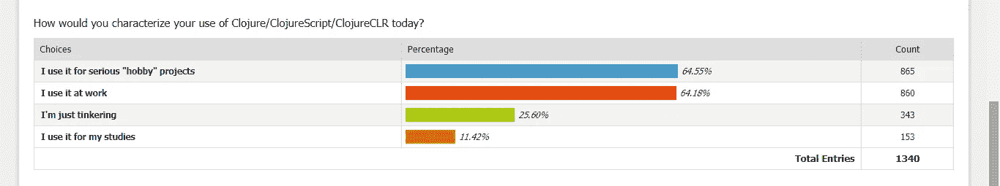
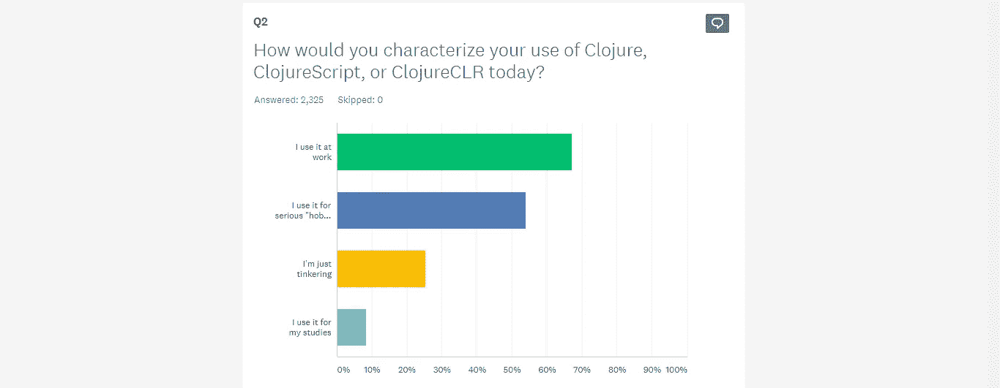

# 你不应该知道未来趋势清单上有什么:3 个被低估的原因

> 原文：<https://javascript.plainenglish.io/you-shouldnt-learn-what-s-on-the-futuristic-trend-list-3-underrated-reasons-why-25531000d5de?source=collection_archive---------12----------------------->

## 你的解决方案正在等着你。

Photo by [Singkham](https://www.pexels.com/@singkham-178541?utm_content=attributionCopyText&utm_medium=referral&utm_source=pexels) from [Pexels](https://www.pexels.com/photo/clear-light-bulb-planter-on-gray-rock-1108572/?utm_content=attributionCopyText&utm_medium=referral&utm_source=pexels)

我们都见过流行的编程趋势，比如[这个](https://techbeacon-com.cdn.ampproject.org/v/s/techbeacon.com/app-dev-testing/5-emerging-programming-languages-bright-future?amp_js_v=a6&amp_gsa=1&amp&usqp=mq331AQHKAFQArABIA%3D%3D#aoh=16234353180541&referrer=https%3A%2F%2Fwww.google.com&amp_tf=From%20%251%24s&ampshare=https%3A%2F%2Ftechbeacon.com%2Fapp-dev-testing%2F5-emerging-programming-languages-bright-future)和[这个](https://hackr-io.cdn.ampproject.org/v/s/hackr.io/blog/best-programming-languages-to-learn-2021-jobs-future/amp?amp_js_v=a6&amp_gsa=1&usqp=mq331AQHKAFQArABIA%3D%3D#aoh=16234348872933&referrer=https%3A%2F%2Fwww.google.com&amp_tf=From%20%251%24s)。

但是趋势列表的重点不在于趋势本身，而在于你如何利用它。

至少 97%的我们，人类，爱潮流，倒数，和编号列表。是的，如果我说我不是潮流爱好者，那我是在撒谎。

为什么我们喜欢这些趋势？*我们想展示最新要闻，新闻。或者用我们对一种新的流行技能的熟练程度来让我们的朋友惊叹。*

但是，我们利用这些趋势为我们的职业带来优势了吗？大多数人都不知道。

他们学习未来趋势列表上任何闪亮、有趣的技术、框架或语言，而不进行有效的提问。这就是问题所在！这里有三个被低估的原因。

## 1.不是所有的趋势都能被发现。

如此多的趋势已经过时，不会造成任何重大影响。Clojure。

*clo jure 是什么？*

*   一种创建于 2007 年的编程语言
*   它的第一个稳定版本于 2009 年推出

现在，Clojure，过去和现在都被认为是 Java 的有力替代者，远不如 Java 现在的流行程度。

根据 Stack overflow 的调查，它在 2015 年、[、2016 年](https://insights.stackoverflow.com/survey/2016)、 [2019 年](https://insights.stackoverflow.com/survey/2019)分别是第五、第六和第七大最受欢迎的语言。

但在 [2020 年调查](https://insights.stackoverflow.com/survey/2020#technology-most-loved-dreaded-and-wanted-languages-dreaded)中，已经完全从榜单中消失。

*那么，跟在这样的趋势后面跑是否明智？*

现在，比较一下 1995 年创建的 JavaScript 的趋势。

## 2.基础薄弱的学习

许多人在他们所学的主题没有坚实基础的情况下追随潮流。然而，这导致对实际概念的理解薄弱。

这就像作为一个 Python 开发者学习 Node.js，却没有所需的 JavaScript 基础。

## 3.糟糕的分析等同于资源浪费。

追随一个对你当前职业领域没有帮助的趋势只会浪费金钱和时间。

# 公平处理

你认为，大多数时候是因为这些趋势，你的生产力不够吗？

从一个时髦的技能跳到另一个，但在现实中，没有稳定向上的进步就在原地打转？

让我们现在就解决它吧！

# 逆向工程

现在，还有人在用 Clojure。在其早期阶段，在 [2014 年对 Clojure 州的调查](https://cognitect.wufoo.com/reports/state-of-clojure-2014-results/)中，它更多地用于业余爱好项目，而不是工作、学习和修补。

Source: [2014 survey](https://cognitect.wufoo.com/reports/state-of-clojure-2014-results/) for the State of Clojure

现在，根据 Clojure 州的 [2018 年调查](https://www.surveymonkey.com/results/SM-9BC5FNJ68/)，人们现在在工作中使用它比爱好项目、修补和研究多得多。

Source: The [2018 survey](https://www.surveymonkey.com/results/SM-9BC5FNJ68/) of the State of Clojure

这告诉了你什么？

在早期，人们发现了这种闪亮的新语言。它甚至更有吸引力，因为它被视为 Java 的有力替代品。

越来越多的人将它用于业余爱好项目，现在新的技术栈已经到来，它被遗弃了。这并不是因为它实际上不喜欢或害怕。

最近，它被用在工作中，很少用于业余爱好项目。

现在，让我把范围缩小到这一点。

Clojure 仍然很少有人使用，因为它对他们、他们的工作和他们的职业仍然很有帮助，不管未来的趋势是什么。为什么？

因为，在那个时候，他们:

*   分析了趋势列表，然后关闭。
*   做了一些关于它的能力和他们需要什么基础才能很好地掌握这个概念的研究。
*   最后，带着这个问题查看列表:“从长远来看，这种语言对我有帮助吗？”

现在，一个更流行的例子是旋舞和反应土著世仇。以下是一些引人注目的帖子:

*   [颤振超车反应原生:Reddit 论坛讨论](https://www.reddit.com/r/FlutterDev/comments/ikw2rx/flutter_has_officially_taken_over_react_native_as/)
*   [扑扑超车反应原生:一篇博文](https://blog.logrocket.com/why-flutter-is-overtaking-react-native/)
*   [是旋舞的未来！！](https://www.monterail.com/blog/flutter-vs-react-native-mobile-development)

*“现在我如何浏览所有这些信息”*——**你在问自己。**

不用担心，因为你的解决方案就在下面。

# 外卖

在你开始学习一项新的流行技能之前，问自己以下两个问题:

1.  **我有学习它的良好基础吗？**

*这样想吧！*

如果你在 JavaScript 和 React JS 方面有很好的基础，你肯定能很快很好地理解 React Native。 [Rafeh Qazi](https://medium.com/u/c1a517a199d2?source=post_page-----25531000d5de--------------------------------) 就是一个[明显的例子](https://www.google.com/url?sa=t&source=web&rct=j&url=https://m.youtube.com/channel/UCqrILQNl5Ed9Dz6CGMyvMTQ&ved=2ahUKEwjSpvuFoprxAhVDyYUKHV_rBmYQFjAAegQIAxAH&usg=AOvVaw3H5c2bJZbxdydfqIeYABLs)。

现在，你可以拥有所需的基础，但这并不一定意味着该技术从长远来看对你有帮助。

这就引出了第二个问题。

2.从长远来看，这对我真的有帮助吗？

有些人跟风是因为它流行、热门、新潮。但是他们不知道大多数现代语言让他们痛苦，尤其是对他们来说毫无用处的时候。

*想到这个！*

一首歌在 AT 40 排行榜上排名第二。你并不真正喜欢这首歌。

你会把它放在你的 Spotify 播放列表上，因为它是一首热门歌曲吗？不要！因为这对你没用。

除非你想用这首歌来戏弄朋友，或者用最新的要旨来打动朋友。

但是你知道，在那些情况下它对你也是有用的😅

软件开发世界的趋势也是如此。如果你不需要图表上的技术，如果它对你没有用，为什么要学呢？

所以，至于旋舞反应原生，你可以利用[这条信息](https://youtu.be/uxZZzmeCoLE)来做出你的决定。

# 最后的想法

趋势很好。*刮那个！就他们传递的惊人信息而言，他们是非凡的。但这完全取决于你，我的朋友，如何利用它！*

总是问自己这个问题:

“这笔交易值得我花费不可挽回的时间吗？”

感谢阅读！

享受这个？订阅我的简讯，获取更多我的故事。

*更多内容请看*[*plain English . io*](http://plainenglish.io/)