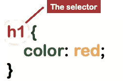
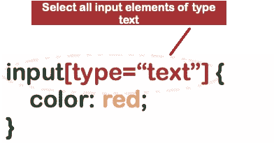
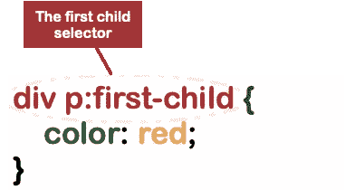
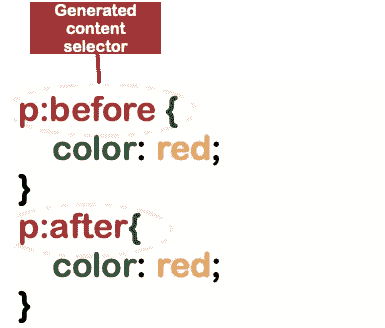
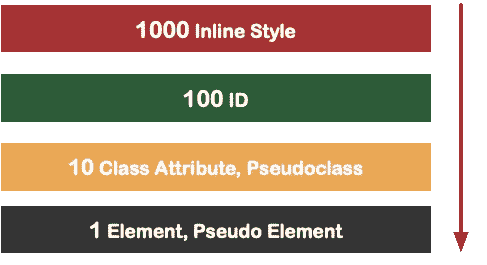

# 你的 CSS 101 修订版:选择器

> 原文：<https://javascript.plainenglish.io/your-css-101-revision-selectors-93ef7d290375?source=collection_archive---------20----------------------->

本文是修订 CSS 基础知识系列文章的一部分。


Photo by [Ferenc Almasi](https://unsplash.com/@flowforfrank?utm_source=medium&utm_medium=referral) on [Unsplash](https://unsplash.com?utm_source=medium&utm_medium=referral)

CSS 代表*层叠样式表，不幸的是，它仍然是*网络的风格语言:)

在 CSS 中，选择器是用来选择你想要样式化的元素的模式。从这里开始，您可以使用一组键值对将样式应用于所选元素。理解选择器是 CSS 的基础，也是一个好的网站设计之路。

最简单形式的 CSS 选择器如下所示。首先，它有选择器部分，后面是包含样式属性的花括号。



我们可以将选择器分为基本选择器、分组选择器、组合子和伪选择器。让我们探索每一个类别。

# 基本选择器

## 元素选择器

该选择器按元素类型选择所有元素。例如，其他类型可以是 body、p、a 等。

```
h1 {color: red;}
```

## 类别选择器

多个元素可能有相同的类，因为类名在 DOM 中不是唯一的。这个选择器选择类名中的元素。

```
.primary {color: red;}
```

## ID 选择器

与类选择器不同，ID 在 HTML 文档中必须是唯一的。要选择 ID，使用 *#* 后跟 ID 名称。

```
#warning {color: red;}
```

## 属性选择器

属性是 HTML 元素中大多数的键值对。您可以使用以下方括号语法按属性选择元素。



```
input[type=”text”] 
{ 
    color: red;
}
```

# 分组选择器

## 目录

如果你想选择所有带有 class info 的元素和所有带有 class primary 的元素，你可以写两个不同的选择器。但是 CSS 也支持组合选择器，用逗号分隔它们。请注意，这不同于选择同时具有两个类的元素。

```
.info,.primary {background-color: black;}
```

# 组合子选择器

## 后代选择器

您可以通过列出由空格分隔的部分路径来选择满足 HTML 树中路径的元素。在下面的例子中，我们选择了作为 div 子元素的所有 h2 元素。

```
div h2 { color: red;}
```

当然，您可以一起使用组合方法和后代选择器。

```
div h1,
div h2 { color: red;}
```

## 相邻兄弟选择器

选择紧跟在 textarea 元素后面的按钮。

```
textarea + button {
  color: red
}
```

## 同科

波浪号选择必须是同级的元素，即具有相同的父元素。

```
textarea ~ button {
    color: red
}
```

## 直接子选择器

它选择直接嵌套在第一个元素(textarea)中的所有按钮

```
textarea > button {
    color: red
}
```

# 假的

## 动作伪类

伪选择器允许指定选择器的状态。

`a:visited`瞄准每一个已经被点击的链接。

`a:hover`当您将鼠标悬停在某个链接上时，选择该链接。

`a:active`点击时应用样式。

```
a:link { color: red;}a:visited { color: red;}a:hover { color: red;}a:active { color: red;}
```

伪选择器的推荐顺序是:链接、访问、悬停和活动

## 伪树结构类

选择 div 的第一个 p 子级。



同样，也有针对其他孩子的选择器，例如:

:最后一个孩子

:独生子女

李:第 n 个孩子(1)，李:第 n 个孩子(2)..李:第 N 个孩子

您可以选择某个文本区的首字母。

```
.data:first-letter { color: red;}
```

选择某些文本的首行。

```
.data:first-line {color: red;}
```

## 伪生成内容

这些选择器处理 CSS 生成的内容。所以 CSS 不仅可以样式化元素，还可以生成内容。这些内容没有插入到 DOM 中，只是可视化的。

“:before”将内容放在父元素中任何子元素之前，而“:after”将内容放在父元素中每个子元素之后。



如果您的元素仅用于视觉消费，并且没有交互和依赖关系，那么生成的内容有助于保持 DOM 小而集中。

# 顺序和特异性

理解你在样式文件中编写选择器的顺序并不影响它们的应用顺序，这一点很重要。这是因为选择器不会按顺序应用，而是基于它们的能力和特异性。不同的选择器比其他的更强大，更具体。更强大的选择器将占上风并覆盖较弱的选择器。



想想下面的例子:

```
textarea h1 {color: red;}h1 {color: blue;}
```

`textarea h1`包含两个元素:`textarea`和`h1`。根据计分制，一个元素得 1 分，所以选择符加起来是 2 分。选择器`h1`只有一个元素，总计 1 点。因此，即使 h1 选择器遵循“textarea h1”的声明，它也不会首先被应用。当你有疑问时，你可以使用特异性计算器:【https://specificity.keegan.st/】T4。

# 遗产

继承也适用于 CSS，但不适用于所有属性。因此，在筛选有子元素的元素时，请记住这一点。下面是一个例子:

```
<div class="parent"> I am the parent element. <p class="child"> I am the child element</p></div>.parent {color: red;}
```

在本例中，也将选择孩子。

由于继承和特殊性规则，如果使用过于复杂的选择器，CSS 会变得很复杂。总的来说，尽量保持简单，没有过多的 HTML 和 CSS，模块化，不要在你的设计中到处乱砍，然后你*几乎*得到可预测的输出。

在未来，我希望我们能看到比 CSS 更易测试和结构化的风格应用框架！

良好的资源:

[https://developer . Mozilla . org/en-US/docs/Web/CSS/CSS _ Selectors](https://developer.mozilla.org/en-US/docs/Web/CSS/CSS_Selectors)

*更多内容请看*[***plain English . io***](http://plainenglish.io/)