# 如何在 Google Cloud 上部署 Angular App

> 原文：<https://javascript.plainenglish.io/your-guide-for-deploying-an-angular-app-on-google-cloud-aint-complete-f6d5998332fb?source=collection_archive---------2----------------------->

## WEB 开发

## 在谷歌云上部署静态角度通用 App？选择合适的服务。丰富您的步骤，让部署更加轻松。

# 符合帕累托定律:20%的努力→ 80%的结果

在应用了部署指南的步骤后，我得到了 80%的满意结果。为了获得 20%的满意度，我必须付出 80%的努力。我在云端遇到了帕累托定律！您的指南可能不完整。以下是你需要知道的。


Photo by [Raimond Klavins](https://unsplash.com/@raimondklavins?utm_source=medium&utm_medium=referral) on [Unsplash](https://unsplash.com?utm_source=medium&utm_medium=referral)

首先让我们看看我遇到了什么问题。稍后，我们将修复它。

# ➡️:如果你不懒，就不要使用应用引擎

在谷歌搜索中输入“在谷歌云上部署 angular app”即可。你会注意到大多数文章描述了如何在应用引擎上部署 Angular 应用。这是在谷歌云平台上部署 Angular app 最常见的方式。

是的，对于懒惰的人来说，这是一个完美的平台，你只需要部署，它会处理你不想考虑的事情。硬币的另一部分是你必须接受它是如何配置的。我的简单应用程序冷启动用了 4 秒多。我的不耐烦的用户走了，他点击离开。

所以，我换了另一个在配置上给我更多自由的 Google 云服务:Google Cloud Run。

# 云运行中的➡️隐藏子域映射

一旦我在 Cloud Run 中部署了我的应用程序，它的运行速度比我在 Application Engine 中部署它时要快得多。所以，这是一个巨大的胜利！我可以将服务映射到我的域。好吧，快乐的日子！

不完全是。我在“WWW”子域上得到一个 404 错误。尽管 DNS 服务器配置得很好。发生了什么事？要么是我的指南不完整，要么是我太笨了。不管是什么原因，它也可能发生在你身上。

# 非根页面上的➡️ 404 错误

当我直接在浏览器中输入页面的 URL 时，我得到了 404 错误。只有网站的根页面可以直接打开，没有任何错误。不过，通过应用程序根页面的菜单导航到不同的页面进行得很顺利。你有同样的问题吗？您可能刚刚安装了标准指南中的标准映像，并相信它马上就能工作。

# ➡️谷歌云运行性能调整

我不得不深入到更高级的话题，来调整 Google Cloud Run 提供的应用程序的性能。我们马上就要开始了。同样，这是一些隐藏的东西，大多数标准指南都没有告诉你。

# 减少工作量

现在你知道我丢失的 20%的结果是什么了，让我们来谈谈如何解决这个问题，这样**你**就有希望用更少的努力获得更多的满足感。

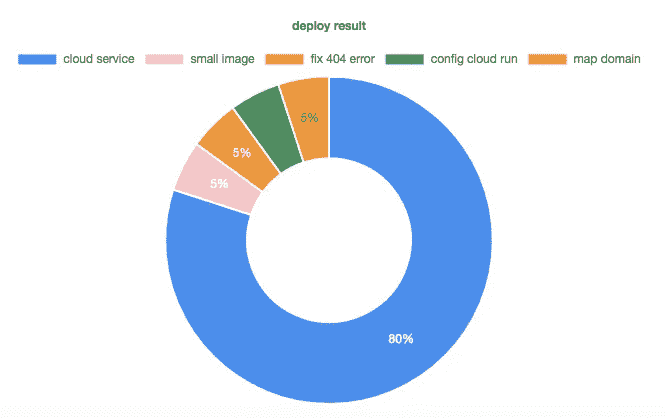

80% result with 20% effort — 20% result with 80% effort

> *1️⃣为你的静态应用选择合适的谷歌云服务*
> 
> *2️⃣打造轻盈形象*
> 
> *3️⃣配置网络服务器以避免 404 错误*
> 
> *4️⃣配置云运行以获得最佳性能*
> 
> *5️⃣地图云正确运行到您的(子)域*

# 🌘 1.选择正确的谷歌云服务🌘

要在 Google Cloud 中部署您的应用，您基本上有以下选择:

*   应用引擎
*   计算引擎
*   库伯内特斯
*   云函数
*   云存储
*   云运行

如果你是谷歌云的初学者，你不知道该使用哪种服务，那么你将花费大量精力来找出最适合你的服务。

对于简单的静态网站，我认为 Google Cloud Run 是最好的方式之一。对那些感兴趣的人来说，如果你在评论中询问，我可以激发这个声明。

# 🌗 2.产生一个轻量级的形象🌗

一旦我们选择使用 Google Cloud Run 作为服务来为我们的应用程序提供服务，我们就需要制作一个 Docker 映像。所以这里我们也想做出一个好的选择。

如果您使用 Node.js 的官方 Docker 映像，这通常是 Angular 应用程序的方式，您必须携带大约 677 MB 的重映像。现在为了我们的目的，我们不需要这样丰富的图像。

我们将构建一个 40 倍小的 Nginx 图像，非常适合我们的静态角度应用。

# 🌖 3.配置 web 服务器以避免 404 错误🌖

现在我们已经选择了正确的服务和轻量级映像，我们需要很好地配置映像。构建 Nginx 映像时得到的标准 Nginx 配置需要进行微调，以避免 404 错误。

# 🌕 4.配置云运行以获得最佳性能🌕

您将使用 Cloud Run 为您制作的图像提供服务。docker 容器中的这张图片存储在 Google Cloud 的容器注册表中。出于性能原因，容器的托管位置非常重要。现在来看看第一条性能提示:将图像推送到您希望大多数用户所在的位置。

另一个性能考虑是优化 Google Cloud Run 中的高级容器设置。请特别注意自动缩放，以便至少有一个实例在运行。这导致更快的启动时间。

# ☀️ 5.正确映射到您的(子)域☀️

Google Cloud Run 有一个很好的功能，可以将服务映射到你的域名。进行映射很容易，但是我很难将服务映射到我的 WWW 子域。在下面我的实践指南的最后一步 6 中，我们将会看到如何正确地绘制地图。

嘣！💥。(努力受欢迎)。最后，还有你努力的最后捷径。

# 让我们开始吧。

所以现在你知道了在谷歌云平台上为你的静态角度网站提供服务时，你应该知道的 5 个主要细节，是时候让它发生了！我上面描述的所有细节都是在以下步骤中实现的。

# 先决条件

跑得快一个前提是你有腿。你还在吗，蜗牛？


Photo by [amirali mirhashemian](https://unsplash.com/@amir_v_ali?utm_source=medium&utm_medium=referral) on [Unsplash](https://unsplash.com?utm_source=medium&utm_medium=referral)

以下是在 Google Cloud Run 中提供 Angular 应用程序并将其映射到您的域的一些先决条件。

*   您有一个谷歌云帐户
*   你在谷歌云中有一个项目，你可以在那里部署和运行你的应用程序
*   您已经在本地机器上安装了 Docker
*   你有一个 SSR Angular 应用程序，随时可以部署。
*   您已经在机器上安装了 Google cloud SDK。
*   您要在其中运行应用程序的 Google Cloud 项目已被配置为活动项目。
*   也许你需要一些耐心，才能把它做好！

如果你不能完全满足所有这些要求，这些步骤可以根据你的情况进行一些小的修改。

# 1️.配置 NGINX 修复 404 错误和更快的传输

我们得到的 alpine nginx 的标准配置文件需要微调。我们将替换该文件。

> 到我的库 [GitHub](https://github.com/gitpoel/docker-alpine-nxing) 获取 nginx 配置文件" *default.conf* "并复制到你的 Angular 应用根目录下的新文件夹" *nginx/conf.d* "中。通过输入您的域(如果有)来调整文件的内容。

您的目录结构如下所示:

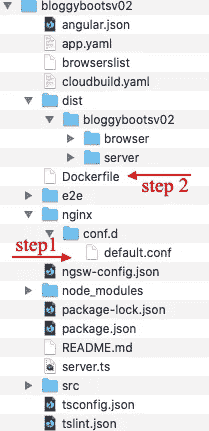

Folder structure of the Angular project “Bloggyboots02”

.

如果您看一下文件内部，配置文件有一个服务器块。在这个块中，我们告诉 Nginx 他应该进行内部重定向，否则我们会遇到我上面讨论过的 404 问题。

此外，出于性能原因，我们使用 GZIP。它在传输过程中减小了文件的大小。您还可以决定添加图像、CSS 和 JS 文件的客户端缓存。如果这是您想要的，那么将这种代码添加到服务器块中:

```
server {
   # caching
   location ~* \.(jpg|jpeg|png|gif|ico)$ {
       expires 20d;
    }
    location ~* \.(css|js)$ {
       expires 5d;
    }
}
```

# 2️.创建覆盖标准配置的 Docker 文件

在 angular 项目的根目录下，创建一个名为 Dockerfile 的文件，包含以下内容。它将创建一个小的简单的 Docker Alpine Nginx 图像，运行您的 Angular Universal 应用程序。

> 到我的库 [GitHub](https://github.com/gitpoel/docker-alpine-nxing) 获取 docker 文件，并将其复制到 Angular 应用程序的根目录。根据您的环境进行调整。发现下面我的言论！

以下是 docker 文件的内容和一些重要的注释

```
**# STEP 1 building your app**FROM node:alpine as *builder* RUN apk update && apk add --no-cache make git**# a) Create app directory**
WORKDIR /app**# b) Create app/nginx directory and copy default.conf to it**
WORKDIR /app/nginx
COPY nginx/conf.d/default.conf /app/nginx/**# c) Install app dependencies**
COPY package.json package-lock.json /app/
RUN cd /app && npm set progress=false && npm install**# d) Copy project files into the docker image and build your app**
COPY .  /app
RUN cd /app && npm run build:ssr**# STEP 2 build a small nginx image**FROM nginx:alpine
**# a) Remove default nginx code**
RUN rm -rf /usr/share/nginx/html/***# b) From 'builder' copy your site to default nginx public folder**
COPY --from=*builder* /app/dist/bloggybootsv02/browser /usr/share/nginx/html**# c) copy your own default nginx configuration to the conf folder**
RUN rm -rf /etc/nginx/conf.d/default.conf
COPY --from=builder /app/nginx/conf.d/default.conf /etc/nginx/conf.d/default.confEXPOSE 80
CMD ["nginx", "-g", "daemon off;"]
```

几个**重要**备注:

1.  在步骤 1 b 中，我们需要将默认配置文件复制到‘builder’环境中，这样我们就可以在以后将它从 builder 环境复制到 nginx 配置文件夹中。
2.  在步骤 1 d，我们运行命令“ **npm run build:ssr** ”。这意味着我们正在建立服务器端渲染的应用程序，这意味着我已经使用通用角度。如果这不起作用，你应该改变这一步，让它以你想要的方式构建你的应用。标准的建角方式是`ng build --prod`。你可以检查你的 package.json 中的 NPM 命令来构建你的应用程序。(不过，我建议查看 Angular 网站，看看 Angular Universal 为您提供了什么)
3.  在步骤 2 b，我们使用**端口 80** 来公开我们的应用程序。Google cloud 使用默认端口 8080，所以要注意，如果你像我一样，走 8080 以外的另一个端口，那么在运行 Cloud Run 的时候就要更改了。稍后，我们将看到如何在云运行中更改默认端口号。
4.  在步骤 2 b 中，您会注意到我们将/app/dist/bloggybootsv 02/browser 作为我们的 dist 文件夹，以复制到 nginx/HTML 目录。当你创建 docker 文件时，你应该使用你自己的 dist 文件夹的路径。浏览器文件夹是在 SSR 构建过程中生成的；记得我之前的话:我用角通用。
5.  在步骤 2c，我们替换了标准的 nginx 配置，以避免 404 错误并提高性能。

# 3️.构建并标记 Docker 图像

现在您的 docker 文件已经准备好了，调整下面显示的命令，使它适合您的环境。请进一步阅读如何针对您的案例运行它的说明。

> 运行下面的命令，但首先:根据您的环境进行调整！

```
docker build -t app:0.1 .docker tag app:0.1 eu.gcr.io/bloggyboots/app:0.1
```

运行 Angular 项目根目录中的命令。用**第一个命令**， *docker build -t app:0.1。*”，我们构建图像并用名称“app:0.1”标记它(-t 选项)。你可以选择任何名字。“0.1”表示应用程序的版本。

第二个命令**、**、*docker tag app:0.1 eu.gcr.io/bloggyboots/app:0.1*，需要一些解释，对于您的情况可能会有所不同。为了将图像推送到注册表，您需要决定您想要在哪个**位置**存储您的图像。谷歌是这样说的:

*   `gcr.io`在美国的数据中心托管图像，但该位置将来可能会改变
*   `us.gcr.io`在美国的数据中心托管映像，与`gcr.io`托管的映像放在不同的存储桶中
*   `eu.gcr.io`在欧盟主持图像
*   `asia.gcr.io`在亚洲的数据中心托管图像

就我而言，我使用`eu.gcr.io` 是因为我怀疑我的大多数用户会在欧洲使用这个应用。(在多区域中有多种部署方式，但这里让我们保持简单)

命令中的“bloggyboots ”(这是我的项目名称)可以不使用，而是使用另一个名称。

**可选**:在把你的应用程序推到云端之前测试一下:

```
docker run -p 4000:80 --name my-app app:0.1
```

# 4️.将本地图像推送到 google cloud container 注册表，负责定位

现在是时候将映像推送到云了。调整下面显示的命令，使其适合您的环境。请进一步阅读如何针对您的案例运行它的说明。

> 运行下面的命令，但是首先:根据您的环境进行调整！

```
docker push eu.gcr.io/bloggyboots/app:0.1
```

我使用`eu.gcr.io` 将它推到欧洲的一个位置。请参阅上一段的解释，您应该选择哪个位置以及哪个命令附加到它。

另外，使用您在上一步中使用的注册表名称。我的是 bloggyboots，我用“app:0.1”标记了这张图片。

执行完这个命令后，您应该可以在云中看到您的映像。转到谷歌云控制台，搜索容器注册表。打开应用程序文件夹，找到您的图像。您应该会看到类似这样的内容:

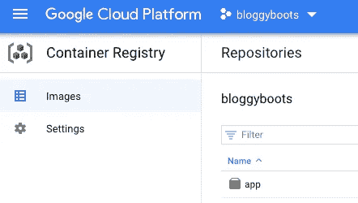

或者直接运行:

```
gcloud container images list --repository=eu.gcr.io/bloggyboots
```

替换您选择的存储库名称的`eu.grc.io/bloggyboots`。

# 5.在 Google Cloud Run 中创建服务

既然我们已经有了云中的映像，那么是时候使用 Cloud Run 来运行它了！

打开 Google Cloud，确保您位于您想要创建服务的项目中，并且您的图像存在于该项目中。

在谷歌云控制台中，搜索 Cloud Run。当你在那里时，创建一个服务。

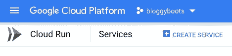

您需要选择想要部署的区域。**最好让你的容器注册区域与你在 Google Cloud Run** 中选择的区域同步。否则，您将支付网络费用，这可以通过这种方式避免。在谷歌云中查找关于该位置的更多信息。对我来说，我选择欧洲-西欧 4(荷兰)。

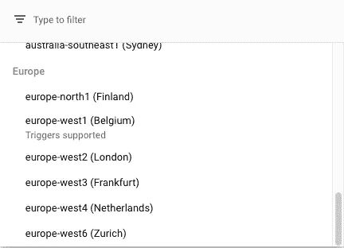

在创建服务的下一步中，您可以从已经推送到云中的容器注册表中选择您的映像(参见前面的段落)。

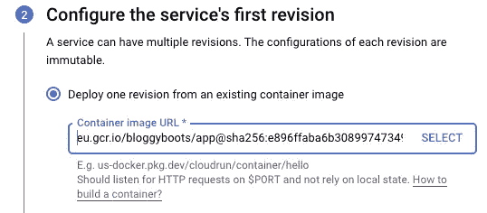

在高级设置中，容器端口必须等于您在 Docker 文件中配置的端口号，这一点很重要。我使用端口 80。

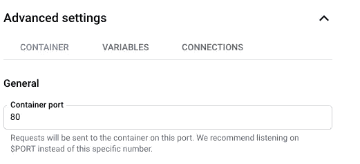

Set the port number to the port number of your Docker config!

您可以更改**自动缩放**。我希望至少有 1 个实例，这样当有人第一次访问我的网站时，我的网站会比默认的 0 个实例启动得更快。

最少运行 1 个实例会多花一点钱，但是当那个图像没有流量的时候，Google 会收你更少的钱。我还将最大实例数从默认的 1000 更改为 4。如果你有一个非常受欢迎的网站，你应该相应地改变这个最大值，这样你的用户就可以从运行更多图片的性能优势中获益。但是请记住:收益会伴随着额外的成本。

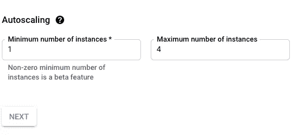

Auto scale for better performance

设置服务的第三步是您希望服务被触发的方式。我们正在发布一个网站，所以我们选择“允许未经验证的调用”。

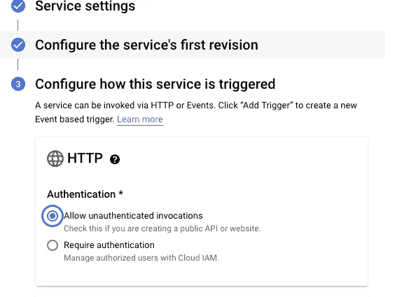

当您创建了您的服务后，您就差不多完成了！Google 为您的应用创建了一个 URL。您可以通过单击您的服务名称来检查这一点。在页面的顶部，它显示了网址。

现在服务已经启动并运行了，是时候将您的服务映射到您自己的域了。

# 6.正确地将服务映射到您的域

转到您的 Google 云控制台，确保您已经打开了包含您的服务的 Cloud Run 项目。转到 Cloud Run，您应该会看到您的服务正在运行。

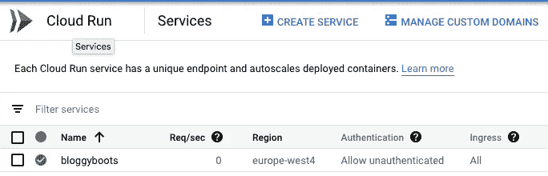

Cloud Run with your service

点击菜单顶部的“管理自定义域”。

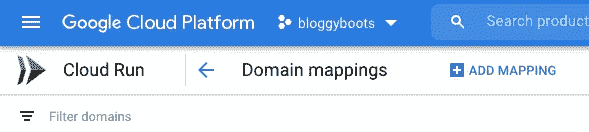

map cloud run service to your domain

点击“添加映射”。

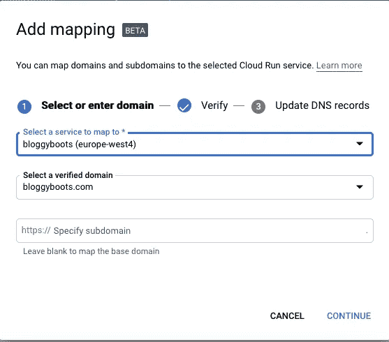

map the service to your domain

选择您的服务并将其映射到您的域。按下继续按钮，谷歌云生成 DNS 记录。您应该复制这些记录并将其粘贴到您的域主机中。对我来说，我用谷歌域名托管我的域名。对你来说，这可能是另一个注册，像 godaddy.com 或 hostgator.com。

要检查映射是否顺利，使用“ *dig* 命令，例如:

```
dig yourdomain.com
```

现在您应该做的是，将服务映射到您的“WWW”子域:再次添加映射，并在第三个字段中输入“www.yourdomain.com”，该字段显示“指定子域”。

这将生成一个 CNAME 记录，该记录将被复制到您的域名注册机构的 DNS 记录中；就像你对 A 级唱片和 AAA 级唱片做的那样。

# 结论

您已经部署了一个运行轻量级图像的容器，该容器带有一个静态的 Angular Universal 应用程序。容器在云上运行，你的站点被正确的映射到这个服务器上！你不会有 404 错误。性能得到优化。有关云运行的更多优化，您可以查看朱舒·王的文章“ [3 种优化云运行响应时间](https://medium.com/google-cloud/3-ways-to-optimize-cloud-run-response-times-4504ed0e6804)”。

我的 Angular 应用程序在 bloggyboots.com 的运行，在我的一个页面上有谷歌的灯塔报告。对于 Angular 应用程序来说，结果相当不错。

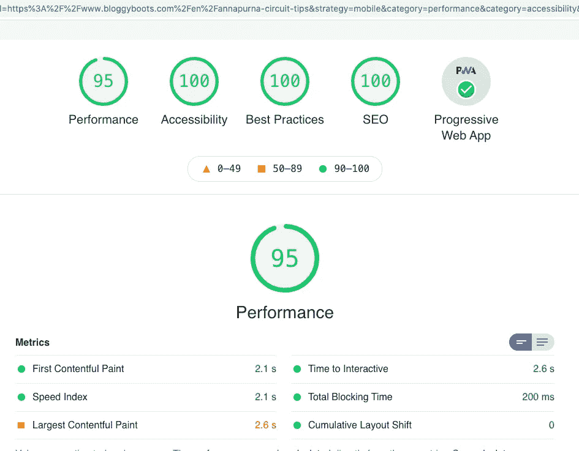

Google Lighthouse Report of Bloggyboots.com

如果你有任何问题，请在评论中提出。部署并享受！