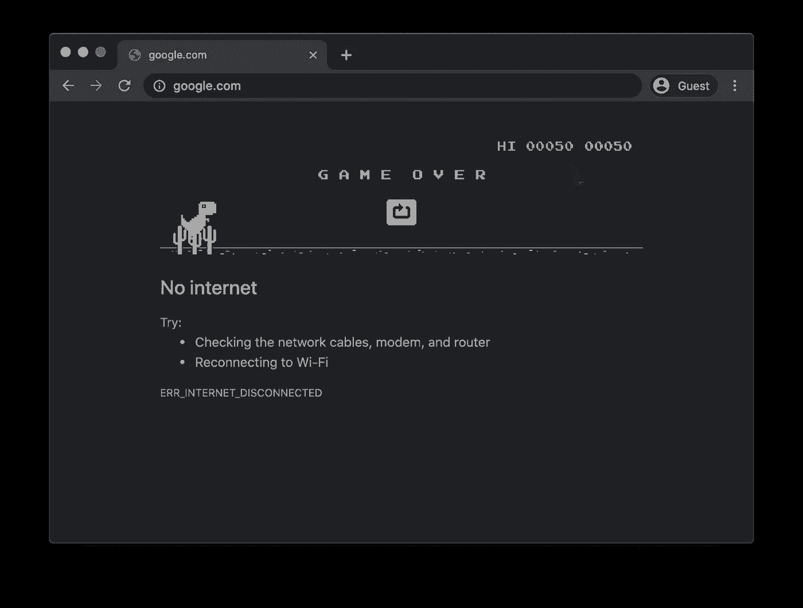
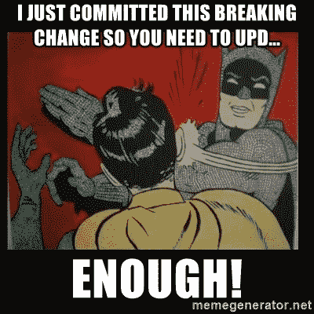

# 你的 PWA 要在 2021 年 8 月破了

> 原文：<https://javascript.plainenglish.io/your-pwa-is-going-to-break-in-august-2021-34982f329f40?source=collection_archive---------0----------------------->

My (totally random) prediction: 52% of all PWAs will break with Chrome 93

> 更新:4 月 14 日，谷歌宣布他们将暂停推出这一功能的计划。查看我的后续文章 [**这里**](/google-pauses-plan-to-break-your-pwa-d249bca27852?source=friends_link&sk=3790f72381ad47fc41089429a6e13807) **。**

如果您有 PWA，并且最近查看了您的控制台或应用程序清单，您可能会注意到以下消息:

> 页面无法脱机工作。从 Chrome 93 开始，可安装性标准正在改变，该网站将无法安装。[https://developer . chrome . com/blog/improved-pwa-offline-detection](https://developer.chrome.com/blog/improved-pwa-offline-detection)了解更多信息

或者，如果您使用 Edge:

> 无法安装网站:页面无法脱机工作。在 Edge 93 于 2021 年 8 月稳定发布后，该页面将不被视为可安装。

你看，在 Chrome 93 之前，你所要做的就是让 Chrome 可以安装你的应用程序,*假装*在你的服务工作器中监听 fetch 事件。你甚至不需要做任何事。你所要做的就是注册一个监听器。就这样。很简单。

我猜谷歌对黑客攻击有异议。说实话，可能有太多的网站——其中许多可能根本就不应该安装——使用了这样丑陋的黑客手段:

Nope, this won’t work anymore!

随着 Chrome 即将发布，你必须真正利用缓存，否则你的 PWA 将不再可安装。

## 为什么会这样？

谷歌的信条是 PWA 永远不应该显示 Chrome 的默认离线屏幕。相反，所有的 pwa 应该可以脱机使用，或者显示某种类型的[脱机页面作为后备](https://web.dev/offline-fallback-page/)。感谢上面的黑客，你实际上没有被迫让你的 PWA 离线工作。现在你会(或者你必须找到一个更丑陋的黑客不需要)。

A PWA shouldn’t show the Dino page… for some reason

现在，为什么一个除了说“你离线了”之外几乎没有任何用处的自定义页面比默认的恐龙页面更好的退路还有点不清楚。人们确实知道那一页是什么意思。它为如何恢复在线提供了清晰的方向。而且它是由谷歌自己建立的(所以它不像是把流量重定向到某个不相关的第三方网站)。

但显然，谷歌不喜欢自己的解决方案。所以你必须自己建立一个(很可能没有谷歌的好)。也就是除非你能做的比[恐龙游戏](https://en.wikipedia.org/wiki/Dinosaur_Game)明显好)。

Fix your PWA!

旁注:我正在构建 [**Progressier**](https://progressier.com) ，特别是为了让你不必应对谷歌/苹果/微软/三星/火狐的最新奇思妙想(我们会为你处理这些——而且是免费的)，但如果你绝对坚持要把这些强加给自己，下面是你必须做的事情，让你的应用程序变得兼容。

## 我能做什么来解决这个问题？

首先，您必须填充您的“fetch”处理程序，以便它实际上做一些有用的事情，例如缓存资源。有两种主要的方法可以做到这一点。

*   使用 [*网络回落到缓存*](https://web.dev/offline-cookbook/) 策略，您的服务人员将首先尝试从您的服务器检索资源。然后，当它不能这样做时——例如，因为您离线——从缓存中检索它(如果它存在)。

*   使用[*Stale-While-re validate*](https://web.dev/stale-while-revalidate/)策略，您的服务人员首先查看缓存，同时向服务器发出请求。如果资源存在于缓存中，它会立即将它发送回客户端——导致看似瞬时的负载。当(并且如果)服务器成功响应请求时，它将在缓存中保存更新的响应。这种方法的主要缺点是您将提供的资源总是比落后*一个版本。*

还有几个其他有用的策略。使用*缓存优先*，您根本不需要重新验证资源。资源一旦在缓存中就永远不会被更新——但是这个策略也可以减轻你的 AWS 账单。使用*纯网络*，您根本不使用缓存，因此资源总是新鲜的。还有一种*仅缓存*策略，这几乎没有用。

其次，您可能还必须在“install”事件处理程序中预先缓存资源。有趣的事实:这个事件在安装服务人员时触发。而不是当用户安装了你的应用。出于某种原因，我看到许多开发人员混淆了这两个概念。

## 资源缓存的问题

因此，服务人员离线处理的方式仍然存在一个主要问题。当你更新你的应用程序和创建新的资源时，如果你想让所有东西都离线工作，你必须记得预先缓存它们。这可能会带来很多麻烦——尽管像 [Workbox](https://developers.google.com/web/tools/workbox) 这样的库确实让事情变得简单了一些。无论如何，这凸显了 PWAs 最糟糕的一面。制作 PWA 不是一蹴而就的。有很多东西你必须定期更新，否则它们会坏掉。

在 [Progressier](https://progressier.com) ，我们的解决方案(截至 2021 年 3 月)目前部分兼容 Chrome 93。大多数有 Progressier 的 pwa 已经离线工作了——尽管这有点依赖于你的应用程序的确切结构。到 Chrome 93 发布时，我们将完全兼容，这样，运行 Progressier 的每个应用程序都可以离线使用，不管它们是如何构建的。

我们将如何解决上述问题:我们的机器人将定期访问您的应用程序，并检查网络请求。当我们看到新资源时，我们会自动将它们添加到要缓存的资源列表中。使用 Workbox，您必须手动构建缓存策略。使用 Progressier，策略会自动为您建立。

你有什么问题吗？或者需要帮助使您的 PWA Chrome 93 兼容？评论或发电子邮件给我在 kevin@progressier.com