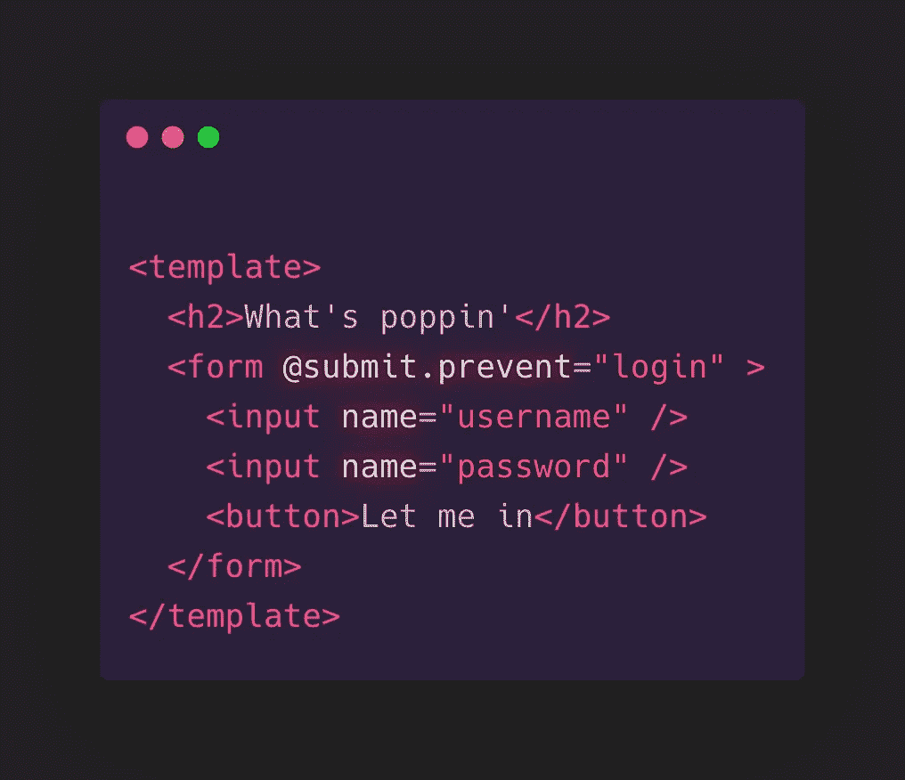

# 你过度设计了你的 Vue 表单

> 原文：<https://javascript.plainenglish.io/youre-over-engineering-your-vue-forms-c9f90dab55c1?source=collection_archive---------12----------------------->

Your Vue forms could look like this. (Created using [@carbon_app](https://twitter.com/carbon_app))

## Vue 中的表单

## 如何快速创建干净的表单组件

几乎每个应用程序都包含某种形式。无论你是在构建一个 todo 应用程序，一个聊天机器人，还是下一个克隆的俱乐部会所，你很可能至少需要构建一个。

Vue 的主要卖点之一是它的反应能力和数据绑定系统。如果您以前使用过它，您肯定会遇到将数据绑定到模板元素或子组件的`v-model`和其他变体。

这通常也是构建新表单时首先想到的事情。

"只需添加一些输入标签，并在每个标签上添加 v-model . "— *不知情的开发人员*

`v-model` 很棒，在很多 Vue 组件中都有它(当之无愧)的位置。

但是正如编程中经常出现的情况，通常会有更多的解决方案需要考虑。有时，这些其他解决方案对于特定的用例更有效。

因此，让我们来看看如何提升我们的表单，花更多的时间编写实际上需要脑力的东西。

# v 型车的问题是

使用`v-model`是有代价的。

当您在表单组件中使用`v-model`时，您将数据从组件双向绑定到表单中的一些输入标签或子组件。这要求您将属性添加到模板中要使用它的每个标签上。

让我们看一个简单的登录表单:

我们的`login`函数可能看起来像这样:

这段代码很好，但是为每个标签键入`v-model`会很快变得多余。想象一下一个更复杂的注册页面，比如一个金融科技应用。您可能需要收集关于用户的金融专业知识、历史和情况的数据。

这可能很快导致具有许多不同类型输入的长表单。

你可能会说使用 **v-for** 可以很容易地解决这个问题，在某种程度上你是对的。

如果你只有一堆文本输入，你可能会没事。

但是如果你有不同的输入类型，一些*文本*，一些*数字*和一个*密码*字段呢？

现在添加对不同标签的需求，如`textarea`或定制子组件。您最终将一个对象的`inputs`数组作为道具传递给一个 **FormFields** 组件，并使用一堆复杂的逻辑和/或插槽来创建您原本在模板中输入的内容的过度工程版本。

但至少它现在是可重复使用的，对吗？

Dev explaining how abstracting forms into a global component will “clean up” our codebase. (Found on knowyourmeme.com)

一旦你首先想起`v-model`的用途，这个架构中的缺陷就变得更加紧迫。

这里是摘自 Vue 文档的第一句话:

您可以使用`v-model`指令在表单输入、textarea 和 select 元素上创建**双向数据绑定**。

用于**双向数据绑定**。但是**你不需要在登录表单、注册表单或财务问卷上进行双向数据绑定**！

用户输入数据，提交数据，如此而已。

在很多情况下，您根本不需要组件来更新输入中的数据。

# 使用 Object.fromEntries

处理提交的一种方法是在各自表单的`FormData`上使用`Object.prototype.fromEntries`。

想想上一个例子中的登录表单。另一种可以让它工作的方法是完全释放任何`v-model`和`v-on:click`处理程序，只依赖好的旧 JavaScript 表单来完成这项工作。

如果您需要复习一下为什么这样做，没有指定`type`属性的`form`标签中的`button`标签被分配了`submit`类型，并在单击时触发父`form`标签`submit`事件。然后，`submit`事件用一个`Event`对象调用登录函数，该对象包含一个引用表单元素的`target`属性。

让我们来看看我们闪亮的新`login`功能。

我们在这里做的是将表单元素传递给`FormData`构造函数，它返回“一组表示表单字段及其值的键/值对”([https://developer.mozilla.org/en-US/docs/Web/API/FormData](https://developer.mozilla.org/en-US/docs/Web/API/FormData)，MDN)。

然后，我们将返回值从`new FormData`构造函数传递给`Object.fromEntries`，将`FormData`转换成`Object`。

既然我们现在已经有了简单对象属性的值，我们可以继续使用析构并简单地将相关值传递给`loginWithUsernameAndPassword`函数来获取我们需要的值。

该方法不创建双向绑定，因此只需创建模板并提取登录函数中的值。

# 警告

请注意，由于此方法不创建任何双向绑定，因此当组件重新呈现时，所有用户输入的值都将丢失。如果使用这种方法，**不要使用 v-model** 之类的反应属性绑定组件内的任何元素。包含`v-model`的输入发出的每个更新事件将导致组件重新呈现，清除所有非反应性输入字段。

# 最后的想法

表单是一种非常常见的组件类型。尽管开发人员经常使用它们，但人们很少花时间优化他们的表单工作流，即使这可能会在可读性、开发时间和体验方面产生巨大的差异。

我希望你喜欢这篇关于一种方法的小文章，我已经学会喜欢这种方法，并且已经在多个产品级项目中应用了。

如果你有另一种在 Vue 中构建干净有效的表单的方法，我很乐意在评论中听到。

*更多内容尽在*[*plain English . io*](http://plainenglish.io/)