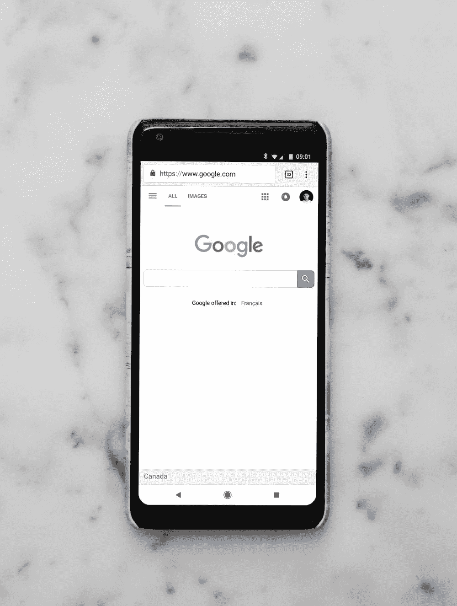
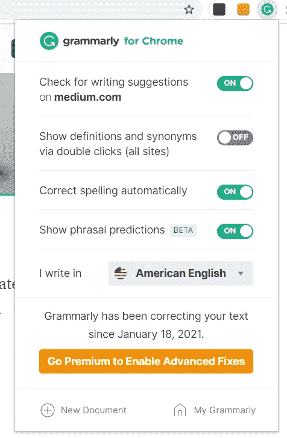
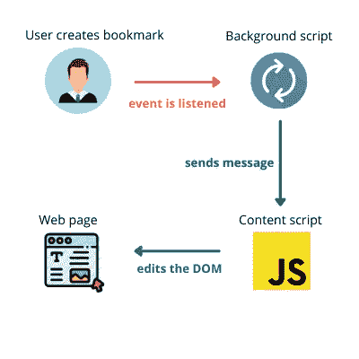
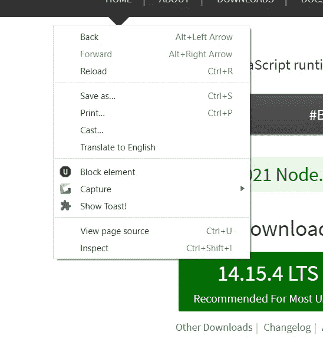
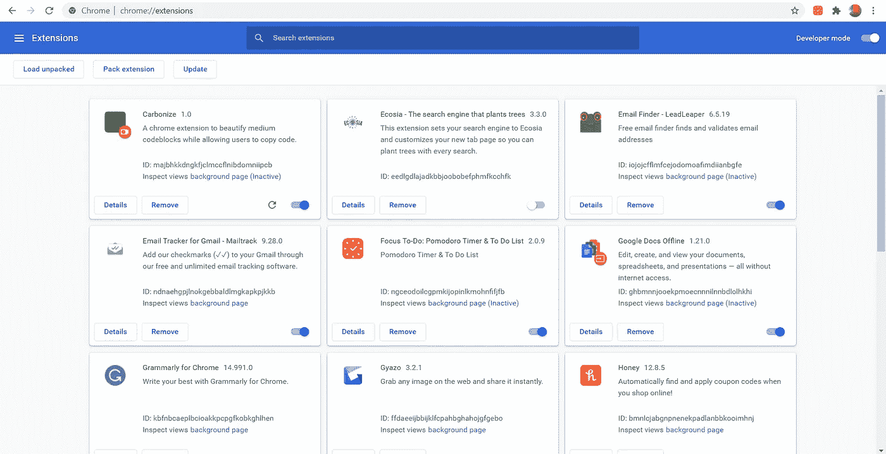
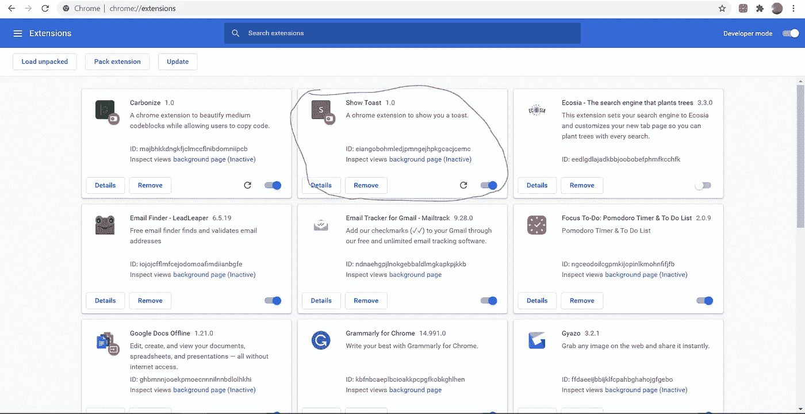

# 从零到英雄:Chrome 扩展

> 原文：<https://javascript.plainenglish.io/zero-to-hero-chrome-extensions-4060520daf59?source=collection_archive---------8----------------------->

## 以编程方式挖掘浏览器的全部功能！


Photo by [Christian Wiediger](https://unsplash.com/@christianw) on [Unsplash](https://unsplash.com/photos/zhZydTyNMPg)

# 介绍

在我的编码之旅中，我尝试了各种技术，并致力于移动应用程序和 web 应用程序。直到最近，我才开始学习 Chrome 扩展，我必须说，它们被低估了。它们允许开发人员深入利用浏览器的功能。在本文中，我将首先简要介绍 Chrome 扩展的背景信息，然后我们将一起构建一个扩展。

# 议程

*   背景概念
*   扩建部分
*   下载扩展

# 背景概念



Photo by [Charles Deluvio](https://unsplash.com/@charlesdeluvio) on [Unsplash](https://unsplash.com/photos/leqrylJNYUQ)

Chrome 扩展提供了一种简单的方法来直接访问 Google Chrome 中的各种功能。在本节中，我们将浏览组成扩展的不同部分:弹出窗口、内容脚本和后台脚本。之后，我们将介绍消息传递，这是不同部分之间的一种通信方式。

**弹出**



Screenshot of Grammarly Chrome Extension Popup

简单来说，Chrome 扩展的弹出窗口就是在工具栏中点击扩展图标时呈现的 HTML。比如上图，点击语法图标后，语法弹出下拉可见。

此外，Chrome 扩展可以分为浏览器动作扩展或页面动作扩展。在页面操作扩展中，该扩展仅在用户访问特定页面时可用:工具栏中的扩展图标仅在特定页面上启用。但是，在浏览器操作扩展中，无论网页如何，该扩展都是可用的:默认情况下，工具栏中的扩展图标将对所有网页启用。

**内容脚本**

根据谷歌 Chrome 开发者文档，内容脚本是可以在网页环境中运行的文件([内容脚本](https://developer.chrome.com/docs/extensions/mv2/content_scripts/))。内容脚本可以访问和操作它们被注入的网页的 HTML。

Gif by Author

请注意，在使用 Gyazo 扩展截图后，屏幕右侧会出现一个通知。本质上，内容脚本是将通知的 HTML 插入到用户当前所在的网页中。

**后台脚本**

它们是用户在与 Chrome 交互时可以创建的许多事件和动作。例如，用户可以创建新的书签，或者导航到新的标签。后台脚本可以监听从用户交互中创建的事件。后台脚本功能强大，因为开发人员可以运行自定义回调来响应浏览器事件。

**消息传递**

Chrome 扩展的全部功能通过消息传递得以释放。提供一点背景知识，Chrome 扩展的每个组件都有其局限性。例如，内容脚本不能监听和响应用户与浏览器的交互，后台脚本不能访问用户导航到的网页的内容。消息传递允许 Chrome 扩展的不同组件相互通信。

考虑下面的用例。假设我们的 Chrome 扩展在用户每次创建新书签时都会显示一个祝酒词。

由于它们的局限性，如果我们仅仅局限于背景脚本或内容脚本的范围，就不可能创建这个流。然而，通过消息传递，我们可以在用户创建书签时从后台脚本向内容脚本发送消息。从那里，内容脚本可以通过在网页中插入一段祝酒词来对消息做出反应。



Photo by Author

在本文中，我将进一步向您展示如何利用消息传递的力量。

# 扩建部分

既然我们已经获得了关于 Chrome 扩展的高级背景信息，是时候实现我们所学的了。查看我们将构建的演示:

Gif by Author

最终产品将是一个简单的 Chrome 扩展，在用户单击上下文菜单选项后，它将在页面上显示一个 toast。用户还将能够更改 toast 消息。

**我们开始吧！**

让我们从创建文件夹结构开始

```
- popup/ - popup.js - popup.html- background.js- content.js- content.css- manifest.json
```

考虑一下`manifest.json`。`manifest.json`文件是您的扩展的配置文件。它定义了你的扩展。它可以详细说明后台脚本和内容脚本的位置，并提供基本信息，如扩展的名称和描述。如果你以前用过 Node.js，它相当于`package.json`。

以下是我们的 Show Toast 扩展的配置:

让我们从`browser_action`开始一步步走过去。

如果`manifest.json`中存在`browser_action`字段。这意味着 Chrome 扩展是可用的，不管用户在哪个 URL 或网页上。扩展工具栏中的扩展图标将始终启用，以便用户与之交互。而且，通过`default_popup` 字段，我们可以为弹出框指定 HTML 文件的位置。

转到`background`，我们注意到有一个`scripts`字段。这是我们指明后台脚本位置的地方。我们还通过将`persistent`设置为 false 来表明我们的后台脚本不是持久的。根据 Google Chrome 开发者文档，在大多数情况下，保持后台脚本的非持久性可能是有益的，因为这样消耗的资源更少([事件管理](https://developer.chrome.com/docs/extensions/mv2/background_pages/#persistentWarning))。

放到内容脚本上。内容脚本直接注入网页。请记住，`matches` 字段是一个 URL 数组，表示内容脚本可以插入的有效网页。`run_at`字段决定何时注入内容脚本。根据 Google Chrome 开发者文档，最好将`run_at`的值设置为`document_idle` ( [内容脚本](https://developer.chrome.com/docs/extensions/mv2/content_scripts/))。`js` 和`css` 字段对应于内容脚本的路径和内容脚本引用的样式表。

最后，我们到了`permissions`部分。`permissions` 字段是，我们在这里声明我们将在 Chrome 扩展中使用的各种 API。首先，我们需要利用 Chrome 存储 API 来存储用户想要在 toast 上显示的消息。此外，我们还需要使用上下文菜单 API。



Photo by author

正如你在上面的图片中看到的，要获得我们的扩展项，**显示 Toast！**，在右键菜单中，我们必须通过上下文菜单 API 将我们的项目添加到菜单中。

**现在让我们码出** `background.js`

```
chrome.runtime.onInstalled.addListener(() => {
    chrome.contextMenus.create({
        id: "show-toast",
        title: "Show Toast!",
        contexts: ["all"]
    });// default message when chrome extension is installed for the first time
    chrome.storage.sync.set({message: "Hello! This is the default greeting!"});
});
```

在上面的代码片段中，我们为安装扩展添加了一个事件处理程序。在事件处理程序的回调中，我们首先将扩展项添加到右键菜单中。然后，我们与 Chrome 存储 API 交互，为`message` 字段设置默认值。澄清一下，这个字段的值是将要显示的实际 toast 消息。

```
chrome.contextMenus.onClicked.addListener(({menuItemId}) => {
    if (menuItemId === "show-toast") {
        chrome.storage.sync.get(["message"], ({message}) => {
            sendMessage(message);
        });
    }
});
```

现在，每当单击一个菜单项时，我们就为它注册一个事件处理程序。实际上，每次打开右键菜单并选择菜单项时，都会触发该事件处理程序。在事件处理程序中，我们断言被点击的项是我们的扩展项(`menuItemId`看起来很熟悉，不是吗)。如果断言为真，我们从 Chrome 存储器中加载`message`键的值，并将其传递给一个名为`sendMessage`的神秘函数。让我们创建这个函数！

```
const sendMessage = (toastMessage) => {
    chrome.tabs.query({currentWindow:true, active:true}, (tabs) => {
        const tab = tabs[0];
        chrome.tabs.sendMessage(tab.id, {
            toastMessage: toastMessage
        });
    });
}
```

在这个函数中，我们将使用消息传递将`toastMessage`发送到内容脚本，以便它可以显示 toast。请记住，后台脚本是独立于网页的上下文运行的，这意味着它不能直接操纵网页来显示吐司。

我们首先通过`chrome.tabs.query`找到活动标签，即用户所在的标签。然后，我们可以通过`chrome.tabs.sendMessage`向该选项卡发送消息。因此，通过这个函数，我们可以向用户当前选项卡上的内容脚本发送消息。在这种情况下，消息的内容存储 toast 消息。

我所经历的可能听起来令人不知所措，但一旦我们建立了内容脚本，它就会变得更加清晰。

总的来说，`background.js`应该是这样的:

Code for the background script

**让我们编写内容脚本或** `content.js`

让我们从停止的地方开始，创建一个消息监听器，这样我们就可以捕获后台脚本将发送给我们的消息。

```
chrome.runtime.onMessage.addListener((request, _, sendResponse) => {
        if("toastMessage" in request){
          showToast(request.toastMessage); 
           sendResponse({status: "OK"});
        }
    else{
           sendResponse({status: "FAIL", 
            message: "toastMessage not provided"});           
        }
});
```

在上面这段代码中，我们添加了一个每当消息被发送到内容脚本时的处理程序。函数参数`request` 对应的是我们发送消息时在后台脚本中提供的消息内容。总之，通过发送和侦听消息，我们可以在后台脚本和内容脚本之间进行通信。但是，我们不要忘记制作`showToast`函数。

```
const showToast = (message) => {

   //append html element to webpage
    let toastContainer = document.createElement("div");
    toastContainer.innerText = message;
    toastContainer.className = "toast";
    document.body.appendChild(toastContainer);

   //remove element after 2 seconds
    setTimeout(()=>{
        document.body.removeChild(toastContainer);
    }, 2000);
};
```

这里是`content.css`:

The stylesheet referenced in the content script

在上面的函数中，我们将简单地创建一个 toast div，并将该 div 附加到网页的正文中。两秒钟后，我们将从网页中删除该元素。制作吐司就这么简单。

这是`content.js`最后的样子:

Code for the content script

我们现在有了一个事件流，从用户单击菜单中的扩展项开始，到网页上显示的 toast 结束。唯一剩下的事情是，我们必须允许用户定制他们的祝酒词。

**让我们通过创建弹出窗口来完成这个扩展！**

The HTML of the popup

上面的 HTML 将代表弹出窗口的用户界面。它将被放入弹出文件夹下的 popup.html 文件中。我们有输入，用户可以编辑 toast 消息的地方，和提交按钮，它将用于更新 Chrome 存储中的消息。

让我们进入`popup.js`来制作功能。

```
const onHandleSubmit = () => {
    const newMessage = document.getElementById("message").value;
    chrome.storage.sync.set({message: newMessage}, () => {
        console.log("Finished Setting!");
    });
}
```

这是提交按钮的`onclick`处理程序。我们首先检索输入的值，然后将 Chrome 存储器中的`message`字段更新为该值。我们可以在弹出窗口中使用 Chrome 存储 API，这很酷。

```
const setupHandlers = () => {
    const submitButton = document.getElementById("submit");
    submitButton.onclick = onHandleSubmit;
}
```

我们可以使用上面的函数设置提交按钮的`ondlick`处理程序。

最后，我们不能忘记将输入元素的值填充到 Chrome 存储器中存储的初始消息值中。

```
chrome.storage.sync.get(["message"], ({message}) => {
    const messageInput = document.getElementById("message");
    messageInput.value = message;
    setupHandlers();
});
```

一旦我们填充了这个值，我们将通过`setupHandlers`函数注册提交按钮的`onclick`处理程序。

添加这些内容后，`popup.js`文件应该如下所示:

The code for the popup

维奥拉。扩展现在完成了！

最后一件事，让我们在浏览器上安装扩展，这样我们就可以使用它了。

# 下载扩展

首先，通过在搜索栏中键入 chrome://extensions 导航到以下网页。



Photo by Author

然后，点击“加载解压缩”按钮。导航到 manifest.json 文件所在的文件夹，并选择该文件夹。如果没有出现错误，现在应该会弹出扩展。



Photo by Author

Gif by [**@runnerspace**](https://giphy.com/channel/runnerspace)

那是一场马拉松！

# 结论

在本文中，我们探索了构成 Chrome 扩展的各种组件，并通过创建我们的 Chrome 扩展来应用我们的知识。虽然这是一个基本的扩展，但我的目标是展示我们如何实现这些重要的概念，以便我们在未来构建更复杂的扩展。如果你喜欢这种类型的文章，并且还有更多的剩余资源，我推荐你看看[用 Github API](https://medium.com/swlh/build-a-dynamic-portfolio-with-the-github-api-6d74081e5164) 构建动态投资组合。

请让我知道你是否喜欢或不喜欢这篇文章的某些部分，以及我如何改进。感谢您的阅读！

# 资源

**后台脚本:**[https://developer . chrome . com/docs/extensions/mv2/Background _ pages/](https://developer.chrome.com/docs/extensions/mv2/background_pages/)

**内容脚本:**[https://developer . chrome . com/docs/extensions/mv2/Content _ Scripts/](https://developer.chrome.com/docs/extensions/mv2/content_scripts/)

**舱单文件:**【https://developer.chrome.com/docs/extensions/mv2/manifest/ 

**消息传递:**[https://developer.chrome.com/docs/extensions/mv2/messaging/](https://developer.chrome.com/docs/extensions/mv2/messaging/)