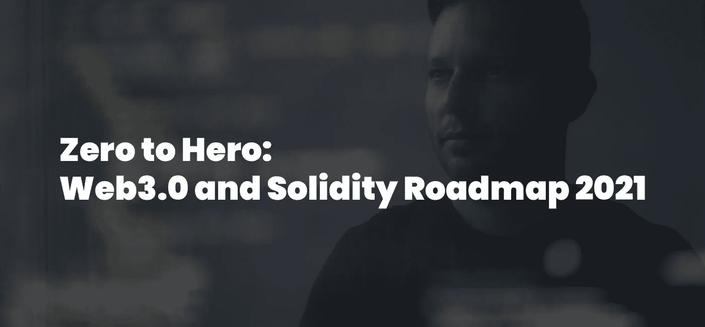
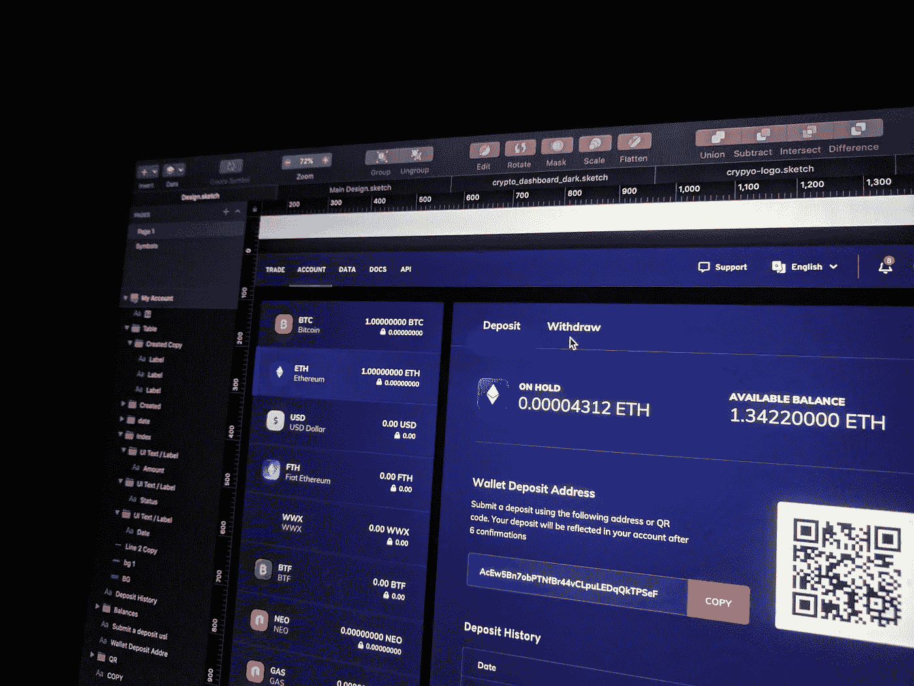
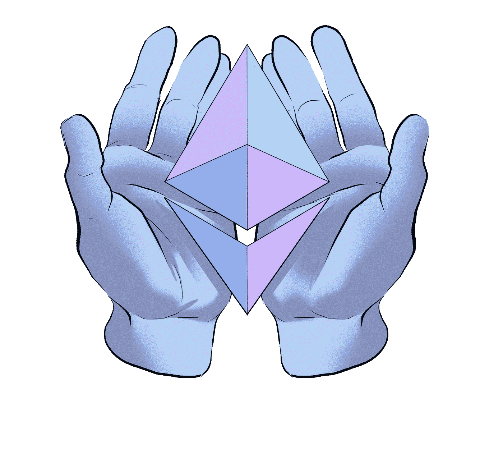
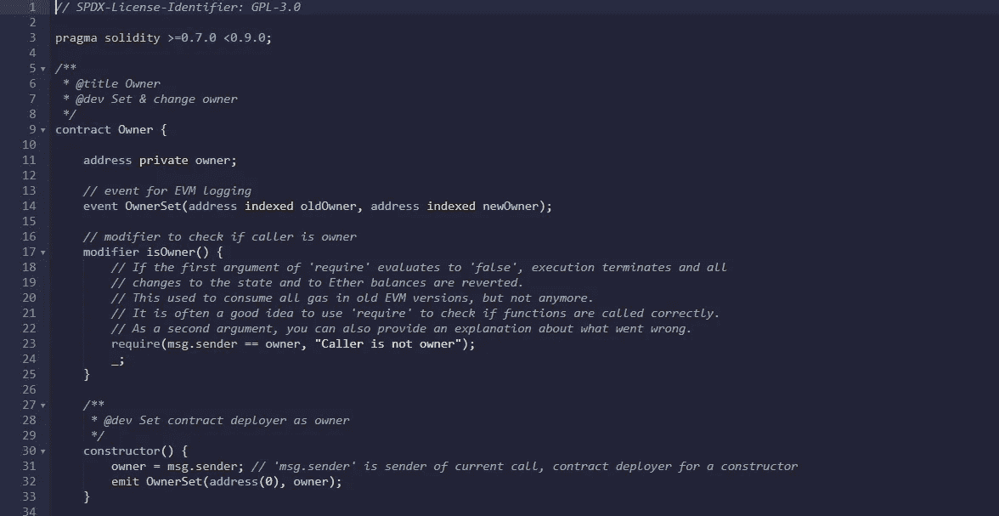
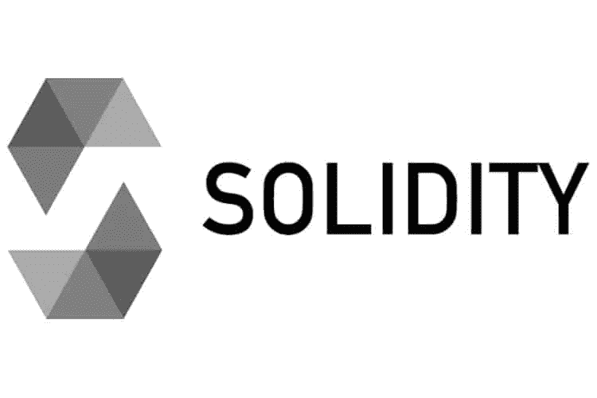
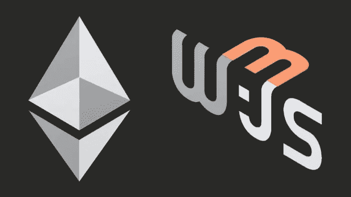
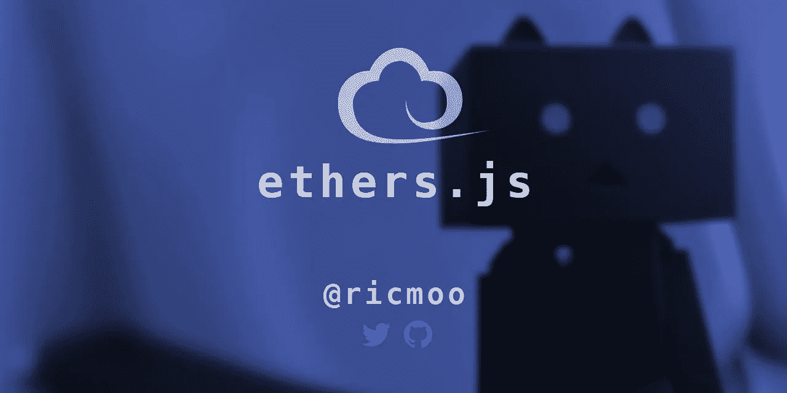

# 从零到英雄:Web3.0 和 Solidity 年发展路线图

> 原文：<https://javascript.plainenglish.io/zero-to-hero-web3-0-and-solidity-development-roadmap-2021-926e759a366b?source=collection_archive---------0----------------------->

今天学习 Web3.0 和区块链开发就像昨天以 10 美元的价格购买一枚比特币。

最初发布于:[完整的 Web3.0 和 Solidity 路线图 2021](https://vitto.cc/web3-and-solidity-smart-contracts-development-roadmap/)

进入区块链行业，**的普通程序员年薪约为 14 万美元，**可能是你作为开发者所能做的最佳投资。

不幸的是，网络缺乏好的资源，找到一个好的区块链发展路线图可能会很快变得乏味。

我花时间收集了最好的在线视频、课程和网站，并整理了学习 web3.0 和区块链开发的**最佳资源。**

从完全零编程知识到扎实和区块链专家，这就是为什么我们会从计算机科学的基础开始。

# 1.Web3.0 和区块链之前:CS 的基础

摩天大楼需要坚实的基础才能不倒塌。

区块链开发这是一个艰难的课题，我不会说谎。在深入研究节点和块并开始您的路线图之前，最好先了解计算机科学的基础知识:

[**哈佛自己发布的著名 CS50 —计算机科学基础—免费课程**](https://learning.edx.org/course/course-v1:HarvardX+CS50+X/home) 将教你了解计算机和数据处理基础知识所需要知道的一切。

一旦你对 CS 有了一些了解，是时候了解区块链是如何工作的，为什么它有用，以及它的局限性了。

# 2.学习区块链的基础知识

作为一名 Web3.0 开发者，你需要了解**什么是区块链**，它如何工作，以及为什么它可能会扰乱我们交换商品和支付的方式。
区块链技术不再仅仅与加密硬币相关，而是已经成为一个真正的分布式云计算系统，能够运行完整的后端来支持尖端的分散应用程序(DApps)。

用区块链 101 **在 [**Coursera 上免费学习区块链的基础知识。**](https://www.udemy.com/course/blockchain-theory-101/?LSNPUBID=JVFxdTr9V80&ranEAID=JVFxdTr9V80&ranMID=39197&ranSiteID=JVFxdTr9V80-5jnCta624e46I9A5_CU6Uw&utm_medium=udemyads&utm_source=aff-campaign)**

# 3.什么是分散式应用？

当你了解了区块链、节点、共识以及这项技术的所有主要组成部分后，你会开始怀疑:

“我可以使用区块链开发什么样的应用程序？”

**构建在区块链之上的应用被称为去中心化应用，或 DApps** ，具有:

*   **一个标准的前端**，使用 JavaScript 或 React、Vue、Svelte 等框架/库构建。
*   **一艘坚固/索拉纳/铁锈后端**，建造在区块链之上。

**了解什么是分散式应用:**

[查看 DApp 雷达，了解 Defi(去中心化金融)和其他基于区块链的应用的真实例子](https://dappradar.com/)

为了理解 DApp 的前端和后端如何协同工作:通信和交换数据，您需要**学习前端开发**和标准后端开发、API 和模式的基本原则。

# 4.2021 年学习前端开发

如前所述**分散式应用有一个标准的普通 JavaScript 或 JavaScript 框架前端**，这就是为什么在深入开发你的第一个 DApp 之前，学习前端开发的基础知识和网络如何工作是关键。

学习 HTML，CSS，HTTP，JavaScript，挑一个框架，开始搭建静态网站。

[**完整的 2021 年前端开发路线图，包含 15 种以上免费资源**](https://medium.com/javarevisited/2021-zero-to-hero-front-end-developer-roadmap-30c7ed630a8f) ，助您踏上征程，开始将技能货币化。

# 5.该不该学后端开发？

*是，现在。*

**去中心化应用后端**与“标准”应用后端有很大不同，首先是**区块链技术被用作去中心化数据存储的主要来源**，而标准后端通常使用数据库或对象存储。

尽管如此，大多数技术原理还是一样的。

## 5.1 2021 年学习后端开发

*了解前端和后端如何交换数据。*
学习:Node，Express，DBs，HTTP，如何开发 API，开始部署前沿应用。

[**2021 年免费资源后端开发路线图**](https://vittoriorivabella.medium.com/zero-to-hero-backend-developer-roadmap-2021-8b6985cfe2d) **。**

# 6.了解什么是以太坊及其工作原理

一个 web3.0 开发者需要了解以太坊是如何工作的。

**以太坊**是运行在计算机网络上的软件，确保被称为**智能合约的小程序的复制和处理。**

[**在这段视频中与维塔利克·布特林**一起了解以太坊的更多信息，](https://www.youtube.com/watch?v=gjwr-7PgpN8)以太坊区块链的发明者之一讲述这项技术。

如果你想进一步探索以太坊是什么，[**我几乎不建议你去查文档和正版以太坊网站**](https://ethereum.org/en/developers/docs/) **。**

# 7.区块链上的软件:智能合约

*以太坊和智能合约就像面包和黄油，你需要两者都懂。*

智能合同是存储在区块链平台上的软件，可以自动执行协议。

它是用 Solidity，Rust，或者 Vyper (Solidity 但是 Python 风格的)写的。

在弗吉尼亚大学的这个免费课程中，学习什么是智能合同。

# 8.学习可靠性以开发和部署智能合同

当然，知道什么是**智能合约**是不够的，作为一名 Web3.0 或区块链开发者，你必须知道**如何编写自己的智能合约。**这就是稳健发挥作用的时候了。

Solidity 是一种编写智能合同的高级、面向合同的编程语言，允许程序员编写自动执行的代码，为区块链 DApps 提供支持。

不幸的是，正如我们所说，网络缺乏学习可靠性和区块链开发的良好资源。

以下是我发现的 2021 年最好的免费课程:

*   [16 hrs+区块链- freecodecamp 中的稳固性](https://youtu.be/M576WGiDBdQ)
*   [坚固性全过程——吃积木](https://www.youtube.com/watch?v=p3C7jljTXaA&feature=emb_title)
*   [2 小时硕士坚实度全课程- Dapp 大学](https://www.youtube.com/watch?v=YJ-D1RMI0T0&t=17s)

# 9.通过创造僵尸来学习坚固

事实证明，学习可靠的最佳资源之一是游戏化编程课程，在这里你将学习如何开发智能合同，同时创建一个僵尸工厂来启动你的世界统治计划。

[**检出隐型丧尸，完全免费。**](https://cryptozombies.io/)

# 10.连接您的 DApp 前端:学习 Web3.js 或 Ethers.js

既然你已经知道如何创建**智能契约**，你需要一种方法来连接你的前端和你的本地或远程 Solidity(或类似的)后端，使用从 **HTTP 到 Websockets 的任何东西。**

为此，您可以在两个 JavaScript 库之间进行选择:

*   **Web3.js**
*   **Ethers.js**

## 10.1 学习 Web3.js

web3.js 是库的**集合，允许您使用 **HTTP** 、 **Websockets** 和其他通信协议直接从基于 JavaScript 的前端连接本地或远程以太坊节点。**

[**这里是 DApp 大学**](https://www.youtube.com/watch?v=t3wM5903ty0) **的完整 web3.js 速成班。**

## 10.2 了解 Ethers.js

Ethers.js 是一个轻量级的 **JavaScript 库**，用来替代 Web3.js 连接 JavaScript 前端和智能联系人。

[**学习前端 DApp 开发用 Ethers.js 作者 Nader Dabit。**](https://youtu.be/a0osIaAOFSE)

# 11.开发您的第一个分散式应用程序

通过实践和解决问题来学习是关键，这确实是我们大脑保留信息的最佳方式。

开始建立你的第一个 DApps 来加强你对区块链发展的理解。

[**由 freecodecamp**](https://www.youtube.com/watch?v=8wMKq7HvbKw) **在此免费课程中开发 5 个 DApps。**

## 其他 DApps 项目灵感

在您的区块链开发人员组合中寻找项目创意可能不是那么直观。

下面我就和大家分享一下[**6 个项目思路来实践你的 web3.0 知识**](https://ethhole.com/challenge) **。**

# 12.了解如何测试您的智能合约

*测试你的区块链智能合约是关键。*

区块链之所以如此特殊，是因为它的不可逆性:智能合约一旦添加，就无法编辑或召回，而且它的部署也需要真金白银(煤气费)。

这就是为什么**你应该学习如何在部署之前彻底测试你的智能合约**的原因。

## 如何测试我的分散式应用程序？

有 4 种类型的测试来测试您的智能合约:

*   **节点测试。**
*   **功能测试。**
*   **性能测试。**
*   **API 测试。**

在这个 1 小时的区块链测试免费介绍中，了解更多关于测试您的分散化应用和智能合约的信息。

# 13.学习松露和加纳切

使用 Truffle 加速您的开发:适用于任何 EVM 区块链的开发环境、测试框架和资产管道。

它配有:

*   **内置智能合约编译**
*   **可脚本化的迁移框架**
*   **还有更多。**

**另一侧的 Ganache** 包含在**松露**套件中，用于**测试以太坊触点**。它实际上创建了一个模拟的区块链，用账户来测试你的交易，避免设置无用的模板来启动你的 DApp 开发。

[**从本教程开始探索松露**](https://www.youtube.com/watch?v=62f757RVEvU&t=172s) **。**

[**从官方文献中了解加纳切。**](https://www.trufflesuite.com/docs/ganache/overview)

# 结论

学习 Web3.0 和区块链开发一开始可能听起来令人生畏，但每个人都可以做到。

从计算机科学的基础开始，一步一步地学习 JavaScript，从可靠性到尖端的 DeFi 应用程序。

你不会在 1 周内学会区块链开发，但你可以在 1 年的全身心投入中学会。

*更多内容请看*[***plain English . io***](http://plainenglish.io/)