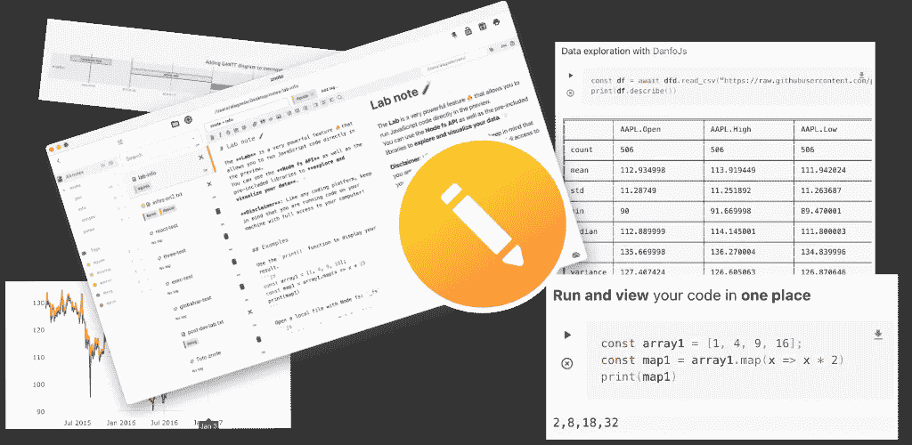
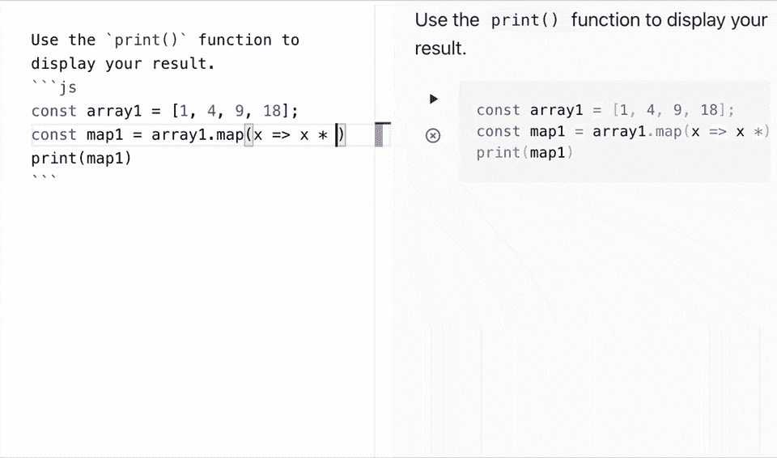
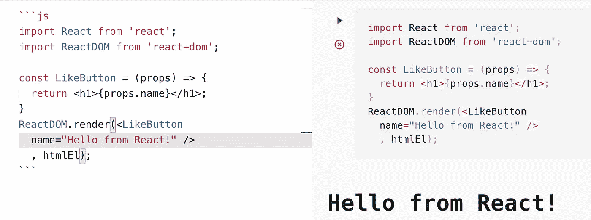
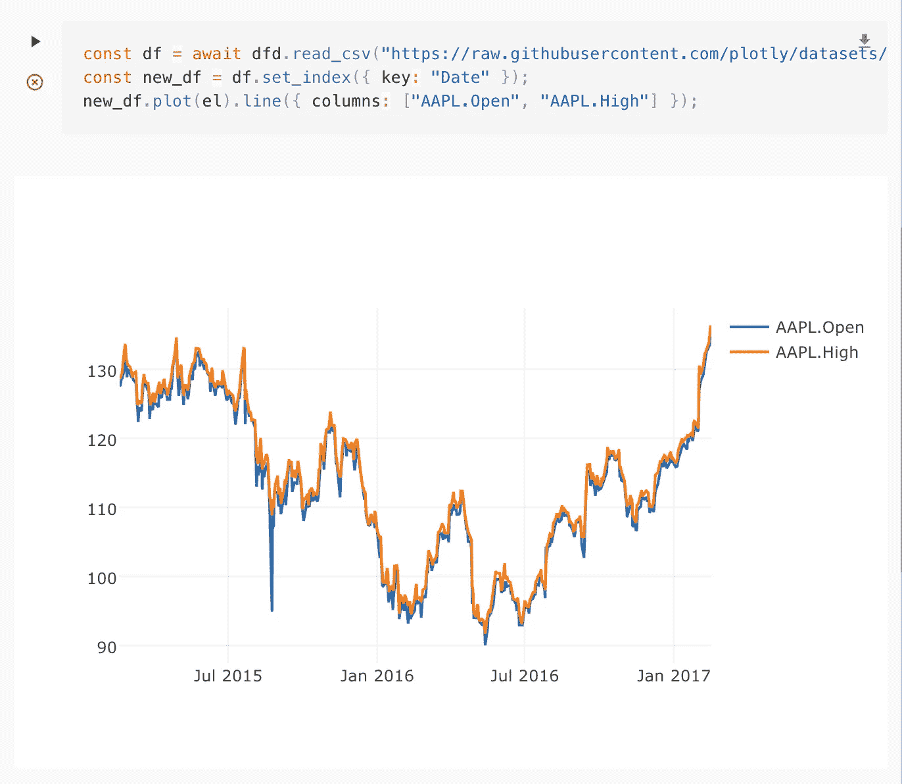
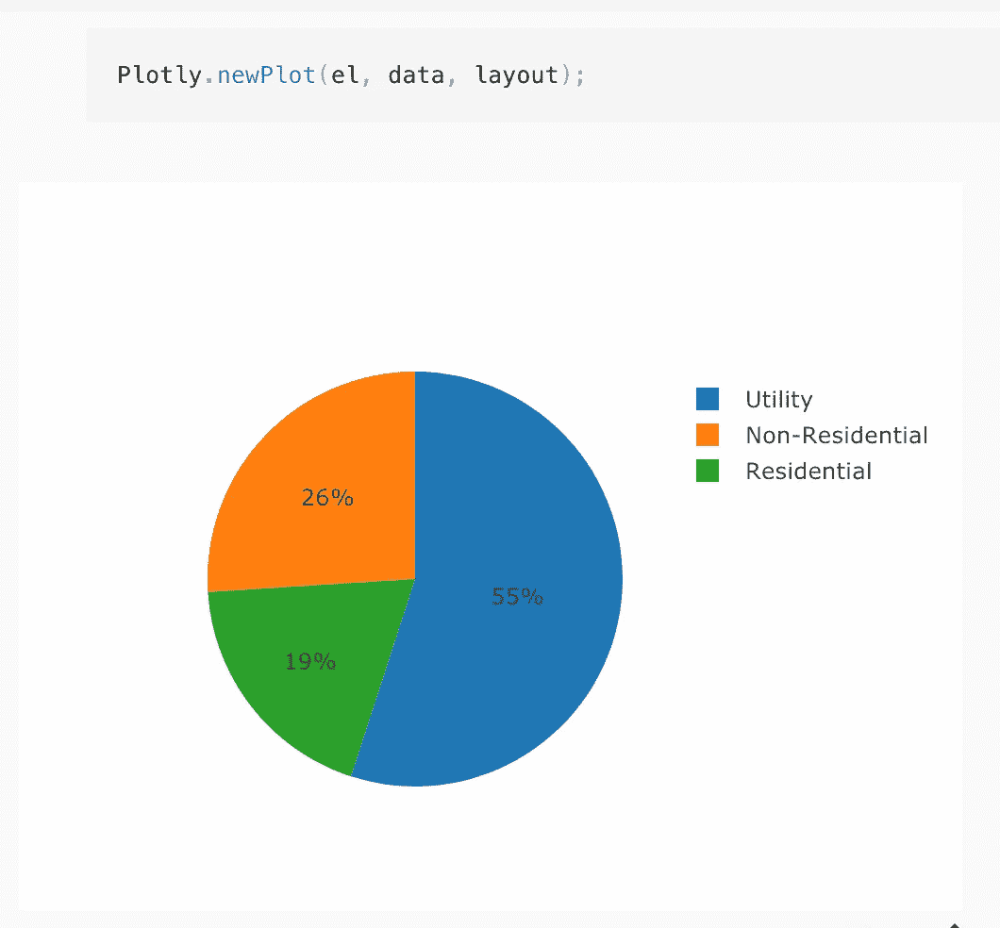
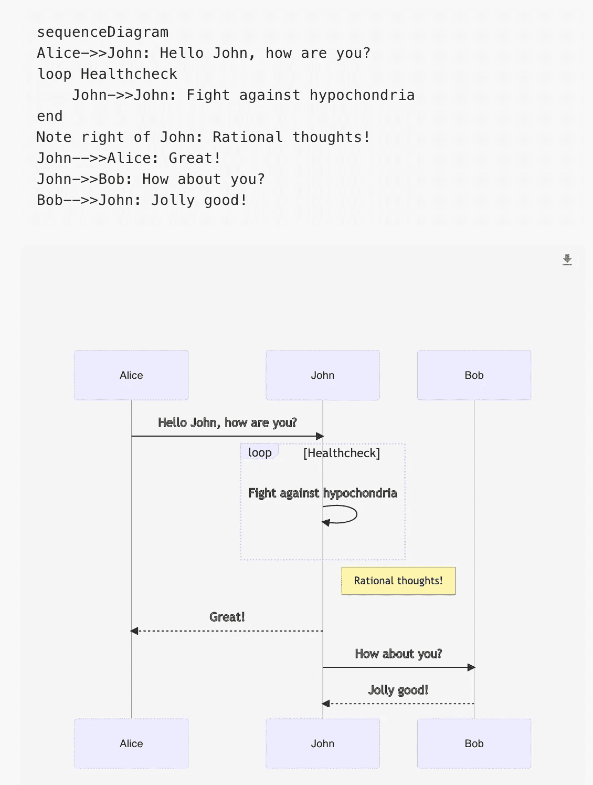
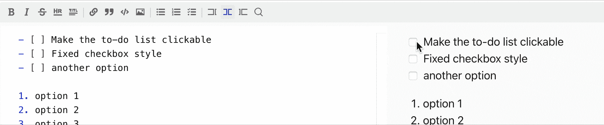
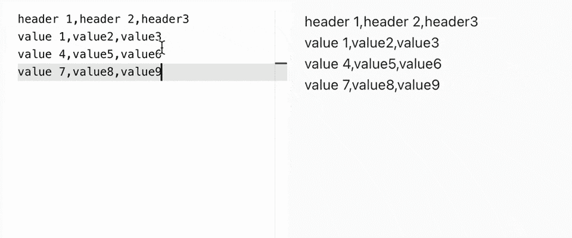

# Znote:一个受 Jupyter Notebook 启发的 markdown 和 JavaScript 实验室

> 原文：<https://javascript.plainenglish.io/znote-a-markdown-and-javascript-lab-inspired-by-jupyter-notebook-ecf7b5adedc4?source=collection_archive---------7----------------------->

作为一名开发人员，你可能会花很多时间学习和测试代码、破解 API 或数据集、编写文档，无论是为你自己还是为你的队友。

在本文中，我将向您展示如何使用 Znote 快速构建代码原型或执行数据探索。受到令人敬畏的 [**Jupyter**](https://jupyter.org/) 项目的强烈启发，Znote 试图给 JavaScript 生态系统提供类似的体验。

# 什么是 Znote？

Znote 是一个强大的工具，用于交互式地开发/呈现数据或原型脚本。

note 将代码及其输出集成到一个文档中，该文档结合了可视化、图表、叙述性文本和其他媒体。

此外，您可以组织您的工作，以快速访问您的笔记和想法。

# 用于原型开发的 JS 平台

JS Playground 完全集成了 Markdown 语法。只需创建一个标准的 JavaScript 代码块来开始执行您的代码。

为了加快这个动作，你可以使用键盘快捷键 **Cmd+P**

JS playground

***注意*** *:代码块是异步的，支持最新的 JavaScript ES6–7 语法。所以可以直接* `*await*` *进行异步功能。错误被自动捕获并显示在输出中。*

因为预览版是本地浏览器，所以可以导入并运行 React *(是的，也支持 JSX)*之类的任何 JS UI 库😊

react example

也可以将 **Node.js** libs 与`require()`关键字混合使用，或者运行普通的 NodeJS 代码。

其他的**节点 API** 也可以像`fs`或`exec`一样与你的本地系统轻松交互。可能性是无限的…

完整文档[此处](https://doc.notebookjs.app/#/)。

# 数据探索

Znote 预装了两个强大的库来帮助你进行高效的数据探索: [DanfoJS](https://danfo.jsdata.org/) 和 [PlotlyJS](https://plotly.com/javascript/)

Danfo.js 的灵感很大程度上来自 Pandas 库，并提供了类似的接口和 API。这意味着熟悉 Pandas API 的用户可以轻松使用 Danfo.js。

danfoJS graph

**PlotlyJS** 构建在 [d3.js](https://d3js.org/) 和 [stack.gl](https://github.com/stackgl) 之上，Plotly.js 是一个高级的、声明性的图表库。plotly.js 附带了 40 多种图表类型，包括 3D 图表、统计图和 SVG 地图。

# 图表

多亏了 [Mermaid](https://mermaid-js.github.io/mermaid/#/) 集成，你可以使用文本和代码创建图表和可视化。

mermaid

# 动态降价

因为与文本交互也很重要，所以 Znote 提供了大量的动态助手和自适应补全功能来帮助您编写高质量的文档。

dynamic checkbox

CSV/Table markdown helper

*这只是开始！Znote 包含了一系列有用的特性，可以帮助你在日常工作中提高效率。🧑‍💻*

## **现在呢？已经有了！**

你可以在这里登陆网站获取应用:[https://znote.io/](https://znote.io/)

完整的产品文档可在线获取[https://doc.notebookjs.app/#/](https://doc.notebookjs.app/#/)

希望你会喜欢使用这个应用程序，它会让你的工作多一点乐趣。