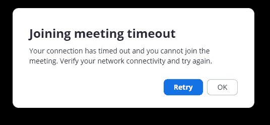
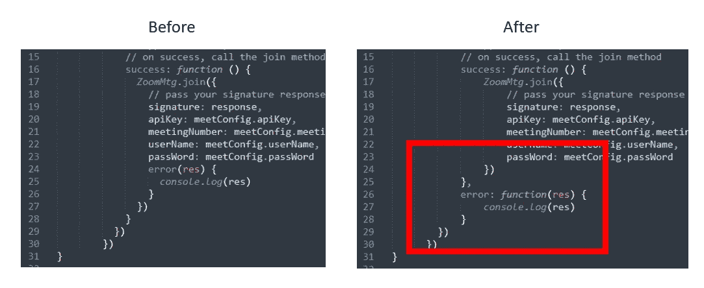

# Zoom Web 客户端 SDK HTML5/JavaScript/PHP 示例

> 原文：<https://javascript.plainenglish.io/zoom-web-client-sdk-html5-javascript-php-example-9210f5bda17f?source=collection_archive---------8----------------------->


Photo by [LinkedIn Sales Solutions](https://unsplash.com/@linkedinsalesnavigator?utm_source=medium&utm_medium=referral) on [Unsplash](https://unsplash.com?utm_source=medium&utm_medium=referral)

我最近开始用 pure/plain/vanilla Java script 将 Zoom 集成到我的网站应用程序中，但是遇到了几个问题，给出了[文档](https://marketplace.zoom.us/docs/sdk/native-sdks/web)和[样本代码示例](https://github.com/zoom/sample-app-web):

*   提供的示例代码有安全问题
*   纯 JavaScript 和 PHP 的不完整文档

**我会列出我遇到的问题/解决方案，然后提供一个完整功能的 JavaScript + PHP 示例，将 Zoom 集成到一个基本的 web 应用**。

> 文档中的代码用于 Angular 我想要普通的 JavaScript。

# 问题#1:使用正确的密钥

我正在浏览 Zoom 的文档“构建一个应用程序——Web 客户端 SDK”

注册 Zoom 开发者账户后，第一步是选择你的应用类型。我之所以选择“SDK ”,是因为这个术语在整个教程中被频繁使用。我正在使用我的 SDK 密钥/ SDK 秘密值，但是得到错误(特别是“加入会议超时”)。



原来我需要一个 JWT (JSON Web Token)应用的凭证！

## **吸取的教训**

如果 SDK 凭证不起作用，请尝试 JWT 的凭证！它被称为“API Key / API Secret”，与示例代码中的名称相匹配。

# 问题#2:变量不一致

示例 Zoom web 客户端代码可以工作，但是它使用了 ZoomMtg。 **generateSignature()** 函数，需要你在客户端提供 API Secret，这是一个安全威胁。代码注释和文档表明您应该使用服务器端代码来生成签名。

或者，您可以遵循文档中给出的代码。然而，我很难让它工作。

在这两种情况下，都建议您传入一个对象。不幸的是，文档中有一个名为 **meetConfig** 的对象，其中包含了诸如 **meetingNumber、**之类的项目，而示例代码中的 **meetingConfig** 包含了不同的元素，例如 **mn** 表示“会议号码”。

我努力将这两个代码样本结合起来(一个工作但不安全，另一个不工作)。

# 问题 3:不完整的 PHP 示例

您将需要服务器端代码来生成“签名”他提供的 PHP 代码帮了大忙，但是我想为那些经验不足的人补充一些缺失的部分。

如果您遵循推荐的方法传入一个对象(而不是单独的值)，您将首先需要使用 *json_decode()* 函数。

下面是代码的一个缩写片段；完整的代码在本文末尾的链接中:

```
<?php// fill in your API Secret (probably from the JWT, not the SDK!)
$apiSecret   = '...';// if you're passing in a JSON object, decode it first
$meetingData  = json_decode(file_get_contents('php://input'), true);// Make sure your variable names match!
$apiKey   = $meetingData['meetingData']['apiKey'];
$meetingNumber  = $meetingData['meetingData']['meetingNumber'];
$role    = $meetingData['meetingData']['role'];print generate_signature( $apiKey, $apiSecret, $meetingNumber, $role);function generate_signature ( $apiKey, $apiSecret, $meetingNumber, $role) {
 // use their code
}?>
```

# 问题#4:缺少纯 JavaScript 示例

> **注意:**我最终没有使用这一部分中的代码修复，但我想提一下，以防你需要帮助将代码从 Angular

该文档没有提供纯 JavaScript 示例。对提供的角度代码进行以下更改:

*   移除“导入”，假设您使用的是 CDN
*   在 *getSignature()* 前添加关键字“函数”
*   调整错误位置；下面截图



# 我仍然得到缩放“加入会议超时”错误！

在撰写本文时，我还没有找出原因，但解决方法是**主机需要先登录**。也许这是我的“免费”变焦帐户的一个限制？

**还有**:Zoom 提供的会议 ID 有空格(更容易阅读)。你需要去掉空格，它才能工作。

# 最终缩放 JavaScript SDK 代码

完整的代码可以在 GitHub 上找到:

[](https://github.com/stevesohcot/zoom-web-client-sdk-example) [## stevesohcot/zoom-web-client-SDK-example

### 将一些特定于角度的代码转换为纯/普通/普通的 JavaScript 整个 PHP 脚本以生成签名…

github.com](https://github.com/stevesohcot/zoom-web-client-sdk-example)